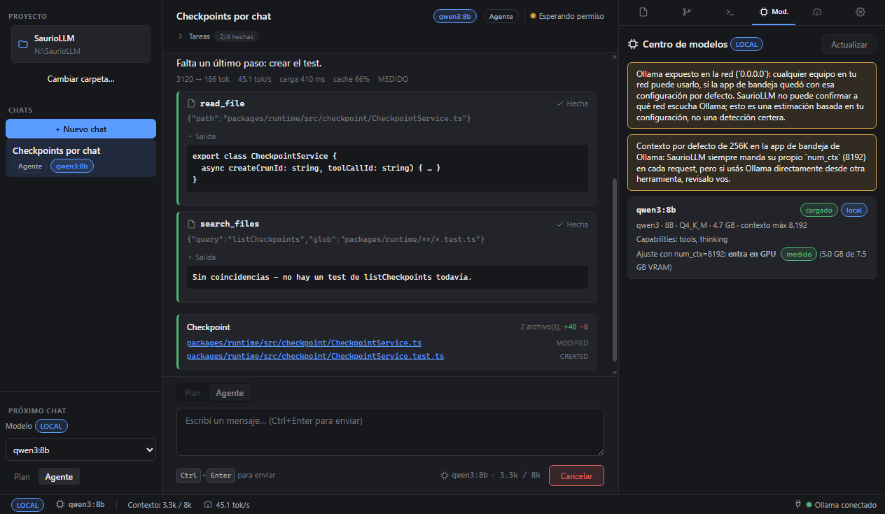

# SaurioLLM

SaurioLLM es un asistente de código estilo "agente" para Windows: una app de escritorio (Electron +
React) que lee y edita archivos de tu proyecto, corre comandos en una terminal integrada y responde en
un chat, usando un modelo de lenguaje local (con [Ollama](https://ollama.com/), gratis y privado) o un
proveedor por API (OpenAI-compatible o Anthropic) si preferís no correr modelos en tu máquina.


## ¿Ya tenés el instalador o querés bajarlo?

- **Descargar y probar la app:** guía completa en [`docs/INSTALAR.md`](docs/INSTALAR.md) — bajar el
  instalador desde [Releases](../../releases), qué hacer con el aviso de Windows SmartScreen (el
  instalador no está firmado digitalmente: es un proyecto sin certificado de firma de código pago, no
  significa que sea inseguro), y primer arranque.
- **Usar la app día a día** (modos plan/agent, permisos, checkpoints, Centro de modelos, etc.):
  [`docs/MANUAL.md`](docs/MANUAL.md).
- **Arquitectura completa** (decisiones, estructura de carpetas, estado real de la implementación):
  [`docs/architecture/`](docs/architecture/), especialmente
  [`docs/architecture/16-estado-de-implementacion.md`](docs/architecture/16-estado-de-implementacion.md).

## Requisitos para usar la app

- Windows 11 (target principal de esta versión).
- Para modelos locales (gratis, privado): [Ollama](https://ollama.com/download) instalado y corriendo.
- Para modelos por API en vez de locales: una clave de API de un proveedor compatible con OpenAI o con
  Anthropic (con costo según el proveedor).

Más detalle de requisitos, espacio en disco e instalación paso a paso en
[`docs/INSTALAR.md`](docs/INSTALAR.md).

## Capturas

| | |
|---|---|
|  |  |
| Permisos: la app pide confirmación antes de acciones sensibles | Centro de modelos: instalados, explorar catálogo y descargas |

Más capturas (estado vacío, panel de rendimiento, asistente de primer arranque) en
[`docs/MANUAL.md`](docs/MANUAL.md#8-capturas).

---

## Desarrolladores

Monorepo pnpm (electron-vite 5 + React 19 + TypeScript). Para compilar el proyecto vos mismo en vez de
usar el instalador de Releases:

### Requisitos

- Node >= 24.14 (probado con 24.14.1 / con el 24.21.0 que trae embebido Electron 44.4.2).
- pnpm 10 (probado con 10.33.0).
- Windows 11 (target principal; sin toolchain C++ instalado — ver "Nativos" abajo).

### Scripts

```bash
pnpm install             # ver nota de "Nativos" si termina en exit distinto de 0
pnpm dev                 # electron-vite dev con hot-reload de main/preload/renderer
pnpm typecheck            # tsc --build sobre todas las project references
pnpm test                 # vitest run en packages/runtime, packages/repomap y apps/desktop
pnpm lint                 # eslint . (config flat en eslint.config.mjs)
pnpm build                # electron-vite build (main/preload/renderer, sin empaquetar)
pnpm --filter @saurio/desktop run build:installer
                          # electron-vite build + electron-builder: genera apps/desktop/release/
                          # (carpeta desempaquetada win-unpacked/ + instalador NSIS "SaurioLLM Setup
                          # <versión>.exe"); usar "-- --dir" al final para generar SOLO la carpeta
                          # desempaquetada, sin el instalador.
```

También hay dos scripts `.cmd` en la raíz pensados para probar la app con doble clic sin usar la
terminal: `SaurioLLM.cmd` (arranque normal, `pnpm dev`) y `SaurioLLM-build.cmd` (genera la carpeta
desempaquetada). Ver [`docs/MANUAL.md`](docs/MANUAL.md) para el detalle de qué hace cada uno.

### Nativos (better-sqlite3, node-pty, electron)

Esta máquina de desarrollo no tiene el toolset MSVC de Visual Studio instalado. Por eso:

- `better-sqlite3` **no** está en `pnpm.onlyBuiltDependencies` del `package.json` raíz a propósito: trae
  su prebuild N-API bundleado (`prebuilds/win32-x64.node`) y funciona sin compilar; si se agrega a
  `onlyBuiltDependencies`, pnpm intenta `node-gyp rebuild` y falla por falta de MSVC aunque el módulo
  funcione igual.
- Cada `pnpm install`/`pnpm add` puede borrar `node_modules/electron/dist`. El script
  `scripts/ensure-electron-dist.mjs` corre en `postinstall` y lo restaura automáticamente
  (`node node_modules/electron/install.js`) si falta.
- `pnpm install` puede terminar en código de salida distinto de 0 por un lifecycle script fallido aunque
  `node_modules` quede utilizable: verificar siempre con un `require()`/import real, no solo el exit code.
- `electron-builder.yml` tiene `npmRebuild: false`: los prebuilds de better-sqlite3 y node-pty ya
  funcionan con el ABI de Electron sin recompilar, y sin MSVC un rebuild forzado rompería el empaquetado.

### Grammars de repo map

`@vscode/tree-sitter-wasm` (no `tree-sitter-wasms`, incompatible con `web-tree-sitter` 0.27 por falta de
`dylink.0`). Los `.wasm` de TypeScript, TSX, JavaScript y Python viven en `resources/grammars/`
(atribución de licencia de las queries en `resources/grammars/NOTICE`).

### Terminal

Shell por defecto: `powershell.exe` (Windows PowerShell 5.1). `pwsh.exe` (PowerShell 7) se usa si está
instalado.

### Empaquetado (electron-builder)

`electron-builder.yml` se invoca siempre desde `apps/desktop` (con
`pnpm --filter @saurio/desktop run build:installer`, que corre `electron-builder` con
`--config ../../electron-builder.yml`): todas las rutas de ese archivo (`files`, `extraResources.from`,
`directories.buildResources`) son relativas a `apps/desktop`, no a la raíz del repo — ver los
comentarios en el propio `electron-builder.yml` para el detalle de por qué `model-catalog.json`,
`prompts/` y `grammars/` usan cada uno una convención de ruta empaquetada distinta.

## Licencia

[MIT](LICENSE) © 2026 Sauri0. El catálogo de queries de tree-sitter en `resources/grammars/` incluye
código derivado de [Aider](https://github.com/Aider-AI/aider) (Apache-2.0) — ver
`resources/grammars/NOTICE`.
