# Manual de uso — SaurioLLM (MVP)

Guía simple para probar la app. Si algo no funciona como dice acá, es información útil:
anotalo (ver la sección "Cómo reportar un problema" al final).

## 1. Requisitos

- **Windows 11** (target principal de esta versión).
- **Node.js >= 24.14** (probado con 24.14.1 y con el 24.21.0 que trae embebido Electron 44.4.2).
- **pnpm 10** (probado con 10.33.0).
- **Ollama** corriendo en `http://127.0.0.1:11434`, con estos dos modelos instalados:
  - `qwen3:8b` — modelo recomendado, usa tool calling nativo.
  - `qwen2.5-coder:7b` — modelo alternativo, usa tools "por texto" (transporte distinto, ver más abajo).
  - Instalalos con `ollama pull qwen3:8b` y `ollama pull qwen2.5-coder:7b` si todavía no los tenés.
- Dependencias del repo ya instaladas (`pnpm install` en la raíz del monorepo).

No hace falta configurar nada de Ollama a mano: los scripts de arranque lo detectan solos.

## 2. Cómo abrir la app

Hay dos scripts `.cmd` en la raíz del repo (`N:\SaurioLLM`). Se abren con doble clic.

- **`SaurioLLM.cmd`** — arranque normal para probar la app:
  1. Chequea si Ollama responde en `127.0.0.1:11434`.
  2. Si no responde, intenta levantarlo solo con `ollama serve` en segundo plano y espera hasta que
     conteste (hasta ~30 segundos).
  3. Corre `pnpm dev`, que compila y abre la ventana de SaurioLLM.
  4. Para cerrar todo: cerrá la ventana de la app y después la consola (o `Ctrl+C` en la consola).

- **`SaurioLLM-build.cmd`** — genera una versión empaquetada (no hace falta para probar la app día a
  día, solo si querés una carpeta "instalable" sin correr `pnpm dev`):
  1. `pnpm build` (compila main/preload/renderer).
  2. `pnpm --filter @saurio/desktop run build:installer -- --dir` (arma la carpeta desempaquetada con
     electron-builder en `apps/desktop/release/win-unpacked/`, sin generar el instalador `.exe` de
     NSIS — solo el ejecutable suelto, más rápido para probar).
  3. Al terminar, el ejecutable queda en `apps\desktop\release\win-unpacked\SaurioLLM.exe`: se puede
     abrir con doble clic como cualquier `.exe` de Windows.

  Para generar además el instalador NSIS (`SaurioLLM-Setup-<versión>.exe`, con asistente de
  instalación/desinstalación), corré `pnpm --filter @saurio/desktop run build:installer` (sin
  `-- --dir`) — deja el instalador en `apps/desktop/release/`, junto a la misma carpeta
  `win-unpacked/`.

  **Verificado de punta a punta en esta versión** (antes esta sección decía "este paso falla": el
  bug real era `electron-builder.yml` armando mal las rutas relativas al `cwd` de `apps/desktop/`,
  ya corregido en una sesión anterior a esta nota — lo que quedaba roto era la propia documentación).
  `apps\desktop\release\win-unpacked\SaurioLLM.exe` abre, dibuja la interfaz completa (verificado con
  una captura real, `docs/capturas/smoke-packaged-build.png`) y responde IPC contra Ollama real
  (`app:ping`/`models:list` con los modelos instalados en este equipo). Las grammars de tree-sitter
  (resaltado/repo map) y las queries de repo map viajan junto al ejecutable en
  `resources/grammars/` y `resources/repomap-queries/` — no dentro del `.asar` (es de solo lectura).

## 3. Primer uso, paso a paso

1. **Abrir una carpeta de proyecto.** Al abrir la app por primera vez, elegí la carpeta del proyecto
   que querés que SaurioLLM edite (un repo de código). Solo se puede tener **un proyecto abierto a la
   vez** en esta versión.
2. **Elegir el modelo.** En el selector de modelo del chat, elegí `qwen3:8b` (recomendado: tool calling
   nativo, es el que se probó de punta a punta) o `qwen2.5-coder:7b` (tools por texto, transporte
   distinto y menos ejercitado en pruebas reales).
3. **Elegir el modo:**
   - **Modo `plan`**: el modelo puede leer archivos y proponer un plan, pero no edita nada. Útil para
     pedirle que entienda el proyecto o describa un cambio antes de tocarlo.
   - **Modo `agent`**: el modelo puede editar archivos, crear/borrar archivos, correr comandos, etc.
     (según el preset de permisos activo).
4. **Pedir un cambio.** Escribí el pedido en el chat (por ejemplo: "arreglá el bug de la función X" o
   "agregá un endpoint que haga Y"). El modelo va a ir respondiendo en streaming.
5. **Ver las tarjetas de herramienta ("tool cards").** Cada vez que el modelo usa una herramienta
   (leer un archivo, editarlo, correr un comando, buscar código) aparece una tarjeta en el chat con el
   nombre de la tool, sus argumentos y el resultado. En modo `agent`, las tools que modifican archivos
   (`edit_file`, `write_file`, `delete_file`) generan además un **checkpoint** automático antes de
   aplicar el cambio.
6. **Permisos.** El preset por defecto es `balanced`, que en esta versión tiene `write = allow` dentro
   de la carpeta del proyecto: el modelo puede escribir archivos sin pedir confirmación cada vez.
   Comandos marcados como críticos sí van a mostrar una tarjeta de permiso pidiendo que confirmes antes
   de ejecutarlos. **El flujo de permiso en modo "preguntar siempre" (`ask`) no se probó todavía de
   punta a punta contra un modelo real en esta versión** — si lo activás y algo se comporta raro,
   es justamente lo que falta validar.
7. **Revisar el diff.** Desde la tarjeta de checkpoint (o el panel de archivos) podés ver el diff
   exacto de lo que cambió (`+N -M` líneas) antes o después de que se haya aplicado.
8. **Deshacer (revert).** Cada checkpoint se puede revertir individualmente: el archivo vuelve
   exactamente a como estaba antes de esa edición puntual (comparación probada byte a byte en las
   pruebas de esta versión).
9. **Terminal.** Hay un panel de terminal integrado (usa PowerShell de Windows por defecto, o `pwsh`
   si está instalado) para correr comandos vos mismo, en paralelo a lo que hace el agente.
10. **Centro de modelos.** Tres pestañas: "Instalados" (modelos detectados en vivo desde
    `127.0.0.1:11434`, con capabilities y ajuste estimado de VRAM), "Explorar" (catálogo curado,
    descargar/borrar modelos) y "Descargas" (progreso de la sesión actual). Ver §4 para el detalle.
11. **Panel de rendimiento.** CPU/RAM/GPU/VRAM en vivo (con gráficos de los últimos ~10 minutos
    mientras el panel está abierto), tokens/segundo de las respuestas del modelo, y una sección de
    diagnósticos con acciones sugeridas.

## 4. Qué está y qué no está en esta versión

### Sí está (probado de punta a punta contra Ollama real, ver `docs/architecture/16-estado-de-implementacion.md` §6)

- Listar modelos reales de Ollama y elegir uno.
- Correr un chat en modo `plan` hasta terminar (`completed`), con tool calls de lectura reales
  (`list_files`, `read_file`).
- Correr un chat en modo `agent` que edita un archivo real (`edit_file`), con checkpoint, diff y
  métricas de tokens/segundo.
- Ver el diff de un checkpoint.
- Revertir un checkpoint (el archivo vuelve exacto a su contenido original).
- Cerrar la app y volver a abrirla: el historial de chats, mensajes, tool calls y checkpoints se
  conserva (base SQLite persistente en `%APPDATA%\SaurioLLM`).

### Nuevo en esta pasada (integración parcial de escritorio)

- **Panel de archivos real**: `files:tree`/`files:read` ya existen (antes degradaba con un aviso).
  Árbol perezoso por carpeta (cada clic en una carpeta pide sus hijos, nunca el repo entero de una),
  `fs.watch` marca "modificado externamente" en vivo, y seleccionar un archivo lo abre en un visor de
  solo lectura con CodeMirror (cargado en un chunk aparte, no infla el bundle inicial).
- **Carpeta de modelos detectada**: el Centro de modelos ahora muestra la carpeta `OLLAMA_MODELS`
  detectada (variable de usuario/máquina o default), si está validada contra los manifests instalados,
  y el espacio libre/total del disco (`fs.statfs`). Los avisos de modo attach (exposición en red,
  contexto 256K de la app de bandeja) salen del mismo canal, en modo lectura, sin ningún botón que
  cambie configuración de Ollama.
- **Cambiar modelo/modo de un chat ya creado** desde selectores en la cabecera del chat
  (`chat:setModel`/`chat:setMode`); no afecta un run en curso, solo el próximo turno.
- **Terminal con varias pestañas** y puerto de datos real (antes había una nota de que el preload
  exponía un stub; ya no es así — cada pestaña es una sesión `node-pty` propia).
- **Un solo proyecto abierto a la vez, con cancelación real**: abrir otro proyecto cancela los runs
  que hubieran quedado vivos del proyecto anterior.
- **Code-splitting**: CodeMirror y xterm.js salen del bundle inicial del renderer (`FileViewer` y
  `TerminalPanel` se cargan con `React.lazy` recién cuando se usan).

### Nuevo en esta pasada (Centro de modelos v0.2/v0.3, Panel de rendimiento v0.2, Ajustes, onboarding)

- **Descargar/borrar modelos desde la app** (`DownloadManager`, doc 13 §5): el Centro de modelos
  ahora tiene pestañas **Instalados / Explorar / Descargas**. "Explorar" muestra el catálogo curado
  (`resources/model-catalog.json`, 16 modelos con tamaño verificado contra el registry real de
  Ollama) con filtro por uso (programación/conversación/análisis/visión), botón "Descargar" con
  progreso en vivo (velocidad, ETA, cancelación) y "Eliminar" con confirmación mostrando los GB a
  liberar (hace `unload` antes si el modelo está cargado, y se bloquea si el scheduler lo tiene en
  cola). Probado de punta a punta contra Ollama real: se descargó y volvió a borrar `all-minilm`
  (~46 MB) con progreso real medido. **Limitación conocida**: si no hay espacio suficiente
  (`checkSpace`, margen de 2 GiB), el pull se rechaza con un error antes de crear ningún registro —
  no queda un estado `insufficient_space` visible en una tabla `downloads` persistida, porque esa
  tabla (ya migrada) no admite ese valor en su columna `status` y ampliar el `CHECK` es una migración
  de `packages/runtime/src/persistence` (zona de otro agente en esta sesión). El historial de
  "Descargas" tampoco sobrevive a un reinicio de la app todavía (vive en memoria del proceso).
- **Recomendaciones de modelos según tu hardware** (`RecommendationEngine`, doc 13 §8): se usa en el
  asistente de primer arranque (ver más abajo) para sugerir modelos que entran en tu GPU. La fórmula
  de "entra/no entra" para un modelo **todavía no instalado** es más simple que la de un modelo ya
  instalado (no tiene la arquitectura exacta hasta que `/api/show` responde) — está marcada
  `estimado` siempre y documentada como aproximación en el código.
- **Panel de rendimiento con muestreo continuo** (`MetricsTicker`, doc 14 §6/§8): mientras el panel
  está abierto (o hay una tarea real corriendo en el scheduler), CPU/RAM/GPU/VRAM/temperatura/potencia
  se miden cada 2 s, se ven en gráficos de línea simples (SVG propio, sin librería) de los últimos
  ~10 minutos, y se agregan por minuto en la tabla `metrics_minute` con retención de 30 días. Sección
  nueva de "Diagnósticos" (poca VRAM libre, cola larga del scheduler, offload a CPU, Ollama caído,
  contexto no coincidente) con la evidencia medida y una acción sugerida — nunca cambia nada solo.
- **Ajustes nuevos**: toggle de mitigación de GPU (antes solo se podía tocar editando
  `settings.local.json` a mano o con la variable `SAURIO_GPU=1`; requiere reiniciar la app para que
  el cambio tenga efecto) y `num_ctx` por defecto por modelo, editable por modelo instalado —
  alimenta el ajuste estimado que se ve en "Instalados" **y** (desde la pasada de Proveedores/API, ver
  abajo) el `num_ctx` real que un run manda al modelo.
- **Asistente de primer arranque**: se muestra una sola vez. Si no detecta Ollama corriendo, ofrece
  "Modelos en mi PC" (abre `https://ollama.com/download` en tu navegador tras pedir confirmación
  explícita — SaurioLLM no instala nada) o "Tengo una clave de API" (te lleva a Ajustes > Proveedores).
  Si Ollama ya está corriendo, recomienda modelos para programar en tu equipo. Se puede reabrir desde
  Ajustes ("Volver a ver el asistente de primer arranque").

### Nuevo en esta pasada (Proveedores/API, frontera local-nube)

- **Ajustes > Proveedores es real**: agregar un proveedor (Ollama attach, OpenAI, OpenRouter,
  Anthropic u "OpenAI-compatible personalizado" — LM Studio, llama.cpp server, vLLM, Groq...), pegar
  su clave de API (se guarda cifrada con `safeStorage` de Electron; nunca se ve de nuevo, solo
  "clave configurada: sí" + los últimos 4 caracteres), "Probar conexión" (health + listado de modelos
  reales), habilitar/deshabilitar y borrar. Los modelos de todos los proveedores habilitados aparecen
  juntos en `models:list`, cada uno con su localidad real.
- **Selector de modelo agrupado por proveedor**, en la barra lateral (próximo chat) y en la cabecera
  del chat activo, con badge **LOCAL** / **LAN** / **NUBE** según de dónde viene cada modelo.
- **Frontera local/nube**: elegir un modelo NUBE para un chat (nuevo o ya creado) pide una confirmación
  explícita la primera vez por proyecto ("el contenido de este chat va a salir de tu PC hacia
  \<proveedor\>"); un ajuste global "Solo local" (Ajustes > Localidad) bloquea cualquier modelo no
  local aunque ya hubiera consentimiento. Nunca hay fallback automático a un modelo distinto del
  elegido. Cada llamada no local queda registrada en `audit_log`. El badge NUBE se ve en la cabecera
  del chat y junto a cada mensaje del agente mientras el chat use un modelo no local — limitación
  conocida: el badge por mensaje refleja el modelo **vigente** del chat, no necesariamente el que
  generó ese mensaje puntual si el chat cambió de modelo en el medio (no se persiste esa asociación
  por mensaje todavía).
- **Tokens de entrada/salida bajo cada mensaje**, incluso después de reabrir la app (antes solo se
  veían durante la sesión en la que se generaron). El costo en moneda siempre aparece como "no
  disponible": ningún proveedor del MVP (Ollama/OpenAI-compatible/Anthropic) lo informa.
- **`num_ctx` por defecto por modelo (Ajustes) ya llega al run real**, y el tope automático contra el
  `contextMax` real del modelo (`/api/show` o `/v1/models`, según el proveedor) también está
  conectado en la app (antes solo se probaba con `eval/harness.ts`, fuera de la app real).
- **Reanudar un permiso pendiente tras reiniciar la app**: si cerrás la app con un run esperando que
  contestes un permiso, al reabrir la tarjeta de permiso vuelve a aparecer sola (antes solo
  funcionaba si la app seguía viva).
- **Historial de Descargas persistido**: la pestaña "Descargas" del Centro de modelos ahora también
  muestra descargas de una sesión anterior (antes solo las de la sesión actual, en memoria).
- Probado de punta a punta contra OpenRouter real (agregar proveedor, probar conexión, listar
  modelos, un chat corto con un modelo gratuito, verificar el badge NUBE y el registro en
  `audit_log`) — ver `apps/desktop/src/main/host/createRuntime.providers.e2e.test.ts` (se salta si
  no hay `OPENROUTER_API_KEY` en el entorno).

### Todavía no está, o está a medias (conocido, documentado en el doc 16 §3 y §4)

- **Perfiles de configuración** — quedan para una versión futura.
- **Limpieza de estilos inline**: se hizo en las pantallas tocadas en las pasadas de diseño; varios
  otros paneles (chat, diff, archivos, terminal, sidebar, ErrorBoundary) todavía tienen
  `style={{...}}` sueltos.
- **El indexador del repo (repo map) corre en el mismo proceso** que el resto de la app (no en un
  proceso aparte todavía), así que un repo muy grande puede notarse en el uso de CPU/memoria del
  proceso principal.
- **`ripgrep`** no está en el PATH de este equipo de desarrollo; `search_code` y el repo map tienen un
  fallback manual cuando no lo encuentran, pero conviene verificar en tu equipo si `rg` está disponible
  para la búsqueda más rápida.
- **El estado "compactando contexto" nunca se muestra** en la UI aunque el motor de contexto sí
  compacta internamente cuando hace falta.
- **El badge NUBE por mensaje no es históricamente exacto** si un chat cambió de modelo local↔nube en
  el medio (ver arriba, "Nuevo en esta pasada (Proveedores/API...)").
- **El bundle del renderer pesa ~2.2 MB** (sin optimizar todavía para producción).
- **El flujo de permiso "preguntar siempre" (`ask`)** no se ejerció contra Ollama real en las pruebas
  de esta versión (el preset por defecto tiene `write = allow`, así que nunca se disparó la tarjeta de
  permiso durante las pruebas).
- **El modo `plan` no dejó tareas guardadas** en las pruebas: el modelo describe el plan en texto pero,
  con el prompt actual, no siempre llama a la herramienta que guarda tareas — no se determinó todavía
  si esto es lo esperado o una mejora pendiente del prompt.
- **Con modelos chicos (8B) el agente puede trabarse** reintentando una edición ambigua sin
  corregirse, hasta que el detector de bucles corta el run — es un comportamiento del modelo, no un
  error de la app, pero puede pasar. Si ves que el mismo `edit_file` se repite varias veces sin
  avanzar, es justamente esto: cancelá el run y pedí el cambio con más contexto (indicando la línea o
  función exacta).

### Carga de modelo, selector de modelo y pantalla de inicio (esta sesión)

Cierra los bloqueos reportados por un usuario real que instaló la v0.1 en una notebook con iGPU
Intel Arc (Vulkan, sin `nvidia-smi`) y solo `gemma4:26b/31b` instalados:

- **El modelo no entra en la memoria del equipo (`oom_load`)**: mientras Ollama carga el modelo (puede
  tardar más de un minuto) el chat muestra "Cargando modelo… mm:ss" con un botón Cancelar, en vez de
  quedar en un "Generando…" sin explicación. Si el provider devuelve un error real de falta de
  memoria, la app reintenta sola con menos capas offloadeadas a GPU (~75% → ~50% → 0% = solo CPU, más
  lento) antes de rendirse; cada intento queda visible como un ajuste automático. Si ni con CPU entra,
  aparece una tarjeta con el mensaje real del error y dos acciones: "Elegir otro modelo" (abre el
  Centro de modelos) y "Reintentar con menos capas en GPU" (arranca de nuevo la misma escalera —
  útil si mientras tanto se liberó memoria).
- **Selector de modelo con estados explícitos**: en vez de un `<select>` vacío o engañoso, ahora dice
  explícitamente "Iniciando motor local…", "Ollama no está corriendo" (con botón "Iniciar") o "No hay
  modelos instalados" (con botón "Abrir Modelos"). El modelo por defecto de un chat nuevo prioriza el
  último usado en este proyecto (si sigue instalado), después el mejor clasificado por la escala de
  seis niveles para tu hardware, y por último el primer modelo instalado. Nunca se permite enviar un
  mensaje a un modelo local que ya no está instalado: se avisa antes de intentarlo.
- **Pantalla de inicio** cuando no hay ningún proyecto o chat abierto: estado del motor local y de los
  modelos instalados, y tres accesos grandes — Abrir/cambiar carpeta, Elegir o instalar un modelo,
  Nuevo chat — más un enlace a "Configurar proveedores" (API de nube). Rediseño de navegación (sección
  8): "Inicio" es ahora una sección propia de la barra de navegación izquierda, no un estado dentro del
  chat.
- **Log de `ollama serve`**: cuando la app arranca Ollama por su cuenta, su stdout/stderr queda en
  `%APPDATA%\SaurioLLM\logs\ollama-serve.log`; al cerrar la app, se detiene SOLO ese proceso (nunca uno
  que ya estuviera corriendo o que hayas arrancado vos). En equipos sin `nvidia-smi` (iGPU Intel/AMD),
  la línea real `msg="inference compute"` que Ollama loguea por dispositivo ahora alimenta el
  detector de hardware (o, en modo attach, se lee de `%LOCALAPPDATA%\Ollama\server.log` en solo
  lectura).
- **Pendiente**: el intento fallido de cargar un modelo (`oom_load`) todavía no queda registrado en la
  tabla de modelos probados del Centro de modelos ("probado: no entra en este equipo") — el mecanismo
  para eso vive en `packages/runtime/src/models/**`, zona de otra sesión de trabajo en paralelo; ver
  `docs/architecture/16-estado-de-implementacion.md` para el detalle.

## 5. Qué NO deshace el revert

Revertir un checkpoint deshace **el contenido del archivo o archivos que ese checkpoint tocó**, byte a
byte, hasta el estado justo antes de esa edición puntual. No deshace:

- **Comandos de terminal** que el modelo (o vos) hayan corrido — un `npm install`, un script que borró
  algo fuera del control de checkpoints, etc. Los checkpoints cubren archivos editados por las tools
  del agente, no efectos secundarios de comandos arbitrarios.
- **Cambios hechos después** del checkpoint sobre el mismo archivo por otra edición posterior (revertís
  ese checkpoint puntual, no "todo lo que pasó desde que abriste la app").
- **Archivos creados por otras tools sin pasar por el sistema de checkpoints** (fuera del flujo normal
  de `edit_file`/`write_file`/`delete_file`).
- **El historial del chat**: revertir un checkpoint no borra los mensajes ni las tarjetas de tool del
  chat, solo restaura el contenido del archivo en disco.
- **Cambios en la base de datos de SaurioLLM** (proyectos, chats, configuración): eso no tiene revert,
  solo los archivos del proyecto.

## 6. Cómo reportar un problema

Si algo falla o se comporta raro, esto es lo que hace falta para poder investigarlo:

1. **Qué pediste** (el mensaje exacto o cerca) y **qué modelo/modo** estabas usando.
2. **Los logs de la app**: `%APPDATA%\SaurioLLM\logs\` (se abre pegando esa ruta en el explorador de
   Windows, o `Win+R` → `%APPDATA%\SaurioLLM\logs`).
3. **La base de datos**, si hace falta inspeccionar el historial: `%APPDATA%\SaurioLLM\saurio.db`
   (SQLite; se puede abrir con cualquier visor de SQLite, por ejemplo DB Browser for SQLite). No la
   edites a mano salvo que sepas lo que estás haciendo.
4. Si la ventana se cerró sola o no abrió: contá si la app venía de un `SaurioLLM.cmd` recién abierto o
   de una sesión larga, y si tu equipo tuvo antes problemas de GPU con Electron (ver más abajo).

### Nota sobre GPU

En el equipo donde se armó esta versión, Electron 44 falla al crear un contexto de GPU
("`ContextResult::kFatalFailure`") por cómo está virtualizada la GPU de esa máquina, y el renderer se
cae si no se desactiva la aceleración por hardware. Por eso la app **desactiva la aceleración de GPU
por defecto** al arrancar. Si en tu equipo la GPU funciona bien y preferís la aceleración activada,
podés desactivar esta mitigación de dos formas:

- Corriendo la app con la variable de entorno `SAURIO_GPU=1` (por ejemplo, en PowerShell:
  `$env:SAURIO_GPU=1; pnpm dev`), solo para esa sesión.
- O guardando `{"app.gpuMitigationDisabled": true}` en `%APPDATA%\SaurioLLM\settings.local.json` para
  que quede así siempre.

Si la ventana no abre o se cierra sola apenas arranca, probá primero **sin** tocar nada (la mitigación
ya está activa por defecto); si igual falla, es información valiosa para reportar tal cual.

## 7. Resultados medidos en tu equipo

Todo lo marcado `[COMPROBADO EN EQUIPO]` sale de mediciones reales hechas en este equipo
(RTX 3060 Ti 8 GiB, Ollama 0.34.1 en `127.0.0.1:11434`, 2026-09-18), no son estimaciones. Fuente
completa: `N:/saurio-smoke/RESULTADOS-ollama.md`.

- **`qwen3:8b`, num_ctx 8192**: entra 100% en GPU (5.76 GiB), **59–65 tok/s** de generación,
  recarga del modelo en 4.2–17.8 s según esté o no en caché de disco `[COMPROBADO EN EQUIPO]`.
  Tool calling nativo confirmado (`message.tool_calls` correcto) `[COMPROBADO EN EQUIPO]`.
- **`qwen3:8b`, num_ctx 16384**: ya no entra 100% en GPU en este equipo (offload ≈19.5%),
  **17–20 tok/s** `[COMPROBADO EN EQUIPO]` — más lento que a 8192 porque parte del modelo queda en
  CPU/RAM.
- **`qwen2.5-coder:7b`, num_ctx 8192**: entra 100% en GPU (4.78 GiB), **66–68 tok/s**
  `[COMPROBADO EN EQUIPO]`. Con el prompt usado en la medición, este modelo **no usó tool calling
  nativo** pese a declarar `tools:true`: devolvió el llamado a la tool como texto plano en vez del
  campo nativo `[COMPROBADO EN EQUIPO]` — por eso la app usa el transporte de tools "por texto" para
  este modelo (`TextToolProtocol`) en vez del nativo.
- **Recorrido de punta a punta contra Ollama real** (chat con `qwen3:8b`, modo `plan` seguido de modo
  `agent` arreglando un bug real, checkpoint, diff, revert, cerrar y reabrir la base): **6/6 pasos en
  verde** en tres corridas finales consecutivas, runs de 4.2–17 s según cuántas veces el modelo
  reintentó una edición, ~62–66 tok/s de generación medidos, sin tareas persistidas en modo `plan`
  (ver limitación arriba) `[COMPROBADO EN EQUIPO, eval/harness.ts]`.
- **Cambiar `num_ctx` de un modelo ya cargado siempre fuerza una recarga completa** (4.2–6.3 s medidos)
  y pierde el caché del prompt — evitalo si no hace falta `[COMPROBADO EN EQUIPO]`.
- **Cancelar una respuesta en curso** (abort) libera el modelo casi de inmediato (63–274 ms) con
  `qwen3:8b`/`qwen2.5-coder:7b` (100% en GPU) `[COMPROBADO EN EQUIPO]`.

Estos números van a variar según la GPU, la VRAM libre en el momento (otros programas usando la
tarjeta de video) y qué tan grande sea el proyecto que tengas abierto.

## 8. Capturas

Capturas reales de la UI, tomadas con la herramienta de verificación visual descripta en
`docs/architecture/01-arquitectura.md` §4.1 (`SAURIO_SMOKE_SHOT` + `SAURIO_SMOKE_STATE` +
`SAURIO_SMOKE_CLICK`, implementada en `apps/desktop/src/main/index.ts`): el proceso main espera a
que el renderer termine de dibujar, opcionalmente hace clic en algún selector (para navegar a una
sección o abrir una subpestaña antes de capturar), captura la ventana con `webContents.capturePage()`
y guarda el PNG — sin retoques manuales. El contenido de ejemplo (chat, tool calls, checkpoint,
tareas, permiso) sale de `apps/desktop/src/renderer/src/demo/demoState.ts`, que siembra los stores de
zustand para poder mostrar la UI con datos sin necesitar Ollama corriendo; varias capturas de esta
sección, en cambio, son contra Ollama real (se aclara en cada una).

### 8.1 Rediseño de navegación (feedback real: "todo junto a la derecha... muy compacto")

Un usuario real de la v0.2.0 reportó que el panel derecho angosto con siete pestañas abreviadas
("Arch.", "Diff", "Term.", "Mod.", "Ag.", "Rend.", "Ajus.") no le cerraba — "es compleja y difícil de
usar, muchas cosas muy compactas". El rediseño separa dos ideas que antes vivían juntas en ese panel:

- **Barra de navegación izquierda** (`layout/NavRail.tsx`), angosta pero con ícono + etiqueta completa
  siempre visible (nunca abreviada): Inicio, Chats, Modelos, Agentes, Rendimiento, Ajustes. Cada una es
  una sección a pantalla completa, con atajos `Ctrl+1`...`Ctrl+6`.
- **Panel contextual de la vista Chats** (`layout/RightPanel.tsx`, ahora reducido a esto): Archivos,
  Cambios (antes "Diff") y Terminal — lo único que de verdad acompaña a un chat puntual. Tiene nombre
  completo en las tres pestañas, ancho ajustable arrastrando su borde izquierdo y un botón para
  ocultarlo (queda una franja angosta con un ícono para volver a mostrarlo); arranca oculto por
  defecto en ventanas angostas (`stores/uiNavStore.ts`).

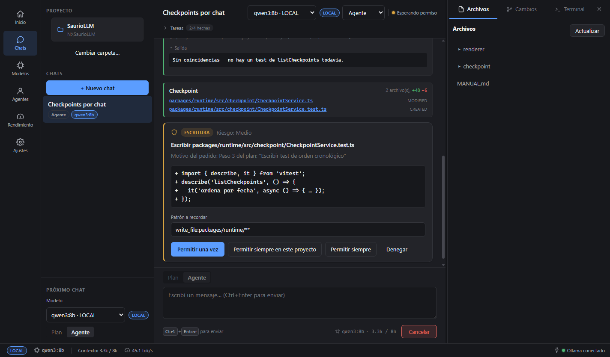

Chat con tool calls, checkpoint y tareas, más el panel contextual en "Archivos" con las tres pestañas
completas (nunca abreviadas) y su botón de cerrar (×) arriba a la derecha.

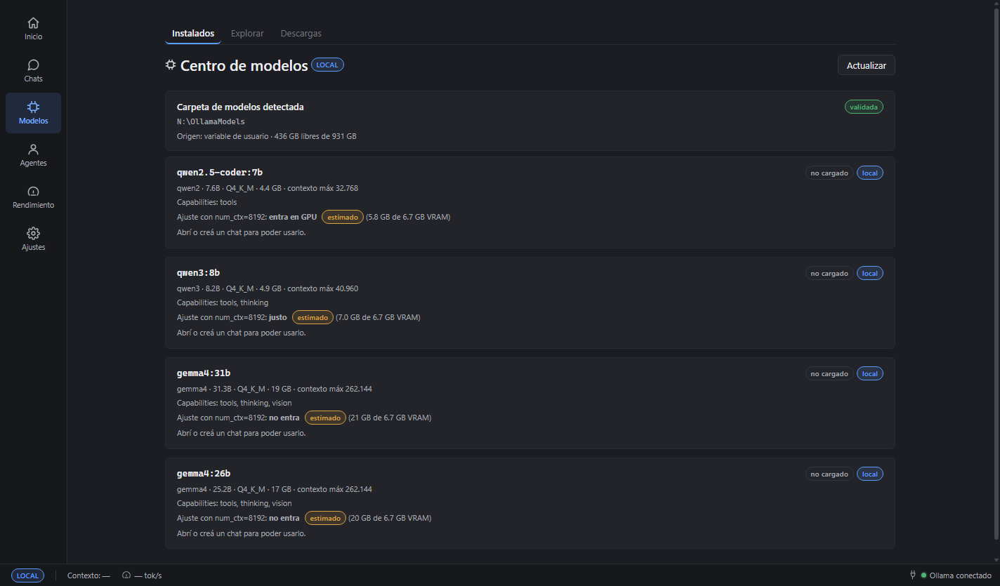
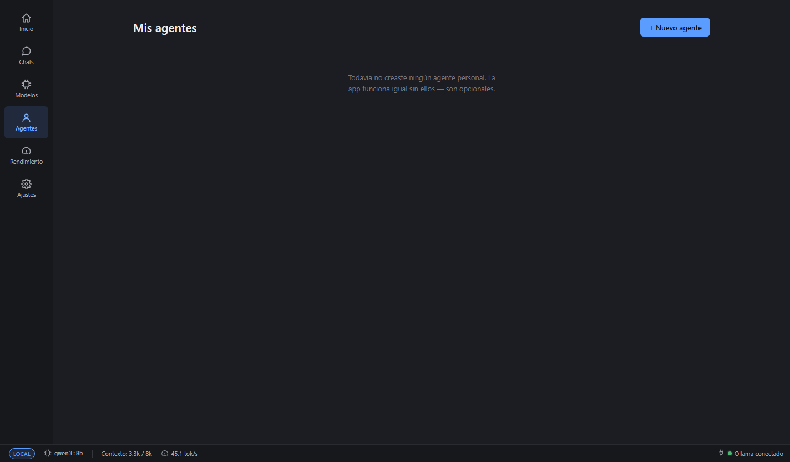
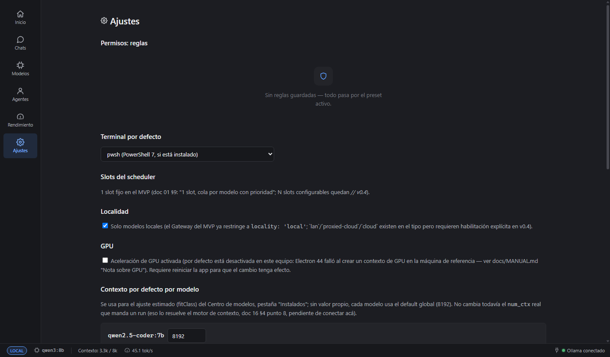

Modelos, Agentes, Rendimiento y Ajustes dejaron de competir por 380px: ahora usan todo el ancho
disponible, con su propio encabezado, tipografía base más grande (14-15px) y un máximo de ancho de
lectura (`layout/WideView.tsx`) para que las tarjetas no se estiren de borde a borde en pantallas
grandes. Los paneles en sí (`features/models/**`, `features/agents/**`, `features/perf/**`,
`features/settings/**`) no cambiaron de lógica — solo cambió cómo se montan.

"Inicio" es ahora una sección propia (antes era un estado dentro del centro de chat) y la vista por
defecto sin proyecto abierto. El asistente de primer arranque (modal) sigue apareciendo igual arriba
de cualquier sección — acá, detectando Ollama real y recomendando modelos para programar en este
equipo.

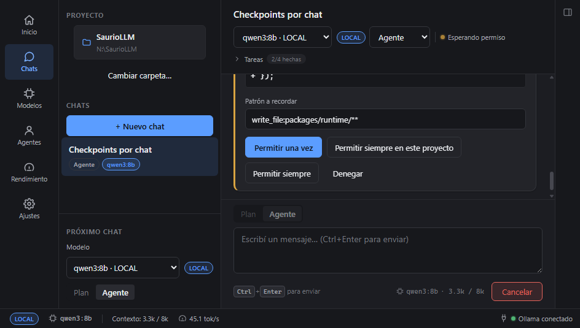
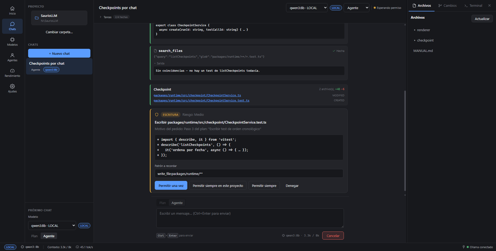

Responsivo desde 960×600 (mínimo de la ventana) hasta pantallas grandes: en 960×600 el panel
contextual arranca cerrado (se puede abrir a mano igual, con la barra lateral y el centro de chat
repartiéndose el resto del ancho sin scroll horizontal); en pantallas grandes las secciones anchas
mantienen su máximo de lectura y la vista Chats reparte el espacio extra en el centro de la
conversación.

**Límite conocido de esta sesión**: la pestaña "Rendimiento" no pudo capturarse con métricas reales
esta vez — otra sesión en paralelo dejó momentáneamente roto el canal `metrics:snapshot` en
`apps/desktop/src/main/**` (fuera de la zona de este encargo, que era `layout/**`/`App.tsx`/CSS). La
captura de más abajo (`smoke-perf-panel.png`) muestra igual el layout nuevo (título, aire, estado
vacío con guía "Medir ahora"), solo que sin datos medidos — no se inventaron números.

### Chat con tool calls, checkpoint y tareas

Barra de proyecto y chats a la izquierda, checklist de tareas fijo arriba del centro de chat, dos
tarjetas de tool call (una con salida colapsable abierta), tarjeta de checkpoint con archivos +48/−6,
árbol de archivos en el panel contextual y barra de estado inferior (LOCAL, modelo activo, contexto
usado, tok/s, estado de Ollama).

### Tarjeta de permiso

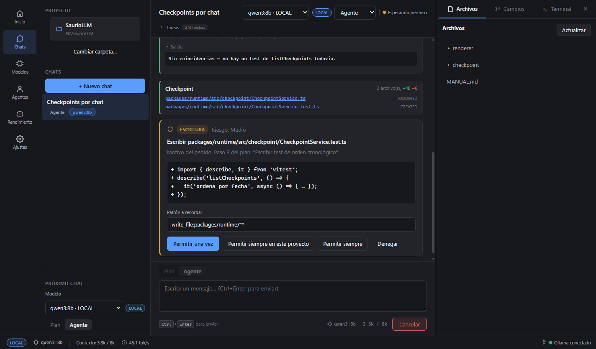

Permiso de escritura destacado con un borde de acento ámbar (no un rojo agresivo), categoría y riesgo,
motivo del pedido, preview del diff, patrón a recordar editable y jerarquía de botones clara
(Permitir una vez en azul primario, alternativas secundarias, Denegar como acción fantasma).

### Estado vacío (sin proyecto abierto)

Guía explícita en vez de una pantalla en blanco: sección "Inicio" con "Bienvenido a SaurioLLM" detrás,
y el asistente de primer arranque (contra Ollama real, corriendo en este ejemplo) recomendando
`qwen2.5-coder:1.5b`, `qwen2.5-coder:3b` y `qwen3:4b` para programar en este equipo. Ver
`capturas/07-motor-apagado.png` más abajo para el mismo estado con Ollama apagado.

### Centro de modelos — Instalados y Explorar (recapturado con la navegación nueva)

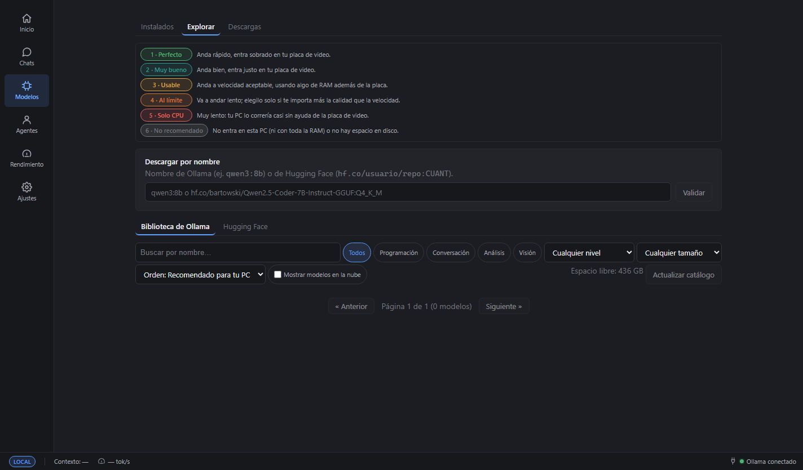

Capturas contra Ollama real (no modo demo), ya con la sección "Modelos" a pantalla completa en vez
del panel angosto de antes: "Instalados" muestra los 4 modelos reales de esta máquina con la carpeta
`N:\OllamaModels` detectada y "Abrí o creá un chat para poder usarlo" en cada uno (no hay ningún chat
activo en esta captura puntual, así que ninguno queda marcado "en uso en este chat" — ver más abajo);
"Explorar" muestra la leyenda de los seis niveles de la escala. El catálogo de Explorar salió vacío en
esta corrida puntual (0 modelos listados) porque esta máquina todavía no había sincronizado contra
`ollama.com/library` en esta carpeta de datos — no es un problema del rediseño de navegación.

### Centro de modelos — escala de seis niveles y usabilidad

Feedback real de un usuario que instaló la v0.1 ("no entiendo cómo instalar, seleccionar y saber si
tengo modelos") llevó a: badge "en uso en este chat" + botón "Usar en este chat" en Instalados;
banner "Ollama no está corriendo" con botón "Iniciar Ollama" (en vez de listas vacías sin
explicación); en Explorar, una leyenda fija en español simple de los seis niveles de la escala
("1 · Perfecto" ... "6 · No recomendado") con el badge y la explicación de una línea calculados
contra el hardware real de esta máquina en cada request, espacio libre en disco visible, y botón
"Usar este modelo" después de descargar. Ver `docs/architecture/16-estado-de-implementacion.md` §12
para el detalle técnico (`TierClassifier`, soporte de `HardwareProbe` para iGPU/memoria unificada).

### Centro de modelos — cobertura máxima del catálogo (sesión 2026-09-18, cierre)

Lo que quedaba pendiente arriba ya está: la pestaña Explorar ahora muestra la biblioteca COMPLETA de
`ollama.com/library` (240 familias reales, 858 variantes reales, sincronizadas en vivo la primera vez
que se abre — ver `docs/architecture/16-estado-de-implementacion.md` §12.6/§13 para el detalle
técnico), no solo las 16 entradas curadas a mano (esas siguen existiendo, pero ahora son la capa de
"uso sugerido/notas" que se fusiona por nombre con el resto de la biblioteca).

- **Búsqueda, filtros y orden**: texto libre, por uso, por nivel de la escala (1-6) y por tamaño
  (chico/mediano/grande); orden "recomendado para tu PC" (nivel ascendente, después tamaño), por
  nombre o por tamaño. Lista paginada de a 30 modelos por página.
- **"Actualizar catálogo"**: sincroniza de nuevo contra `ollama.com/library` (caché de 24 h en
  `userData`; sin conexión, usa la caché aunque esté vencida, y si nunca hubo caché, el snapshot
  incluido con la app — `resources/model-catalog.snapshot.json`, generado con
  `pnpm build:model-catalog`). La pestaña siempre dice de dónde salió el catálogo mostrado
  ("sincronizado ahora" / "en caché" / "incluido con la app, sin conexión").
- **Ficha lateral**: click en cualquier modelo abre sus variantes (tags) de esa familia, con un
  selector de contexto 4k/8k/16k/32k que recalcula el nivel de la escala en vivo para ese contexto.
- **Hugging Face**: pestaña separada para buscar modelos GGUF por texto, ver sus archivos por
  cuantización con tamaño real, y descargarlos (`hf.co/<usuario>/<repo>:<quant>`, el mismo formato que
  entiende Ollama de forma nativa).
- **"Descargar por nombre"**: campo libre siempre visible arriba de Explorar — valida el nombre
  (contra el registry de Ollama o contra `hf.co/...`) y muestra tamaño/espacio/nivel antes de
  descargar.

Verificado real esta sesión: descarga por nombre de `all-minilm` (46 MB, progreso real hasta ~67 MB/s)
y borrado, confirmados contra `/api/tags` real antes y después.

### Panel de rendimiento con muestreo continuo

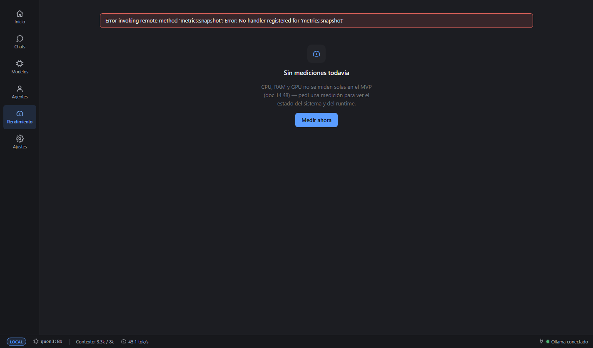

**Nota de esta sesión (rediseño de navegación)**: la captura anterior de esta sección mostraba
mediciones reales (CPU 9.6%, RAM 14 GB, GPU 16.0%, VRAM 6.9 GB...) con `qwen3:8b` cargado. No se pudo
volver a capturar así esta vez: otra sesión en paralelo dejó momentáneamente sin handler el canal
`metrics:snapshot` (`apps/desktop/src/main/**`, fuera de la zona de este encargo) y el panel muestra el
error de esa llamada en vez de datos. Lo que sí queda documentado acá es el layout nuevo — título
"Rendimiento" grande, más aire, estado vacío con guía y botón "Medir ahora" ocupando todo el ancho — y
el resto del texto de esta sección (qué mide, cuándo, límites) sigue describiendo el panel real, sin
cambios de comportamiento de `features/perf/**`.

### Asistente de primer arranque

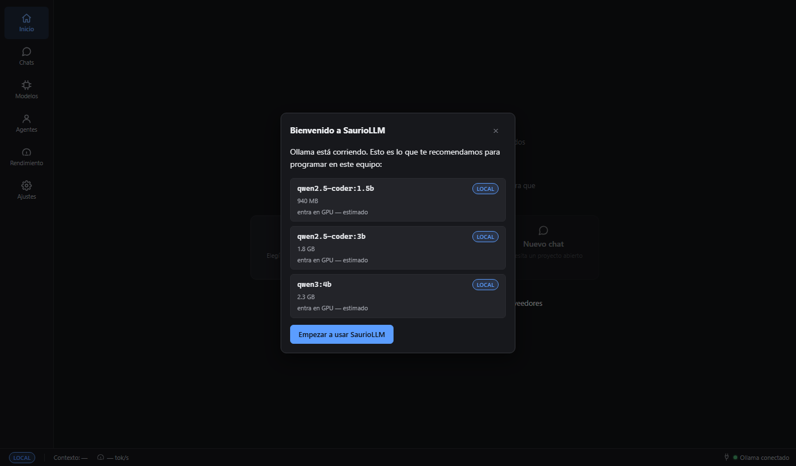

Con Ollama ya corriendo, el asistente recomienda `qwen2.5-coder:1.5b`, `qwen2.5-coder:3b` y
`qwen3:4b` para programar en este equipo (RecommendationEngine real, ordenados de menor a mayor
tamaño porque el objetivo por defecto es velocidad), cada uno con su badge LOCAL y "estimado". El
asistente se muestra igual que antes (modal encima de todo) — lo que cambió es lo que se ve detrás: la
sección "Inicio" nueva, con la barra de navegación a la izquierda.

### Ajustes > Proveedores

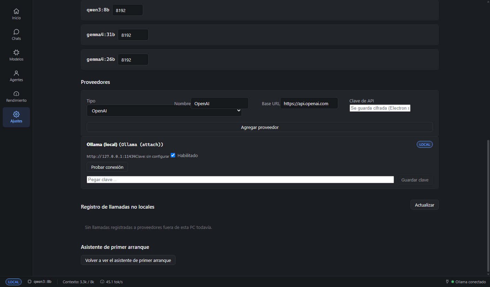

Formulario para agregar un proveedor (tipo, nombre, base URL, clave de API) y la lista de
proveedores configurados — acá, el Ollama local sembrado por defecto, con "Probar conexión" y el
campo para pegar/reemplazar la clave. "Ajustes" ya no es una pestaña de 380px: es una sección propia a
pantalla completa (`layout/WideView.tsx`), a la que se llega desde la barra de navegación izquierda o
con `Ctrl+6`.

### Tarjeta "el modelo no entró en la memoria" (oom_load)

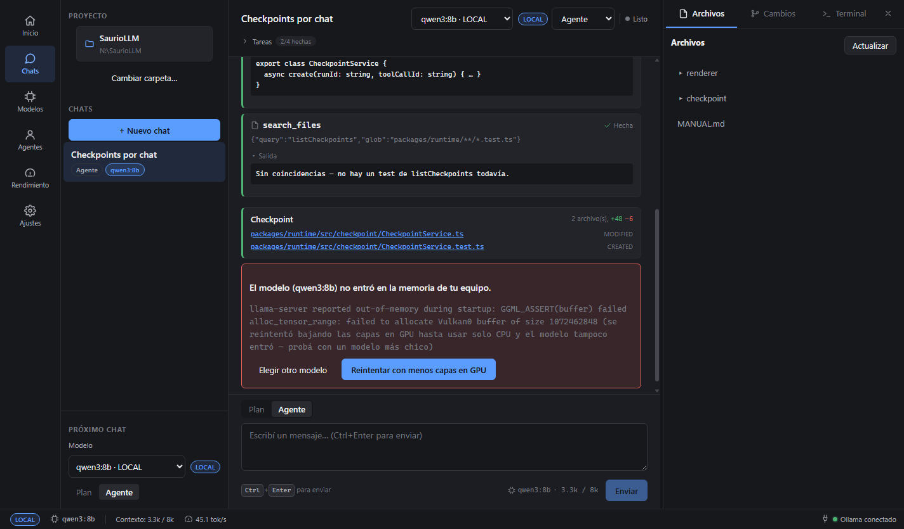

Cuando Ollama devuelve un error real de falta de memoria (aquí, el texto real reportado por un
usuario con iGPU Intel Arc/Vulkan: `GGML_ASSERT(buffer) failed alloc_tensor_range: failed to
allocate Vulkan0 buffer...`), `RunController` ya reintentó automáticamente bajando `numGpu`
(~75% → ~50% → 0 = solo CPU) antes de rendirse; la tarjeta ofrece "Elegir otro modelo" (ahora navega
directo a la sección "Modelos" a pantalla completa, verificado con un clic real en esta sesión) o
reintentar desde cero (útil si mientras tanto se liberó memoria). Capturada en modo demo
(`?demoState={"oomError":true}`, `apps/desktop/src/renderer/src/demo/demoState.ts`) para no
depender de una GPU real sin memoria; el panel contextual a la derecha (Archivos/Cambios/Terminal, ya
con nombre completo) es el mismo rediseño de la sección 8.1.

### Motor local apagado: pantalla de inicio, selector de modelo y barra de estado

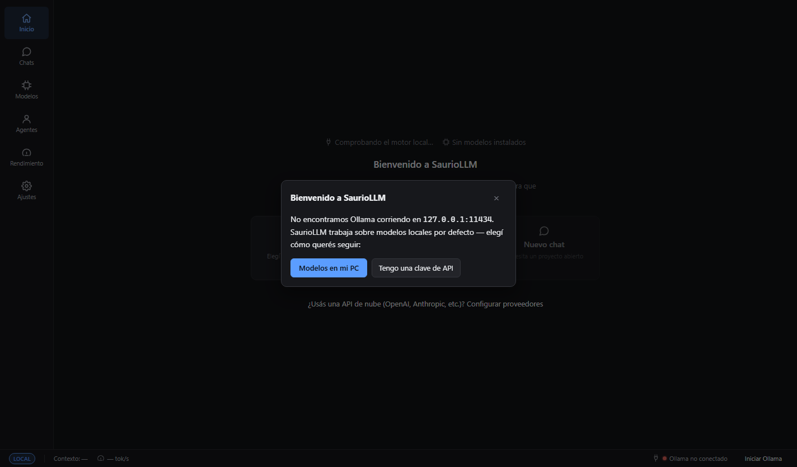

Capturada apuntando la app a un puerto vacío (`SAURIO_OLLAMA_URL=http://127.0.0.1:11999`, variable
solo para pruebas — simula "Ollama apagado" de verdad sin tocar ninguna instancia real de Ollama de
esta máquina, ver `apps/desktop/src/main/host/createRuntime.ts`). La sección "Inicio" muestra
"Bienvenido a SaurioLLM" en rojo detrás del asistente de primer arranque, que detecta lo mismo y
ofrece "Modelos en mi PC" (instalar Ollama) o "Tengo una clave de API"; la barra de estado inferior
muestra "Ollama no conectado" con el botón "Iniciar Ollama". "Modelos" y "Ajustes" ya no son accesos
al pie de una barra lateral: son secciones propias, siempre visibles en la barra de navegación
izquierda, con o sin proyecto abierto.

## 9. Usar modelos por API

Además de Ollama local, podés usar un modelo de OpenAI, OpenRouter, Anthropic o cualquier servidor
"OpenAI-compatible" (LM Studio, llama.cpp server, vLLM, Groq...) sin salir de la app.

### 9.1 Agregar un proveedor

1. Abrí **Ajustes** (ícono de engranaje en la barra de navegación izquierda) y bajá hasta
   **Proveedores**.
2. Elegí el **tipo**: OpenAI, OpenRouter, Anthropic, Ollama (attach — para otra instancia, por
   ejemplo en tu LAN) u "OpenAI-compatible personalizado" (para LM Studio/llama.cpp/vLLM/Groq/etc.,
   con base URL libre).
3. Completá el **nombre** (cómo lo vas a ver en el selector de modelo) y, si hace falta, la
   **base URL** — los tipos conocidos ya traen una por defecto.
4. Pegá tu **clave de API** (no hace falta para Ollama). Se guarda cifrada en tu equipo con
   `safeStorage` de Electron (DPAPI en Windows) — SaurioLLM nunca la guarda en texto plano, nunca la
   muestra de nuevo ni la manda a ningún lado salvo al proveedor elegido, y nunca la escribe en un
   log. Si tu sistema no tiene un backend de cifrado disponible, la app te avisa y no guarda nada.
5. Tocá **Agregar proveedor**. Después podés **Probar conexión** (confirma que la clave funciona y
   te dice cuántos modelos encontró), **habilitar/deshabilitar** sin borrar la configuración, o
   **borrar** el proveedor entero (menos Ollama, que siempre está disponible).

### 9.2 Elegir un modelo de un proveedor

En la barra lateral (para un chat nuevo) o en la cabecera del chat (para uno ya creado), el selector
de modelo agrupa las opciones por proveedor y muestra un badge junto a cada una:

- **LOCAL** — corre en tu PC (Ollama).
- **LAN** — corre en otra máquina de tu red.
- **NUBE** — corre en un servidor de terceros (OpenAI, OpenRouter, Anthropic, o cualquier
  "OpenAI-compatible" con una base URL pública).

### 9.3 La frontera local/nube

SaurioLLM nunca manda tu conversación a la nube sin que lo pidas explícitamente:

- La **primera vez** que elegís un modelo NUBE para un chat de un proyecto dado, la app te muestra
  un aviso — "el contenido de este chat va a salir de tu PC hacia \<proveedor\>" — y te pide
  confirmar. Si confirmás, no te vuelve a preguntar para ese proyecto (pero sí para uno nuevo).
- Si preferís que la app **nunca** use nada que no sea local, activá **Ajustes > Localidad > Solo
  modelos locales**: con eso prendido, ni siquiera se puede elegir un modelo LAN o NUBE, y la
  confirmación de arriba ni siquiera llega a mostrarse.
- La app **nunca** hace un fallback automático a otro modelo: si el que elegiste no está disponible,
  el run falla con un error claro, nunca sigue en silencio con otro proveedor.
- Cada llamada a un modelo no local queda registrada (proveedor, modelo, run) para que puedas
  auditar qué salió de tu PC y cuándo.
- Mientras un chat use un modelo no local, vas a ver el badge **NUBE** en la cabecera del chat y
  junto a los mensajes del agente.

### 9.4 Qué se ve de cada respuesta

Bajo cada mensaje del agente se muestran los tokens de entrada/salida, tokens por segundo (cuando el
proveedor los informa) y una etiqueta de calidad del dato (medido/estimado/no disponible). El
**costo en moneda siempre aparece como "no disponible"**: ningún proveedor del MVP (Ollama, ni
ningún "OpenAI-compatible", ni Anthropic) informa el costo de una respuesta — se muestra así en vez
de inventar un cálculo.

## 10. Actualizaciones automáticas

Resumen para quien ya tiene la app instalada (la explicación completa, pensada para quien todavía no
instaló, está en [`docs/INSTALAR.md`](INSTALAR.md) §5 — no se duplica acá).

- SaurioLLM busca una versión nueva sola al abrir y cada 6 horas mientras queda abierta, la descarga
  en segundo plano sin interrumpir el uso, y al terminar muestra un diálogo nativo ("Reiniciar ahora"
  / "Más tarde"). Con "Más tarde", se instala sola al cerrar la app.
- Si hay un run activo (modelo respondiendo, herramienta ejecutando) cuando termina de descargar, el
  aviso se pospone hasta que termine — nunca corta un run a mitad de camino.
- Errores de red al buscar/descargar quedan solo en `%APPDATA%\SaurioLLM\logs\updater.log`, sin
  ningún aviso — no afectan el resto de la app.
- Implementación: `apps/desktop/src/main/services/updater/` (`AutoUpdaterService` orquesta el flujo
  sobre `electron-updater`; `ActiveRunTracker` es la pieza que sabe si hay un run activo, escuchando
  los mismos `RunEvent` `run.state` que ya consume `RunEventBatcher`). `electron-builder.yml`
  (`publish: github`) es lo que hace que cada build genere `latest.yml` + `.blockmap` y empaquete
  `app-update.yml` dentro de la app — sin esos tres archivos en el Release de GitHub (ver
  `scripts/release-local.mjs`), no hay forma de que electron-updater encuentre la actualización.
- **Ajuste para desactivarlo:** clave `updates.auto` en `settings.local.json` (default `true`) o la
  variable de entorno `SAURIO_NO_UPDATE=1` para una sola sesión — ver detalle en
  [`docs/INSTALAR.md`](INSTALAR.md) §5.
- **Probarlo sin instalar nada** (dos versiones + feed HTTP estático local, en vez del Release real de
  GitHub): compilar dos veces con `apps/desktop/package.json` en versiones distintas
  (`build:installer` cada vez, guardando la salida de `apps/desktop/release/` de cada una en una
  carpeta aparte), servir la carpeta de la versión "nueva" con cualquier servidor HTTP estático en
  `127.0.0.1`, y abrir el `.exe` de `release/win-unpacked/` de la versión "vieja" con las variables de
  entorno `SAURIO_UPDATE_DEV_FEED=http://127.0.0.1:<puerto>` (fuerza el chequeo aunque no esté
  empaquetada/instalada) y `SAURIO_USER_DATA=<carpeta aislada>` (para no tocar datos reales). El log
  de `updater.log` en esa carpeta aislada va a mostrar `actualización disponible` y
  `actualización descargada` en cuanto el chequeo/descarga terminen contra ese feed local — así se
  verificó esta implementación de punta a punta, sin instalar el resultado en ninguna máquina.

## 11. Mis agentes y delegación

Doc de arquitectura completo: `docs/architecture/19-agentes-personales-y-equipos.md` (entregas E2a
"Mis agentes" y E3a "Delegación desde el chat"; equipos y automatización/proactividad — E3b y E4a —
todavía no están implementados).

### 11.1 Mis agentes (opcional, nunca obligatorio)

- Sección **"Agentes"** de la barra de navegación izquierda: lista tus agentes personales
  (avatar/nombre/rol), con "+ Nuevo agente". El único campo obligatorio es el nombre — modelo,
  herramientas, permisos y
  memoria tienen un default sensato, así que crear un agente nunca es un paso necesario para usar la
  app (el chat con el agente builtin sigue siendo el camino por defecto).
- Al crear/editar un agente elegís: emoji + color, rol, **modelo fijo** (uno instalado puntual) o
  **automático** (heurística mínima: usa el modelo ya cargado si entra en memoria, si no cae al
  modelo configurado — todavía en evaluación, no hay selección "inteligente" por tarea), qué
  herramientas puede usar (checklist), preset de permisos (estricto/balanceado/confiado) y si su
  memoria es global o solo de este proyecto.
- **Chat directo con un agente personal**: hacé clic en el agente (desde la sección "Agentes") para
  abrir o crear un chat con él. Si no tenés ningún proyecto abierto, el chat vive en un proyecto
  personal interno (nunca aparece en el selector de proyectos). La cabecera del chat muestra el
  nombre/avatar del agente junto al selector de modelo cuando no es el agente builtin.
- **Memoria por agente**: cada fila de memoria queda etiquetada con su procedencia (dicho por vos /
  inferido / derivado de un archivo) y su confianza (confirmado / hipótesis) — nunca se le muestra al
  modelo como un hecho plano. Una memoria guardada en un proyecto nunca se filtra a otro proyecto
  distinto (solo las memorias marcadas explícitamente como "global" se ven en cualquier proyecto).
  Límite conocido: esto protege lo que el *sistema* de memoria recupera, no impide que el modelo
  "recuerde" algo que vos mismo pegaste en la conversación de otro proyecto — eso es un límite del
  LLM, no de este mecanismo.

### 11.2 Delegar una tarea a otro agente

- Un agente puede tener la herramienta **"Delegar a otro agente"** habilitada explícitamente (no
  viene activada por defecto en ningún agente, ni siquiera el builtin) — solo entonces puede delegar
  una subtarea.
- Al delegar, aparece una **tarjeta de delegación** en el chat: a quién (agente existente, o "worker
  temporal" si no se indicó ninguno — un agente efímero que NO aparece en "Mis agentes"), la tarea y
  el entregable esperado; cuando el sub-agente termina, la tarjeta muestra el resultado (completado /
  falló / necesita más info) con un botón "ver conversación completa" que abre el chat del sub-agente.
- Límites duros, sin depender de que el modelo se autolimite: un sub-agente **no puede delegar de
  nuevo** (profundidad máxima 1) y un mismo chat/turno no puede acumular más de **3 delegaciones**.
  Si el modelo insiste, la tool devuelve un error explícito en vez de romper la conversación.
  Si el sub-agente no responde en un tiempo razonable, la delegación se cancela y se informa como
  fallida — no queda corriendo indefinidamente.
- Con el hardware medido en el equipo de referencia de este proyecto (1 solo slot de inferencia), tu
  agente y el sub-agente **nunca corren al mismo tiempo** — se turnan automáticamente; delegar no
  duplica el uso de VRAM ni acelera nada, solo organiza el trabajo en una conversación aparte.
