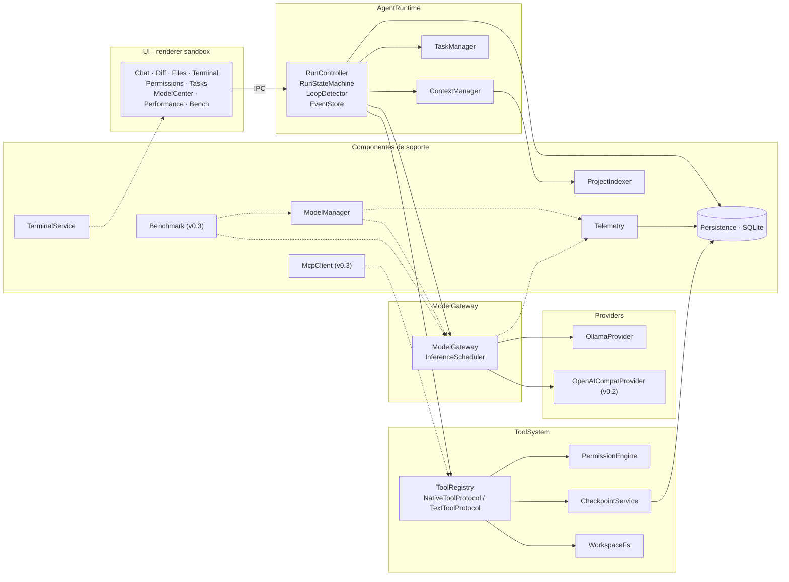

# SaurioLLM — Arquitectura general

**Propósito de este documento:** dar la arquitectura recomendada, cerrada, de SaurioLLM (capas, componentes, procesos, IPC, concurrencia y extensibilidad) para que el usuario la revise y a partir de ella se haga el scaffolding.

**Leyenda:** `[COMPROBADO EN EQUIPO]` `[VERIFICADO EN DOC OFICIAL]` `[DECISIÓN DE DISEÑO]` `[HIPÓTESIS A PROBAR]`

---

## 1. Objetivo y no-objetivos

**Objetivo.** SaurioLLM es un runtime de agentes de escritorio, 100 % local por defecto, que trabaja sobre carpetas del usuario: abre un proyecto, elige un modelo instalado en Ollama, explora el código con herramientas de lectura progresiva, propone y aplica cambios bajo un sistema de permisos, muestra diffs, permite revertir y conserva todo el historial en SQLite `[DECISIÓN DE DISEÑO]`. Conceptualmente es un Claude Code / Codex CLI / Cursor Agent con modelos locales reemplazables, donde el centro de gravedad de la arquitectura es el **runtime de agentes**, no un chat sobre un modelo en particular.

**No-objetivos** `[DECISIÓN DE DISEÑO]`:
- No es "otro chat UI para Ollama": no hay un chat suelto sin proyecto asociado; todo chat vive dentro de un proyecto y un agente.
- No depende de Ollama como único proveedor: Ollama es el primer `Provider`; LM Studio, llama.cpp / APIs OpenAI-compatible y proveedores cloud se agregan sin tocar `AgentRuntime` ni `ToolSystem`.
- No es un editor de código de propósito general ni un IDE.
- No reemplaza a git: el `.git` del usuario nunca se toca (ver §13 de la columna vertebral); los checkpoints son un mecanismo propio, no commits.
- No cambia a nube nunca por su cuenta: toda localidad no local (`lan`, `proxied-cloud`, `cloud`) requiere habilitación explícita por proyecto.
- No hace scaffolding de código de la app en esta etapa: este documento es previo a escribir la primera línea de `saurio/`.

## 2. Principios

Los nueve principios de la columna vertebral (§1.1) gobiernan todo el diseño de capas y componentes de este documento; se listan aquí porque explican decisiones puntuales de las secciones siguientes:

1. **Modelo chico primero.** El diseño se dimensiona para un 7-8B con 8 GB de VRAM y 16k de contexto, y se relaja hacia arriba (más VRAM, más contexto, modelos más grandes), nunca al revés.
2. **El log de eventos es la verdad.** `run_events` es append-only; ninguna transición de un run vive solo en memoria.
3. **Registrar antes de actuar.** Ninguna acción con efectos secundarios corre sin una fila `pending` en SQLite.
4. **Prefijo estable.** Nada dinámico (fechas, contadores) antes del historial en el prompt; lo efímero va al final, marcado `ephemeral: true`.
5. **El proyecto del usuario es sagrado.** El agente escribe solo dentro del workspace, nunca en `.git`, y todo lo que escribe es reversible archivo por archivo.
6. **Medido ≠ estimado.** Todo número que ve el usuario lleva `quality: 'measured' | 'estimated' | 'unavailable'` y su fuente; ninguna estimación se presenta como medición (condición 3 del usuario).
7. **Local por defecto.** Ningún componente cambia de localidad sin acción explícita del usuario.
8. **Cada abstracción paga en el hito 1.** Si una interfaz no la usa al menos una implementación del MVP, no existe todavía en código; queda comentada `// v0.2` / `// v0.3` / `// v0.4`. Únicas excepciones: columnas y variantes de enum que cuestan una línea hoy y una migración mañana (`runs.parent_run_id`, `source.kind = 'delegate'`, `tool_calls.status = 'awaiting_input'`).
9. **Capas con contratos.** `UI → AgentRuntime → ModelGateway → Providers` y `AgentRuntime → ToolSystem`; ninguna capa importa la de arriba; `providers/` solo se importa desde `gateway/`.

## 3. Diagrama de capas

### 3.1 Mermaid



Dos cadenas de dependencia, tal como fija la columna vertebral: **UI → AgentRuntime → ModelGateway → Providers** para todo lo que es inferencia, y **AgentRuntime → ToolSystem** para todo lo que es acción sobre el proyecto (archivos, comandos, permisos, checkpoints). `ModelManager`, `Telemetry` y `Benchmark` cuelgan de `ModelGateway`/`Providers` como consumidores de datos, nunca como intermediarios de la cadena de inferencia.

### 3.2 ASCII

```
Renderer (sandbox)
  UI (Chat, Diff, Files, Terminal, Permissions, Tasks, ModelCenter, Performance, Bench, Settings)
        |
        |  IPC tipado (zod) — invoke() / onEvent()
        v
Main process (Node 24)
  AgentRuntime
    RunController -> RunStateMachine -> EventStore (SQLite, run_events)
    ContextManager -> ProjectIndexer (utilityProcess)
    TaskManager
        |                                   \
        v                                    v
  ModelGateway                          ToolSystem
    InferenceScheduler (slots)            ToolRegistry (builtin + MCP + delegate)
        |                                    |-- PermissionEngine
        v                                    |-- CheckpointService (BlobStore)
  Providers                                  |-- WorkspaceFs
    OllamaProvider  --HTTP NDJSON-->  ollama serve   `-- spawn --> pwsh/bash (run_command)
    OpenAICompatProvider (v0.2)

  Componentes de soporte (leen/alimentan las cadenas de arriba, no las intermedian):
    ModelManager (catálogo, /api/ps, fits)      Telemetry (métricas, diagnósticos)
    Benchmark (v0.3, mide model_compat)         McpClient (v0.3)
    TerminalService (node-pty, independiente de run_command)
    Persistence (better-sqlite3 + drizzle, event log + proyecciones + blobs)
```

## 4. Componentes

Cada componente detalla: responsabilidad, entradas/salidas, dependencias, dónde corre, estado que mantiene y qué persiste.

### 4.1 UI (renderer)

- **Responsabilidad:** renderizar proyecciones de `RunEvent`s; nunca ejecuta lógica de negocio ni accede al filesystem o a Ollama directamente.
- **Entradas:** `RunEvent[]` batched por `runtime:event` (30 ms), `models:changed`, `metrics:tick`, `download:progress`, `provider:health`, datos de `terminal:data` por `MessagePort`.
- **Salidas:** llamadas `invoke(channel, payload)` (`run:start`, `permission:answer`, `checkpoint:revert`, etc.).
- **Dependencias:** `packages/shared/ipc.ts` (contrato), `zustand` (estado local), `@codemirror/merge` (diff), `@xterm/xterm` (terminal).
- **Dónde corre:** proceso `renderer`, con `contextIsolation` y sandbox activos (§6).
- **Estado que mantiene:** slices de zustand (`runStore` reduce `RunEvent`, `chatStore`, `modelsStore`, `perfStore`, `terminalStore`) — todo derivado, reconstruible desde `chat:history` e IPC.
- **Qué persiste:** nada por sí misma; a lo sumo preferencias de UI en `localStorage` del renderer (tema, tamaño de paneles), fuera del dominio de SaurioLLM.
- **Paneles del MVP:** Chat (con tarjetas de tool/permiso/checkpoint), Diff, árbol de archivos, Terminal, Tasks, Centro de modelos mínimo, Settings básico. Panel de rendimiento completo, Banco de pruebas y editor de agentes llegan después (§8).

### 4.2 AgentRuntime

- **Responsabilidad:** orquestar el ciclo de vida completo de un run: `RunController` (una instancia por run activo), `RunStateMachine` (transiciones válidas + persistencia atómica), `LoopDetector`, `EventStore` (escribe evento + proyección en una transacción) y `recover()` al arrancar la app.
- **Entradas:** `run:start`/`run:cancel`/`run:continue` desde IPC; resultados de `ContextManager`, `ToolSystem`, `PermissionEngine`, `CheckpointService`, `TaskManager` y `ModelGateway`.
- **Salidas:** `RunEvent`s (ver interfaz en §5 de la columna vertebral) hacia `EventStore` y hacia la UI.
- **Dependencias:** `ContextManager`, `ToolSystem`, `PermissionEngine`, `CheckpointService`, `TaskManager`, `ModelGateway`, `Persistence`.
- **Dónde corre:** proceso `main`, como parte del paquete Node puro `@saurio/runtime` (sin dependencias de Electron ni React), con un `HostAdapter` para efectos propios de Electron (diálogos, notificaciones) `[DECISIÓN DE DISEÑO, ADR-1]`.
- **Estado que mantiene:** el `Run` en memoria mientras está activo (para poder cancelarlo con `AbortController` e ignorar tool calls que no correspondan a un run vivo de esta sesión, ver "Idempotencia" en la columna vertebral §12).
- **Qué persiste:** `runs`, `run_events`, `messages`, `tool_calls`, `tasks` (todas como proyecciones del log, en la misma transacción que el evento).
- **Nota de diseño clave:** los subagentes (v0.4) son runs con `parent_run_id`; el estado `completed` del run hijo se convierte en el `ToolResult` de la tool `delegate` del run padre. Esto es lo que permite que "varios agentes colaborando" (condición del usuario) no requiera un segundo mecanismo de orquestación aparte del ya existente para un run simple.

### 4.3 ToolSystem

- **Responsabilidad:** `ToolRegistry` (registro único donde tools builtin, MCP y `delegate` conviven detrás de `ToolDefinition`), selección de `ToolProtocol` (nativo o texto Hermes `<tool_call>`), validación con zod, ejecución con timeout y cancelación, truncado de salida nivel 0, persistencia de salidas grandes a `tool-outputs/<toolCallId>.txt`, y `WorkspaceFs` (acceso a archivos confinado al workspace, protected paths, `.saurioignore`).
- **Entradas:** `ToolCall[]` parseados por `AgentRuntime` desde la respuesta del modelo.
- **Salidas:** `ToolResult` por cada llamada, evaluado antes por `PermissionEngine`.
- **Dependencias:** `PermissionEngine`, `CheckpointService` (para tools `mutating`), `TaskManager` (para `task_update`), `@vscode/ripgrep` (para `search_code`), `child_process.spawn` (para `run_command`, sin pty).
- **Dónde corre:** proceso `main`, dentro de `@saurio/runtime`; `run_command` spawnea un proceso hijo (`pwsh.exe -NoProfile -NonInteractive`, fallback `powershell.exe`, `bash` en POSIX).
- **Estado que mantiene:** ninguno propio entre llamadas; cada `ToolCall` es independiente.
- **Qué persiste:** `tool_calls` (con `status`, `category`, `risk`, `args_hash`, `transport`, `match_level`), y opcionalmente el archivo de salida completa.
- **Las 10 tools builtin** `[DECISIÓN DE DISEÑO, corrección aplicada — ver "Desvíos"]`: `list_files, search_code, read_file, read_output, edit_file, write_file, delete_file, run_command, task_update, finish`. En modo `plan` el modelo ve 6 (`list_files, search_code, read_file, read_output, task_update, finish`); en modo `agent` ve las permitidas al agente, que por defecto son las 10. La recomendación de "6-8 tools" (§8 de la columna vertebral) es una guía de diseño para **agentes personalizados** con `allowedTools` acotado, no un límite duro del registro.

### 4.4 ContextManager

- **Responsabilidad:** `ContextBuilder` (ensamblado del prompt: system inmutable → few-shot → repo map → memoria → resumen de compactación → historial → mensaje efímero), `TokenEstimator` calibrado por modelo, `Compactor` (niveles 0/1/2), `RepoMapClient` (habla con `ProjectIndexer`). Garantiza matemáticamente `tokens ≤ numCtx − reserveForResponse` antes de cada llamada.
- **Entradas:** historial de la `ChatHistory`, `AgentConfig.contextPolicy`, resultado de `RepoMapClient.rank(query)`.
- **Salidas:** `ChatMessage[]` listos para `ModelGateway.chat`, evento `context.built` con el reporte de presupuesto.
- **Dependencias:** `ProjectIndexer` (`utilityProcess`), `Persistence` (para `token_calibration`, `repo_map_cache`).
- **Dónde corre:** proceso `main`, dentro de `@saurio/runtime`.
- **Estado que mantiene:** el factor de calibración EMA por modelo en memoria (respaldado en `token_calibration`).
- **Qué persiste:** `token_calibration`, y como parte de `messages`: qué mensajes fueron reemplazados por compactación (`compacted_by`, nunca se borran).

### 4.5 ModelGateway (+ InferenceScheduler)

- **Responsabilidad:** única puerta de inferencia. Resuelve `ModelRef → Provider`, aplica la política de localidad (`authorizedLocality` del run), adquiere y libera slots de inferencia vía el `InferenceScheduler` interno, normaliza `ChatChunk`s y métricas, mide TTFT de cliente y notifica a `Telemetry`.
- **Entradas:** `ModelGateway.chat(ref, req, ctx)` desde `AgentRuntime`.
- **Salidas:** `AsyncIterable<ChatChunk>` hacia `AgentRuntime`; `status()` (slots, cola) hacia `Telemetry` y la UI.
- **Dependencias:** `Providers` (`OllamaProvider`, `OpenAICompatProvider` en v0.2); el `InferenceScheduler` internamente.
- **Dónde corre:** proceso `main`, dentro de `@saurio/runtime`.
- **Estado que mantiene:** `slots` en uso, `ModelQueue` por `(providerId, modelName)`.
- **Qué persiste:** `model_load_samples` en cada carga real (vía `ModelManager`, que es quien escribe esa tabla tras leer `/api/ps`); las métricas de cada respuesta terminan en `messages.response_metrics_json` y `runs.metrics_json`.
- **Decisión de concurrencia (ADR-5, ver §5 abajo):** el slot se adquiere **dentro de** `ModelGateway.chat` y dura exactamente una generación; se libera automáticamente en `done`/`error`/abort. Ningún estado de espera de permiso o ejecución de tool ocupa slot.

### 4.6 Providers

- **Responsabilidad:** implementar la interfaz `Provider` (`health`, `listModels`, `describeModel`, `listLoaded`, `chat`, `load`, `unload`, `pull`, `delete`) para un backend concreto de inferencia.
- **MVP:** `OllamaProvider` habla `/api/version`, `/api/tags`, `/api/show`, `/api/ps`, `/api/chat` por `fetch` + NDJSON con schemas zod propios (nunca el endpoint `/v1`, ni el cliente npm `ollama` — ver ADR-2) `[VERIFICADO EN DOC OFICIAL: investigación 1 §4-5]`.
- **v0.2:** `OpenAICompatProvider` para LM Studio / llama-server, acumulando deltas de tool calls por `index`; sus métricas de duración quedan `estimated` porque `/v1` no expone las duraciones de Ollama.
- **Dependencias:** ninguna hacia arriba; regla de imports: `providers/*` solo se importa desde `gateway/`.
- **Dónde corre:** proceso `main`; hace peticiones HTTP salientes al proceso `ollama serve` (externo, no gestionado por SaurioLLM en el MVP).
- **Estado que mantiene:** ninguno persistente; solo el `AbortSignal` de la request en curso.
- **Qué persiste:** nada directamente (lo que devuelve se persiste vía `AgentRuntime`/`ModelManager`).

### 4.7 ModelManager

- **Responsabilidad:** catálogo de modelos instalados, capabilities, `describeModel`, **único poller** de `/api/ps` (emite `models.loaded`), `MemoryEstimator` (`fits()`), `HardwareProbe`, `DownloadManager` (v0.2), `RecommendationEngine` (v0.3).
- **Entradas:** llamadas desde IPC (`models:list`, `models:describe`, `models:fits`) y desde `AgentRuntime` en la fase `preparing` de un run.
- **Salidas:** `ModelInfo[]`, `LoadedModel[]`, estimaciones `fitClass` etiquetadas con `quality`.
- **Dependencias:** `Provider` (obtenido del `ModelGateway.providers()`, **nunca** `OllamaProvider` importado directo — regla de imports); `Persistence`.
- **Dónde corre:** proceso `main`, dentro de `@saurio/runtime`.
- **Estado que mantiene:** cache de `/api/tags`/`/api/show` con refresco periódico (30 s en reposo, 5 s con panel abierto o run activo).
- **Qué persiste:** `models`, `model_load_samples`, `downloads` (v0.2). **Lee** `model_compat` (escrito solo por `Benchmark`) pero nunca lo escribe — frontera de responsabilidad explícita para no duplicar con `Benchmark` (injerto de "mvp-pragmatic", condición 13.c).

### 4.8 PermissionEngine

- **Responsabilidad:** clasificar cada `ToolCall` en una `PermissionCategory` (`read`, `write`, `delete`, `terminal`, `git_commit`, `git_push`, `network`, `mcp`), evaluar contra `PermissionPolicy` con orden fijo **deny → ask → allow** (sin especificidad `[VERIFICADO EN DOC OFICIAL: code.claude.com/docs/en/permissions]`), aplicar `CommandParser` por shell y sostener las invariantes que ninguna regla destraba (protected paths, comandos críticos, bloqueados por defecto).
- **Entradas:** `ToolCall` + `Mode` + `PermissionPolicy` del agente.
- **Salidas:** `PermissionDecision` (`allow`/`deny` inmediato, o `ask` con `PermissionRequest` completo para la UI).
- **Dependencias:** `CommandParser/pwsh.ts` (MVP; `bash.ts` queda **previsto para más adelante**, ver 06-permisos-y-modos.md), `protected.ts` (lista de paths protegidos).
- **Dónde corre:** proceso `main`, dentro de `@saurio/runtime`.
- **Estado que mantiene:** ninguno propio; las reglas viven en SQLite.
- **Qué persiste:** `permission_rules`, `permission_decisions`.

### 4.9 CheckpointService

- **Responsabilidad:** `BlobStore` en disco (content-addressed, `appData/blobs/<hash>`), `begin`/`commit` por tool call mutante (guarda pre/post imagen exacta: bytes, EOL, BOM, modo), `diff` vía `jsdiff`, `planRevert` + `revert` con resolución de conflicto a tres vías, y el revert es en sí mismo reversible (crea otro checkpoint `kind: 'revert'`).
- **Entradas:** `begin(runId, toolCallId, paths)` desde `ToolSystem` antes de ejecutar una tool mutante; `planRevert`/`revert` desde IPC.
- **Salidas:** `Checkpoint`, `{ unified, added, removed }` para el diff de UI, `{ restored, skipped, revertCheckpointId }`.
- **Dependencias:** `Persistence` (`blobs`, `checkpoints`, `checkpoint_files`).
- **Dónde corre:** proceso `main`, dentro de `@saurio/runtime`.
- **Estado que mantiene:** ninguno entre llamadas; todo el estado vive en `blobs`/`checkpoints`.
- **Qué persiste:** `blobs`, `checkpoints`, `checkpoint_files`.
- **Qué NO cubre** (debe quedar visible en la UI, condición 5 del usuario): efectos de `run_command` (`npm install`, migraciones, borrados fuera del workspace, `git push`, artefactos de build), cambios de otras herramientas, archivos en `.saurioignore`, archivos > 20 MB (`blob_missing = 1`). No es un reemplazo de git. v0.3 agrega un shadow repo solo como **detector** de cambios por comandos, nunca como reversor.

### 4.10 TerminalService

- **Responsabilidad:** terminal interactiva del usuario, independiente de `run_command` (que usa `spawn` sin pty para no ensuciar la salida que ve el modelo con secuencias VT).
- **Entradas/Salidas:** `terminal:create`/`terminal:resize`/`terminal:close` por IPC; datos bidireccionales por `MessagePort` (no por `webContents.send`, para no saturar el canal principal).
- **Dependencias:** `node-pty` 1.1.0, `@xterm/xterm` 6 en el renderer.
- **Dónde corre:** proceso `main` (el pty), streaming al `renderer`.
- **Estado que mantiene:** sesiones de pty activas por `terminalId`.
- **Qué persiste:** nada del contenido de la terminal (es efímera); el MVP no guarda scrollback en SQLite.

### 4.11 Persistence

- **Responsabilidad:** `drizzle` schema, migraciones embebidas, repositorios tipados, `EventStore` (escritura evento + proyección en una transacción), `BlobStore`, carpeta `tool-outputs/`, comando de mantenimiento `saurio db rebuild`.
- **Entradas:** operaciones de escritura/lectura desde todos los componentes de `main`.
- **Salidas:** filas tipadas (derivadas con `z.infer` desde los schemas compartidos).
- **Dependencias:** `better-sqlite3` 13.0.3, encapsulado en `persistence/driver.ts` para poder migrar a `node:sqlite` cuando sea estable `[VERIFICADO EN DOC OFICIAL: investigación 2 C.1]`.
- **Dónde corre:** proceso `main`.
- **Estado que mantiene:** conexión WAL a `saurio.db`.
- **Qué persiste:** todo el modelo de datos de la columna vertebral §4 (proyectos, agentes, chats, runs, `run_events`, `messages` + FTS5, `tool_calls`, permisos, checkpoints, tasks, providers/modelos, perfiles/ajustes, métricas, settings, auditoría).

### 4.12 ProjectIndexer

- **Responsabilidad:** parseo `tree-sitter`, extracción de tags (`*-tags.scm`), construcción del grafo archivo→archivo, PageRank personalizado, cache por mtime; expone `index(projectPath, changedFiles)` y `rank(query)` a `ContextManager`.
- **Entradas:** ruta del proyecto, lista de archivos cambiados (`fs.watch` con debounce).
- **Salidas:** repo map renderizado (`path:\n│ def foo(...)\n⋮`) con presupuesto de tokens.
- **Dependencias:** `web-tree-sitter` 0.27, grammars `.wasm` compiladas por el proyecto (no las de `tree-sitter-wasms` 0.1.13, por la incompatibilidad reportada `[HIPÓTESIS A PROBAR, fuente secundaria]`), `@vscode/ripgrep` (`rg --files`).
- **Dónde corre:** **`utilityProcess`** separado del `main`, precisamente para que un parseo pesado no bloquee la UI ni el loop del agente (ADR-1).
- **Estado que mantiene:** grafo en memoria del proyecto abierto.
- **Qué persiste:** `repo_map_cache` (por `rel_path`, `mtime`, `size`, `lang`, `tags_json`).
- **Alcance del MVP:** ts, tsx, js, python; el resto de archivos entra como árbol plano. v0.2 suma 10 lenguajes más.

### 4.13 TaskManager

- **Responsabilidad:** mantener la proyección `tasks` del plan visible; atiende la tool `task_update`.
- **Entradas:** `task_update(steps[])` desde `ToolSystem`.
- **Salidas:** evento `tasks.updated`.
- **Dependencias:** `Persistence`.
- **Dónde corre:** proceso `main`, dentro de `@saurio/runtime`.
- **Qué persiste:** `tasks`.

### 4.14 McpClient (v0.3, no MVP)

- **Responsabilidad:** `McpConnection` propia sobre `@modelcontextprotocol/sdk` 1.30, registrando tools remotas como `mcp__<server>__<tool>` dentro del mismo `ToolRegistry` que las builtin.
- **Dependencias:** `ToolRegistry` (para registrar), `PermissionEngine` (categoría `mcp`).
- **Dónde corre:** proceso `main`.
- **Estado del MVP:** no implementado; solo existen en el tipo `source.kind = 'mcp'` en `ToolDefinition` y el estado `awaiting_input` en `ToolCallStatus` (principio 8, excepción de costo de migración).

### 4.15 Model Hub / catálogo y descargas (condición 11.A)

- **Responsabilidad:** explorar, descargar y administrar modelos de Ollama: tamaño de descarga (manifest del registry), progreso con cancelación, verificación de espacio en disco antes de descargar, eliminación con confirmación.
- **Componentes nuevos:** `DownloadManager` (dentro de `runtime/models`, v0.2) y el archivo curado `resources/model-catalog.json`.
- **Entradas:** `models:pull`/`models:pullCancel`/`models:delete` por IPC.
- **Salidas:** eventos `download:progress`/`download:done`/`download:failed`.
- **Dependencias:** manifest público del registry (`GET https://registry.ollama.ai/v2/library/<m>/manifests/<tag>`, sin autenticación `[VERIFICADO EN DOC OFICIAL: investigación 4 §3.2]`), `fs.statfsSync` sobre la carpeta `OLLAMA_MODELS` detectada, `POST /api/pull` con `stream: true`.
- **Dónde corre:** proceso `main`.
- **Qué persiste:** `downloads`.
- **Carpeta de modelos:** en modo *attach* (MVP) SaurioLLM solo **lee** la variable de entorno `OLLAMA_MODELS` (hoy `N:\OllamaModels` `[COMPROBADO EN EQUIPO]`) y valida contra `/api/tags`; nunca la cambia. Elegir otra carpeta implica una guía paso a paso para que el usuario mismo edite la variable y reinicie la app de bandeja, o pasar a modo *managed* (v0.3), donde SaurioLLM lanza su propia instancia de `ollama serve` con el `OLLAMA_MODELS` que el usuario confirme explícitamente, sin tocar la instancia ajena.

### 4.16 Hardware Profiler (parte de ModelManager, condición 11.A)

- **Responsabilidad:** `HardwareProbe` detecta CPU (`os.cpus()`), RAM (`os.totalmem/freemem`), y VRAM por la fuente más confiable disponible según plataforma (`nvidia-smi` para NVIDIA `[VERIFICADO EN DOC OFICIAL: docs.nvidia.com/deploy/nvidia-smi]`; registro `HardwareInformation.qwMemorySize` como alternativa Windows-agnóstica `[COMPROBADO EN EQUIPO: registro qwMemorySize = 8589934592, condición 12]`; nunca WMI `AdapterRAM`, que trunca a 32 bits). Cada dato se etiqueta `{ value, unit, quality, source, sampledAt }`.
- **Dónde corre:** proceso `main`, invocado bajo demanda (MVP) o continuo (v0.2, `-lms`).
- **Qué persiste:** `settings.hardware_inventory_json`.

### 4.17 Telemetry / métricas (condición 11.B)

- **Responsabilidad:** **no consulta Ollama por su cuenta ni estima VRAM** (frontera explícita, injerto de "mvp-pragmatic", condición 13.c). Recibe `/api/ps` del `ModelManager`, `status()` (slots/cola) del `ModelGateway`, métricas por respuesta del `ModelGateway`, y muestras del sistema del `SystemSampler`; agrega (`MetricsAggregator`) y diagnostica (`Diagnostics`) con reglas sobre datos ya etiquetados.
- **Entradas:** las fuentes arriba mencionadas.
- **Salidas:** `metrics:tick` (con el panel abierto), diagnósticos con acción sugerida que nunca cambia configuración sola.
- **Dependencias:** `ModelManager`, `ModelGateway`, `SystemSampler` (`services/system-sampler/` en `apps/desktop/src/main`).
- **Dónde corre:** proceso `main`.
- **Qué persiste:** `metrics_minute` (v0.2), `runs.metrics_json`, `messages.response_metrics_json`.

### 4.18 Benchmark y Profiles (condición 11.C, v0.3)

- **Responsabilidad:** **no estima: solo mide.** Usa `ModelGateway.chat` con `priority: 'benchmark'` (reserva el slot en exclusiva) y `ModelManager` para `load`/`unload`. Es el **único** componente que escribe `model_compat` y `benchmark_runs`. Metodología inspirada en `llama-bench` (warm-up + repeticiones, mediana e IQR) `[VERIFICADO EN DOC OFICIAL: tools/llama-bench/README.md]`.
- **Perfiles** (`profiles`, v0.2 activa; en el MVP son presets estáticos referenciados por `effective_config_json.profileId`): `rapido`, `equilibrado`, `calidad`, por proyecto o por agente. Cualquier ajuste automático producido por comparar contra `model_compat` queda en `run_adjustments`, visible y reversible con el botón "Usar lo pedido" — nunca en silencio (condición 11.C).
- **Dónde corre:** proceso `main`, dentro de `@saurio/runtime`.
- **Qué persiste:** `benchmark_runs`, `model_compat`, `profiles`, `run_adjustments`.

### 4.19 OllamaProcessManager (v0.3, no MVP)

- **Responsabilidad:** en modo *managed*, lanzar `ollama serve` en un puerto propio (`127.0.0.1:11435`) con variables de entorno controladas (`OLLAMA_MAX_LOADED_MODELS=1`, `OLLAMA_NUM_PARALLEL=1`, etc.), sin matar ni reconfigurar jamás la instancia de bandeja del usuario.
- **Dónde corre:** proceso `main`, spawnea un proceso hijo `ollama.exe serve`.

## 5. Modelo de procesos de Electron y seguridad

| Proceso | Qué corre ahí | Por qué |
|---|---|---|
| `main` | `@saurio/runtime` completo (AgentRuntime, ContextManager sin el parseo pesado, ToolSystem, PermissionEngine, CheckpointService, ModelGateway+Scheduler, Providers, ModelManager, Telemetry, Persistence, TerminalService) | Un solo salto de IPC por cada token de streaming hacia la UI; el paquete se prueba con `vitest` sin Electron y puede moverse a otro host en el futuro `[DECISIÓN DE DISEÑO, ADR-1]` |
| `utilityProcess` | `ProjectIndexer` (tree-sitter, tags, PageRank) | Trabajo CPU-intensivo aislado; si se cuelga o crashea no bloquea el loop del agente ni la UI |
| `renderer` | React 19 + zustand, con `contextIsolation: true` y `sandbox: true` | Superficie de ataque mínima; el renderer no puede tocar el filesystem ni spawnear procesos directamente |
| Procesos hijo (`child_process.spawn`) | `run_command` del agente (`pwsh -NoProfile -NonInteractive`, fallback `powershell`, `bash` en POSIX) | Sin pty, para que la salida que ve el modelo no traiga secuencias VT |
| Proceso pty (`node-pty`) | Terminal interactiva del usuario | Necesita pty real para una experiencia de terminal completa; separado de `run_command` |
| Externo (no gestionado) | `ollama serve` (modo attach, MVP) | El usuario ya lo tiene corriendo o lo levanta desde la bandeja; SaurioLLM solo le habla por HTTP |

**Seguridad de Electron** `[VERIFICADO EN DOC OFICIAL: electronjs.org/docs/latest/tutorial/security]`:
- `contextIsolation: true`, `nodeIntegration: false`, `sandbox: true` en el `BrowserWindow`.
- El `preload` (`src/preload/index.ts`) expone únicamente `contextBridge.exposeInMainWorld` con dos funciones genéricas: `invoke(channel, payload)` y `onEvent(cb)`, más `terminalPort()` para el `MessagePort` de la terminal. Nunca se expone `ipcRenderer` crudo.
- Cada `registerHandler(channel, schema, fn)` en `main` valida el payload con zod **y** `event.senderFrame` (para que un frame no autorizado, ej. una vista embebida de terceros, no pueda invocar canales privilegiados).
- CSP `script-src 'self'` en el HTML del renderer; sin `eval` ni scripts remotos.
- `asar: true` con `asarUnpack` para los módulos nativos (`*.node`), `@vscode/ripgrep` y las grammars `.wasm`; `electron-builder install-app-deps` corre en `postinstall` para los nativos (`better-sqlite3`, `node-pty`) `[VERIFICADO EN DOC OFICIAL: electron.build/docs, investigación 2 C.8]`.

## 6. Contrato IPC (resumen — detalle en doc 04)

El contrato vive en un único mapa `packages/shared/src/ipc.ts`, `channel → { input, output }` con schemas zod; el preload no conoce la forma de cada canal, solo reenvía. Canales `invoke` del MVP: `project:open/list`, `chat:create/list/history`, `run:start/cancel/continue`, `permission:answer`, `checkpoint:list/diff/planRevert/revert`, `models:list/loaded/describe/fits`, `provider:health`, `terminal:create/resize/close`, `metrics:snapshot`, `settings:get/set`. Eventos `main → renderer` por `webContents.send`: `runtime:event` (`RunEvent[]`, batched 30 ms), `models:changed`, `metrics:tick`, `provider:health`; `terminal:data` viaja aparte por `MessagePort` `[VERIFICADO EN DOC OFICIAL: electronjs.org/docs/latest/tutorial/message-ports]`. Los canales `models:pull/pullCancel/delete`, `download:progress/done/failed` y `bench:run` existen en el tipo desde la migración 1 pero sin handler activo hasta v0.2/v0.3 (principio 8).

## 7. Modelo de concurrencia (condición 2 del usuario)

La condición del usuario exige separar explícitamente dos ejes que en un chat simple suelen confundirse:

**(a) Chats/agentes lógicos — siempre posibles, sin límite físico.** Un proyecto puede tener N chats abiertos, cada uno con su propio agente (`AgentConfig`), cada `run` con su `AbortController`, su propia máquina de estados y su propia cola de eventos. Esto no depende del hardware: es organización de datos (`projects → chats → agents → runs → subruns` vía `parent_run_id`). La UI muestra por run su estado (`en cola`, `generando`, `esperando permiso`) independientemente de cuántos haya abiertos.

**(b) Slots de inferencia — la capacidad física real, configurable.** `settings.inference.slots` por provider define cuántas generaciones pueden estar en curso a la vez contra ese provider. Con **1 slot** (el caso de este equipo: RTX 3060 Ti 8 GB `[COMPROBADO EN EQUIPO]`), todos los runs que quieren generar se serializan en el `InferenceScheduler`, agrupados por modelo para evitar recargas frías innecesarias. Con **N slots** (hardware con más VRAM, o un provider LAN/cloud con más capacidad), varias generaciones corren en paralelo. **Ni la UI ni el runtime cambian entre 1 y N slots**: solo cambia el tiempo que un run pasa en `queued` y si dos runs generan simultáneamente. Las tools, en cambio, no consumen slot y sí corren en paralelo entre runs distintos; las escrituras al mismo archivo se serializan con un lock por path en `WorkspaceFs`.

**Dónde vive el Scheduler.** Dentro de `ModelGateway` (ADR-5), no antes de él ni en `AgentRuntime`: el slot se adquiere en `ModelGateway.chat` y dura exactamente una generación, liberándose automáticamente al `done`/`error`/abort. Así, un run en `awaiting_permission`, `executing_tool` o `compacting` no retiene el único slot disponible mientras el usuario decide o una tool corre.

**Con provider cloud (futuro, condición hardware-agnóstico).** Cada provider aporta su propio pool de slots (`providers.max_concurrency`); un run fija `authorizedLocality` al iniciar y el Gateway rechaza cualquier request cuya localidad no esté autorizada; **nunca hay fallback automático local → nube**. Multi-GPU (v0.4) se resuelve con una instancia *managed* por GPU (`CUDA_VISIBLE_DEVICES`), sin que el modelo de concurrencia de arriba cambie: sigue siendo "N slots gestionados por el Scheduler".

**Tabla resumen:**

| | 1 slot (este equipo) | N slots (hardware con más VRAM / LAN) | Cloud |
|---|---|---|---|
| Chats/agentes lógicos | Ilimitados | Ilimitados | Ilimitados |
| Generaciones simultáneas | 1 (el resto en `queued`) | N | Según `max_concurrency` del provider |
| UI / runtime / modelo de datos | Sin cambios | Sin cambios | Sin cambios |
| Configuración | `settings.inference.slots = 'auto'` (resuelve a 1) | `settings.inference.slots = N` | `providers.max_concurrency` |

## 8. Extensibilidad — qué archivos se tocan

| Para agregar... | Se tocan... | No se tocan |
|---|---|---|
| **Un nuevo provider** (ej. LM Studio) | `packages/runtime/src/gateway/providers/<nuevo>/` (implementa `Provider`), registro en la config de `providers` (tabla `providers`) | `AgentRuntime`, `ToolSystem`, `ModelManager` (usa `gateway.providers()`), UI de chat |
| **Una nueva tool nativa** | Un archivo en `packages/runtime/src/tools/builtin/`, exporta un `ToolDefinition`, se registra en `ToolRegistry` | `ToolProtocol` (nativo/texto son transporte, no dependen de qué tools existan), `PermissionEngine` (clasifica por `category`/`classify()` que la tool declara) |
| **Un servidor MCP** (v0.3) | Configuración de conexión en `McpClient`, que registra `mcp__<server>__<tool>` en el mismo `ToolRegistry` | `ToolSystem` no distingue en su lógica de ejecución si una tool es builtin o MCP; `PermissionEngine` solo suma la categoría `mcp` |
| **Un nuevo agente** (rol, prompt, tools permitidas) | Una fila en `agents` (o un preset en `resources/prompts/`) | Ninguna capa de código; `AgentConfig` ya es data-driven |

## 9. Imprescindible para el MVP / Previsto para más adelante (por componente)

Esta tabla resume la §16 de la columna vertebral aplicada a los componentes de este documento; ante cualquier contradicción con el resto de este documento, manda esta tabla y la §16 de la columna vertebral.

| Componente | Imprescindible para el MVP | Previsto para más adelante |
|---|---|---|
| UI | Chat, tarjetas tool/permiso/checkpoint, diff, árbol, terminal, tasks, Centro de modelos mínimo, métricas por mensaje, Settings básico | Panel de rendimiento completo (v0.2), Banco de pruebas (v0.3), editor de agentes (v0.4) |
| AgentRuntime | RunController, RunStateMachine, LoopDetector, EventStore, `recover()`, cancelación, `run:continue` | Subagentes/`delegate` (v0.4), hooks tipo PreToolUse (v0.4) |
| ToolSystem | 10 builtins, Native + Text protocol, WorkspaceFs, truncado nivel 0, tool-outputs | MCP tools (v0.3), chequeo sintáctico post-edición (v0.2), `remember` (v0.2), `git_commit`/`git_push` (v0.2) |
| ContextManager | Presupuestos 16k, TokenEstimator + calibración, compactación 0+2, `SAURIO.md` lectura | Presupuesto 32k con perfiles (v0.2), `.saurio/rules` (v0.2), embeddings opcionales (v0.4) |
| ProjectIndexer | ts, tsx, js, python; resto como árbol plano; cache por mtime; `fs.watch` | 10 lenguajes más (v0.2) |
| ModelGateway + Scheduler | Camino único, 1 slot, cola por modelo con prioridad, load/unload, locality `local` | N slots (v0.4), providers remotos habilitables (v0.4) |
| Providers | `OllamaProvider` completo | `pull`/`delete` (v0.2), `OpenAICompatProvider` (v0.2), cloud (v0.4) |
| ModelManager | Catálogo, capabilities, poller `/api/ps`, `MemoryEstimator` etiquetado, `model_load_samples`, `HardwareProbe` bajo demanda, badge de localidad | DownloadManager (v0.2), catálogo curado (v0.2), RecommendationEngine (v0.3), AMD/Apple/registro Windows (v0.2) |
| PermissionEngine | Modos plan/agent, categorías, `CommandParser` pwsh, reglas, protected/critical/bloqueados | `CommandParser` bash, ask/edit (v0.2), network/mcp (v0.3), juez LLM (v0.4) |
| CheckpointService | BlobStore, begin/commit, diff, planRevert/revert con conflicto | Shadow repo detector (v0.3) |
| TaskManager | `task_update`, `tasks`, checklist | Plan editable por el usuario (v0.2) |
| TerminalService | node-pty + xterm | Terminales múltiples con pestañas (v0.2) |
| Persistence | Migración 1 completa, WAL, FTS5, `saurio db rebuild` | Retención/vacuum (v0.2) |
| Telemetry | Métricas por respuesta y por run, `/api/ps` vía ModelManager, CPU/RAM | `SystemSampler` continuo, `metrics_minute`, diagnósticos completos (v0.2) |
| Benchmark | — | Todo (v0.3) |
| McpClient | Solo el tipo (`source.kind = 'mcp'`, `awaiting_input`) | Todo (v0.3) |
| OllamaProcessManager | — | Managed (v0.3) |
| Model Hub / descargas | Detección de carpeta (lectura), badge de localidad | Descargas con progreso y catálogo (v0.2), recomendaciones (v0.3) |
| Hardware Profiler | CPU/RAM medidos, nvidia-smi bajo demanda | Sensores continuos, AMD/Apple/registro Windows (v0.2) |

---

## Nomenclatura agregada

No fue necesario introducir nombres nuevos de componentes, tablas, columnas, eventos o interfaces: este documento reutiliza exactamente los de la columna vertebral (`AgentRuntime`, `ToolSystem`, `ModelGateway`, `InferenceScheduler`, `ModelManager`, `PermissionEngine`, `CheckpointService`, `TerminalService`, `Persistence`, `ProjectIndexer`, `TaskManager`, `McpClient`, `OllamaProcessManager`, `Telemetry`, `Benchmark`, `DownloadManager`, `HardwareProbe`, `RecommendationEngine`, y las tablas/interfaces de §4/§5 de la columna vertebral). Se usan dos etiquetas descriptivas puramente organizativas para agrupar componentes al presentar la tabla del §9 y la lista de responsabilidades de la condición 11, sin que sean nombres de código nuevos: "Model Hub / catálogo y descargas" (= `ModelManager` + `DownloadManager` + `resources/model-catalog.json`, ya nombrados en la columna vertebral) y "Hardware Profiler" (= `HardwareProbe`, ya nombrado en la columna vertebral §9). No se creó ningún identificador de código nuevo.

## Desvíos respecto de la columna vertebral

1. **Qué:** el §0 (resumen ejecutivo) de la columna vertebral dice "ocho tools builtin", pero el registro real listado en §3 y §10 tiene 10 (`list_files, search_code, read_file, read_output, edit_file, write_file, delete_file, run_command, task_update, finish`). **Por qué:** esta es la corrección conocida 13.a del brief: se documenta la lista real de 10 en este documento (§4.3), y la cifra "6-8 tools" se conserva únicamente como recomendación de diseño para agentes personalizados con `allowedTools` acotado, no como límite del registro ni del MVP. No se cuenta como desvío nuevo sino como corrección ya prevista por el usuario.
2. **Qué:** ninguna otra contradicción o imposibilidad detectada entre las secciones de la columna vertebral relevantes para este documento (0 a 3, 5, 9, 14, 16, 17, 18, 19). **Por qué:** se usaron la tabla de §16 y las interfaces de §5 como fuente de verdad en los pocos puntos donde otra sección era menos específica (por ejemplo, la ubicación exacta del `InferenceScheduler` "dentro del Gateway" surge de ADR-5, la tabla de decisiones y §14, y las tres coinciden).

## Preguntas abiertas

Ninguna pregunta abierta de la columna vertebral (§20) afecta el diseño de este documento: la pregunta 6 sobre datos comprobados ya fue resuelta afirmativamente por la condición 12 del brief y no se repite aquí. Las preguntas 1 a 5 son operativas (qué modelo descargar, default de permisos de escritura, smoke tests previos al scaffolding, terminal por defecto, confirmación del modo attach de Ollama) y no cambian ninguna capa, componente ni contrato descrito en este documento; quedan para la etapa de scaffolding, no para la arquitectura.
