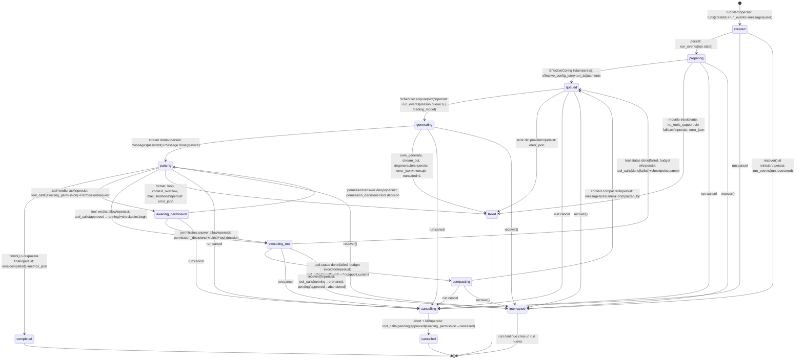
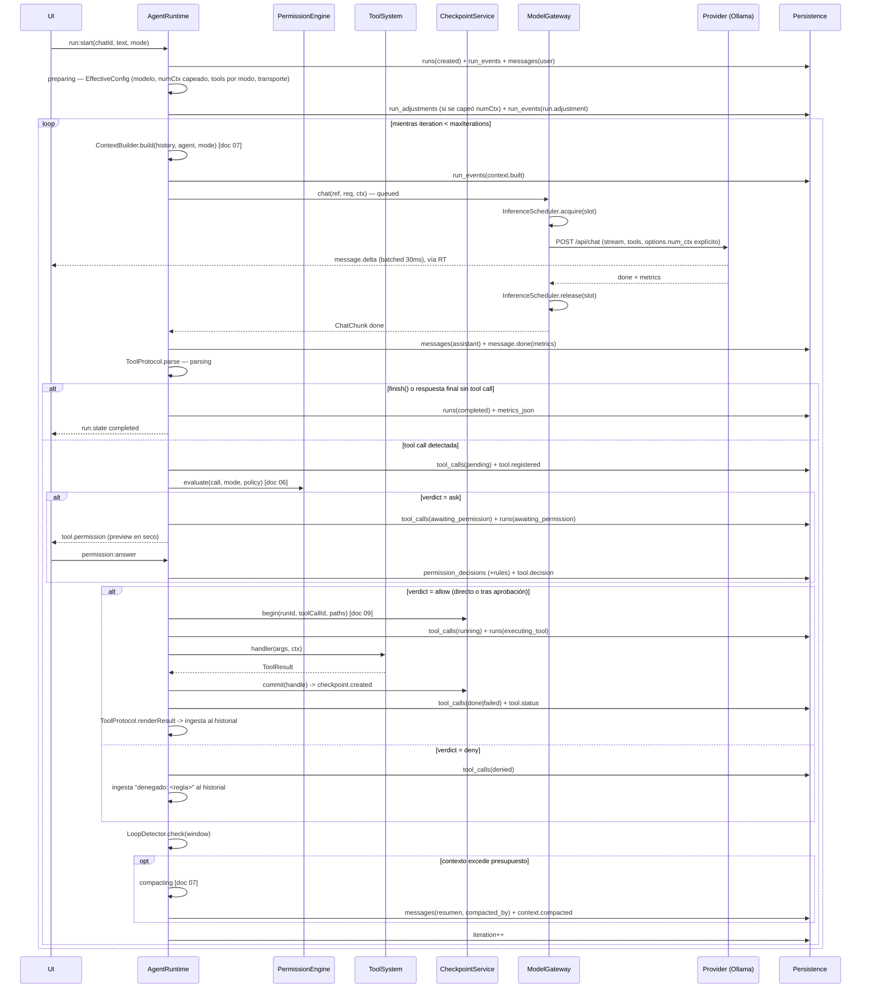

# Documento 05 — Flujo completo de una ejecución del agente

Propósito: describir, paso a paso y con persistencia explícita, todo el ciclo de vida de un `run` en SaurioLLM, desde `run:start` hasta su cierre, incluyendo la máquina de estados, el protocolo de tools, permisos, checkpoints, fallos y el recorrido de validación #1.

Leyenda: `[COMPROBADO EN EQUIPO]` `[VERIFICADO EN DOC OFICIAL]` `[DECISIÓN DE DISEÑO]` `[HIPÓTESIS A PROBAR]`

---

## 1. Máquina de estados del run

Cada transición se persiste en la misma transacción: un evento `run_events(run.state, from, to, reason?)` **y** un `UPDATE runs SET state, state_reason, iteration, last_event_seq` (columna vertebral §4 y §12). El log de eventos es la fuente de verdad; la fila de `runs` es una proyección. `[DECISIÓN DE DISEÑO]`



Nota sobre `awaiting_permission`: es el único estado activo que **sobrevive intacto** a un reinicio (documento 09 §12, "Al arrancar la app"). No hubo acción en curso, así que no hay nada que marcar como huérfano; la tarjeta de permiso se reconstruye leyendo el evento `tool.permission` ya persistido, y responderla desde cero no repite ninguna ejecución.

Ver documento 10 (fallos y recuperación) para el detalle de cada transición hacia `failed`/`interrupted`, la tabla de casos (OOM, Ollama caído, comando colgado, cancelación, cierre a mitad de tool) y las garantías de idempotencia.

---

## 2. Paso a paso numerado

### 2.1 Ingreso (`run:start`)

1. La UI llama `run:start(chatId, text, mode)` por IPC. El canal valida el payload con el schema zod de `packages/shared/src/ipc.ts` antes de llegar al `AgentRuntime` `[DECISIÓN DE DISEÑO]`.
2. El `RunController` rechaza el pedido si el `chat` ya tiene un `run` activo (estado en `runs_active`, índice sobre `runs.state`). Un chat = un run en curso a la vez en el MVP; la organización lógica multi-chat es independiente de esto (documento 12 §14, concurrencia).
3. Se inserta, en una transacción: `runs(created)`, `run_events(run.state: null→created)`, `messages(role: 'user', content: text)`.
4. Si es el primer run en modo `agent` de la sesión sobre ese proyecto, el runtime ejecuta `git status --porcelain` **de solo lectura** (nunca escribe en `.git`, documento 09 §13) y, si hay cambios sin commitear del usuario, emite un aviso no bloqueante sugiriendo un commit manual antes de continuar. Este chequeo es de solo lectura y no crea ningún evento de run; es un aviso de UI paralelo.

### 2.2 Preparación (`preparing`)

5. El runtime resuelve `AgentConfig` (tabla `agents`) más el `Profile` activo del chat, si lo hay, y produce el `EffectiveConfig` (`model`, `numCtx`, `think`, `tools`, `transport`, `promptHash`, `adjustments`). Esta estructura es **inmutable** durante todo el run; queda grabada en `runs.effective_config_json` (columna vertebral §4, invariante de "prefijo estable" §1.1).
6. `ModelManager.describeModel` confirma que el modelo existe en el provider y trae `capabilities`. El transporte de tools se decide una sola vez: `native` si `capabilities.tools === true` y el agente no fuerza `text`; si no, `text` (Hermes `<tool_call>`). Esta decisión determina qué `ToolProtocol` construye el prompt (documento 07, sistema de tools).
7. `numCtx` se capea contra una única fuente: `model_info.<arch>.context_length` reportado por `/api/show`. `/api/ps.context_length` **no** es el techo del modelo: es el `num_ctx` con el que quedó cargado el runner en ese momento `[VERIFICADO EN DOC OFICIAL: api/types.go ProcessModelResponse, research-ollama.md]`, y usarlo como cota haría que un run heredara el contexto de una carga anterior (o los 256K por defecto de la app de bandeja, si alguien cargó el modelo por fuera de SaurioLLM) — justo lo que la condición 12(b) busca evitar. `/api/ps` se consulta **después** de la carga, únicamente para verificar que el servidor asignó de verdad el `num_ctx` pedido (diagnóstico "el servidor asignó otro contexto", documento 14 §7.7). Este capeo contra `/api/show` es el **único ajuste automático del MVP** (ADR-7 de la columna vertebral): se registra una fila en `run_adjustments` (`param: 'numCtx'`, `source: 'auto'`) y un evento `run.adjustment`, visible en la UI. Ningún otro parámetro se ajusta solo.
8. Si `MemoryEstimator.fits(ref, numCtx)` devuelve `partial_offload` o `no_fit`, el runtime **no** decide por su cuenta: se detiene en `preparing` y muestra un diálogo con tres opciones ("continuar igual", "bajar `num_ctx` a X", "cambiar de modelo"). Esto es consistente con la condición de hardware-agnosticidad: la estimación es `[HIPÓTESIS A PROBAR]` salvo que exista una fila `model_compat` medida (documento 13, banco de pruebas) para el `hardware_fingerprint` de esta máquina.
9. El caso real del 17/09 (`gemma4:31b`, `context size set by user to 262144`, `cudaMalloc failed: out of memory`, `Load failed`, HTTP 500 tras 1m14s) `[COMPROBADO EN EQUIPO]` es la evidencia de por qué este paso existe: sin capeo explícito de `num_ctx` y sin diálogo previo, el usuario habría esperado más de un minuto para recibir un error de memoria. Con SaurioLLM, `options.num_ctx` viaja siempre explícito (nunca se hereda el default de 256K de la app de bandeja) y `/api/ps` se consulta para confirmar `context_length` real antes de dar el modelo por cargado.
10. Las tools se filtran por modo (`plan`/`ask`/`edit`/`agent`, ver §4) **antes** de renderizar el prompt: el modelo nunca ve una tool que no puede usar en ese modo.
10 bis. **Múltiples `Agent` manuales en el MVP.** Crear y elegir manualmente entre varios `Agent` sobre el mismo proyecto/chat (por ejemplo un `reviewer` con el mismo modelo y otro `system prompt`) **es parte del Imprescindible del MVP**, independiente de la tool `delegate` (§6, v0.4): la tabla `agents` y el selector de modelo ya soportan esto sin costo de esquema adicional. Cambiar de agente activo entre turnos de un mismo chat solo implica resolver un `EffectiveConfig` distinto en el próximo `run:start` (paso 5); si el modelo no cambia, no hay recarga de pesos, solo reevaluación del prefijo del prompt (unos segundos) `[HIPÓTESIS A PROBAR, fuente secundaria: research-small-models.md §9]`. Es la vía práctica para simular varios roles con un solo modelo en 8 GB de VRAM, y no requiere UI de delegación ni run anidado. `[DECISIÓN DE DISEÑO]`

### 2.3 Construcción del contexto

11. El `ContextBuilder` arma los mensajes en un orden fijo, pensado para maximizar el cache de prefijo de Ollama: `system` inmutable (rol + reglas + protocolo de tools; su hash entra en `effective_config_json`) → few-shot como mensajes reales `assistant`/`tool` (si `contextPolicy.fewShot`) → primer mensaje `user` con repo map + `SAURIO.md` → resumen de compactación si existe → historial append-only → mensaje efímero final (`ephemeral: true`, nunca se persiste en `messages`) con el recordatorio "una tool o respuesta final" y el checklist de tasks vigente.
12. El detalle de presupuestos, niveles de compactación (0/1/2), `TokenEstimator` calibrado y `RepoMapClient` está en el **documento 07 (context management)**; este documento solo marca dónde encaja en el flujo: si `TokenEstimator` estima que `used > numCtx − reserveForResponse`, se dispara compactación (transición a `compacting`, ver §1) **antes** de llamar al modelo; si ni compactando entra, el run termina en `failed(context_overflow)`.
13. Al cerrar el ensamblado se emite `context.built` con el `ContextBudgetReport` (tokens por sección, presupuesto, si hubo compactación).

### 2.4 Llamada al Model Gateway con streaming

14. El runtime invoca `ModelGateway.chat(ref, req, ctx)` con `ctx = { runId, signal, authorizedLocality, priority: 'interactive' }`. El Gateway es el único camino de inferencia (ADR-5): rechaza la llamada si `ref.locality` no está en `authorizedLocality` del run (frontera local/nube, documento 11 §17).
15. El `InferenceScheduler`, interno al Gateway, adquiere un slot (`acquire`) recién en este punto — no antes, no por todo el run. Con 1 slot (configuración local, `[COMPROBADO EN EQUIPO]` RTX 3060 Ti 8 GiB) esto serializa toda inferencia concurrente; con N slots (hardware más grande o proveedores cloud) varias generaciones corren en paralelo sin que este flujo cambie una línea (documento 12 §14). Mientras el slot está ocupado por otra generación se emite `run.state` con `reason: 'queue:<n>'`. Si el modelo pedido no está cargado, el Scheduler dispara `load` (y potencialmente `unload` de otro si hace falta liberar VRAM) antes de generar, y en cuanto arranca esa carga real (potencialmente decenas de segundos — el caso real del 17/09 tardó 1m14s hasta el OOM, ver paso 9) se emite un `run.state` **distinto**, con `reason: 'loading_model'`, para que la UI muestre "Cargando modelo…" en vez de una cola genérica en vez de reusar `queue:<n>` para dos situaciones distintas `[DECISIÓN DE DISEÑO, fuente secundaria: research-small-models.md §8]`.
16. `OllamaProvider` hace `POST /api/chat` con `stream: true`. Se envían siempre: `tools` (si transporte nativo), `think` (según política del modo, ver §4), y **`options.num_ctx` explícito** — nunca se deja que el servidor use su default (recordar: la app de bandeja trae `OLLAMA_CONTEXT_LENGTH=262144` `[COMPROBADO EN EQUIPO]`, y SaurioLLM no puede depender de eso). También `keep_alive` y dos señales de cancelación combinadas: el `AbortSignal` del run y un `AbortSignal.timeout(firstTokenTimeoutMs)` para detectar un servidor que no arranca a generar.
17. Cada chunk NDJSON puede traer `content` y `tool_calls` en el mismo mensaje `[VERIFICADO EN DOC OFICIAL: docs de tool-calling de Ollama]`; el runtime acumula ambos sin asumir exclusividad. Los chunks de texto se emiten a la UI como `message.delta` agrupados en lotes de 30 ms (evita saturar IPC token por token).
18. Un detector de degeneración corre en paralelo al streaming: si una ventana de 50 caracteres se repite 4 o más veces seguidas, el turno se aborta con `failed(format)` sin esperar a que el modelo termine solo.
19. Al recibir el evento `done` del stream: el slot se libera (`Scheduler.release`), se inserta la fila `messages(role: 'assistant', ...)` con `response_metrics_json` (`prompt_eval_count`, `prompt_eval_cached_count`, `eval_count`, duraciones — todas etiquetadas `quality: 'measured'` porque vienen del propio Ollama `[VERIFICADO EN DOC OFICIAL: api/types.go Metrics]`) y se emite `message.done`.

### 2.5 Parseo de tool calls (nativo y fallback de texto)

20. `ToolProtocol.parse` combina las tool calls nativas del chunk con un escaneo del `content` acumulado buscando bloques `<tool_call>` (transporte texto, estilo Hermes). Esto cubre tanto el modelo que devuelve `tool_calls` estructurado como el que, aun en transporte nativo, "narra" una tool call en texto plano por error de entrenamiento.
20 bis. **Tolerant parse (reparación de JSON), antes de la validación zod.** Sobre el bloque extraído en el paso anterior (nativo o `<tool_call>` de texto), el runtime intenta primero `JSON.parse` estricto; si falla, hace un segundo intento con un parser tolerante (`jsonrepair` o equivalente) antes de tocar `argsSchema` (paso 21). Las tolerancias concretas que ese segundo intento debe cubrir, tomadas de la investigación de modelos chicos disponible `[HIPÓTESIS A PROBAR, fuente secundaria: research-small-models.md §1.2 punto 6 y §2.3]`, son: fences markdown ```json``` alrededor del bloque, comillas simples en vez de dobles, coma final, `arguments` como string JSON doblemente codificado, el tag `<tool_call>` sin cerrar, y texto narrativo antes del bloque. Si la reparación tiene éxito, el parseo sigue su curso normal hacia el paso 21 y se registra en telemetría que hizo falta reparar (misma lógica de señal de calidad que el match tolerante del paso 22); **esto no consume el contador de "máximo 2 reintentos por turno" del paso 23**, salvo que la reparación también falle — en ese caso sí cuenta como el fallo de formato del paso 23 y sigue ese mismo flujo (mensaje `role: 'tool'` con el error, reintento). `[DECISIÓN DE DISEÑO]`
21. Cada tool call pasa por su `argsSchema` (zod, con coerción y `.strict()`). Los paths se normalizan relativos al `workspaceRoot`; cualquier intento de salir con `..` es rechazado en esta capa, antes de llegar a `PermissionEngine`.
22. Nombre de tool desconocido: se intenta un match tolerante (case-insensitive, snake/camel, distancia de Levenshtein ≤ 2) y se registra en telemetría como señal de calidad del modelo; si no hay match, se re-prompta con la lista de tools válidas.
23. Error de validación de argumentos: se construye un mensaje `role: 'tool'` con el error y un resumen del schema esperado, y se cuenta como reintento (máximo 2 por turno). Al tercer fallo consecutivo, se intenta un modo de rescate enviando `format` con el schema como un request separado `[HIPÓTESIS A PROBAR: si `format` y `tools` conviven bien en un mismo request de Ollama 0.34.1 — se mide con la matriz de `eval/` del documento 10]`; si tampoco resuelve, el run termina en `failed(format)`.
24. Si el modelo no emitió ninguna tool call ni llamó a `finish`, se lo empuja una vez ("elegí una tool o llamá a finish"); si persiste, su texto se acepta como respuesta final (evita bloquear al usuario por un modelo que "conversa" en vez de usar herramientas).
25. Si hay varias tool calls en el mismo turno: si todas son de solo lectura se ejecutan en orden; si hay alguna mutante, solo se ejecuta la primera y se le avisa al modelo que las demás quedan pendientes para el próximo turno — la regla de "una sola tool mutante por turno" (columna vertebral, decisión 2) se aplica acá.

### 2.6 Chequeo de permisos

26. Antes de cualquier chequeo, cada tool call válida se registra: `tool_calls(pending)` con `category`, `risk`, `args_hash`, `transport`, más el evento `tool.registered`. Este orden — **registrar antes de decidir** — es el principio 3 de la columna vertebral y es lo que permite que un cierre inesperado nunca deje una acción "en el aire" sin rastro.
27. `PermissionEngine.evaluate(call, mode, policy)` resuelve `allow`/`ask`/`deny` según la tabla de categorías y las reglas guardadas (orden fijo deny → ask → allow, sin especificidad, documento 06). El detalle completo de categorías, reglas, `CommandParser` por shell, protected/critical/bloqueados y el diálogo de permiso está en el **documento 06 (permisos y modos)**; acá solo importa dónde se inserta en el flujo:
    - `deny` → `tool_calls(denied)`; el modelo recibe "acción no permitida: `<regla>`" y el run sigue en `parsing`/siguiente iteración sin pasar por checkpoint ni ejecución.
    - `ask` → `tool_calls(awaiting_permission)` + `runs(awaiting_permission)`; se calcula un preview **en seco** (diff sin tocar disco para `edit_file`/`write_file`; comando ya parseado para `run_command`) y se emite `tool.permission` con la `PermissionRequest` completa. **El run no ocupa slot de inferencia en este estado** (ADR-5): esperar al usuario es gratis en términos de GPU.
    - `allow` → pasa directo a checkpoint/ejecución.
28. La respuesta del usuario (`permission:answer`) inserta `permission_decisions` (y, si eligió "recordar", una fila nueva en `permission_rules`) más el evento `tool.decision`.

### 2.7 Checkpoint antes de la primera escritura

29. Para toda tool con `mutating: true` (`edit_file`, `write_file`, `delete_file`), el runtime llama `CheckpointService.begin(runId, toolCallId, paths)` **antes** de invocar el handler. Esto guarda las pre-imágenes exactas (bytes, EOL, BOM, modo de archivo) como blobs content-addressed. El detalle de `BlobStore`, `RevertPlanner`, el revert a tres vías y qué cubre/no cubre un checkpoint está en el **documento 09 (checkpoints y protección del proyecto)**. Para este flujo, lo relevante es la secuencia: `begin` (pre-imagen) → ejecución del handler → `commit` (post-imagen + stats + evento `checkpoint.created`).
30. Es importante notar que el checkpoint se abre **antes** de saber si la ejecución va a tener éxito. Si el handler falla a mitad de camino (por ejemplo, `write_file` tira `EPERM` en Windows), la pre-imagen ya está guardada y el archivo real quedó intacto o con un estado detectable por hash — nunca en un limbo sin rastro.

### 2.8 Write-ahead del tool call y ejecución

31. `tool_calls(running)` se persiste **antes** de invocar el handler (write-ahead, condición 4 del usuario). Esto es lo que permite, tras un cierre inesperado, distinguir con certeza "esta tool call estaba corriendo" (`running` → al reiniciar, `orphaned`) de "esta tool call nunca llegó a ejecutarse" (`pending`/`approved` → `abandoned`). Ver documento 10 §12 para la tabla completa de recuperación.
32. Ejecución según la tool:
    - `run_command`: `spawn('pwsh.exe', ['-NoProfile','-NonInteractive','-ExecutionPolicy','Bypass','-Command', cmd], { cwd, env, windowsHide: true })` (fallback a `powershell.exe`; `bash` en POSIX). Timeout 120 s por defecto (configurable hasta 600 s desde la UI), salida en vivo emitida como `tool.progress`, kill de todo el árbol de procesos con `taskkill /PID <pid> /T /F` si vence el timeout o el usuario cancela `[VERIFICADO EN DOC OFICIAL: investigación 2 §C.3]`.
    - `edit_file`: relee el archivo del disco (nunca usa una copia cacheada de una lectura anterior), compara el hash contra la última lectura registrada en este run; si difiere, falla con "el archivo cambió desde que lo leíste, releé" en vez de pisar el cambio. Aplica el matching en cascada (`exact` → `eol` → `indent` → `whitespace` → `fuzzy`, documento 09 §13) y escribe con archivo temporal + rename atómico, con reintento/backoff (3 intentos, 50/150/400 ms) y, si persiste, falla con `ToolCallErrorCode = 'path_locked'`; nunca hay fallback in-place.
    - `write_file`/`delete_file`: aplican **la misma regla de conflicto** que `edit_file`, sin el matching en cascada (no hay `old_string` que comparar): si `expected_pre_hash` es `NULL` (el run nunca leyó ese path con `read_file` en esta ejecución) o difiere del hash actual del disco, la tool falla con `ToolCallErrorCode = 'edit_conflict'` y el mensaje "el archivo cambió desde que lo leíste / nunca lo leíste; usá `read_file` antes de escribir" — sin excepción para `write_file` sobre un archivo existente. Único caso exento: `write_file` sobre un path que todavía no existe (`change: 'created'`), donde el chequeo es "el archivo sigue sin existir" en vez de comparar hashes.
33. Al terminar el handler: `commit` del checkpoint (post-imagen, stats `+N −M` calculados con `jsdiff` desde los blobs — nunca confiando en lo que dice el modelo), truncado del resultado (nivel 0: si el resultado supera 30.000 caracteres, se persiste completo en `appData/tool-outputs/<toolCallId>.txt` y el modelo recibe un `result_preview` acotado más una tool `read_output` para pedir el resto bajo demanda; niveles 1/2 de compactación de contexto general están en el documento 07). `tool_calls(done|failed)` + evento `tool.status`.

### 2.9 Ingesta del resultado y actualización de tasks

34. `ToolProtocol.renderResult` construye el mensaje que ve el modelo: en transporte nativo, `role: 'tool'` con `tool_call_id` y `tool_name`; en transporte texto, `role: 'user'` con un bloque `<tool_result name="...">`.
35. Si la tool fue `task_update`, se actualiza la proyección `tasks` y se emite `tasks.updated`; en modo `plan`, la llamada a `finish(summary, steps)` es la que produce el `Plan` estructurado que ve la UI como checklist.

### 2.10 Detección de loops

36. El `LoopDetector` mira una ventana de 20 eventos del run: misma tool con el mismo `args_hash` tres veces → nudge ("probá algo distinto"); mismo tipo de error tres veces → nudge con una sugerencia concreta; alternancia A-B seis veces → abort; tres mensajes seguidos sin tool call ni `finish` → se fuerza el cierre del turno como respuesta final. Si un nudge no cambia el comportamiento, el run termina en `failed(loop)`. El detalle de por qué existe (calidad de tool calling en 7-8B, `[HIPÓTESIS A PROBAR]`) y cómo se mide con el harness de `eval/` está en el documento 11 (riesgos).

**Límite conocido del MVP:** este `LoopDetector` no cubre el patrón de "exploración sin convergencia" — tool calls de solo lectura (por ejemplo, sucesivos `search_code`) que varían levemente sus argumentos sin que el modelo avance realmente, un fallo típico en 7B con contexto largo `[HIPÓTESIS A PROBAR, fuente secundaria: research-small-models.md §1.2 punto 10]`. No es bloqueante para el MVP; queda anotado como mejora candidata para el harness de `eval/` (documentos 10/11), no como algo a implementar ahora.

### 2.11 Compaction

37. Cuando el presupuesto de contexto se agota (ver §2.3 y documento 07), el run pasa por `compacting`: se genera un resumen, los mensajes reemplazados quedan marcados con `compacted_by` (nunca se borran — trazabilidad completa) y se emite `context.compacted` con tokens antes/después.

### 2.12 Límite de iteraciones

38. Al cierre de cada iteración (`iteration++`), si se alcanzó `agent.maxIterations`, el run termina en `failed(max_iterations)` con un resumen de lo hecho y un botón "continuar 10 más" en la UI. `run:continue` no reutiliza el run: crea uno **nuevo** que hereda el historial completo del chat (mismo principio que la recuperación tras cierre inesperado, §2.13).

### 2.13 Cancelación

39. `run:cancel` mueve el run a `cancelling`; `AbortController.abort()` corta el `fetch` en curso (Ollama cancela la generación al cerrarse la conexión, `[HIPÓTESIS A PROBAR en 0.34.1]` — se verifica con el harness). La tool en ejecución, si la hay, recibe la misma señal y su proceso hijo es matado con `taskkill /T /F`. Toda tool call en `pending`/`approved`/`awaiting_permission` pasa a `cancelled`; el mensaje parcial en curso se persiste con `truncated = 1`. Lo que ya se aplicó (checkpoints commiteados) se conserva — cancelar no revierte automáticamente.

### 2.14 Fin del run y resumen de cambios

40. `finish(summary)` (o el agotamiento natural del loop con respuesta final) mueve el run a `completed`. Se graba `runs.metrics_json` con: tokens totales, tokens/s promedio (`quality: 'measured'`), `cacheHitRatio`, cantidad de iteraciones, conteo de tool calls por estado final, tiempo de pared total y `load_ms` si hubo carga de modelo.
41. El "resumen de cambios" que ve el usuario al terminar (documento 09) se arma agregando todos los `checkpoints` del run: archivos tocados, líneas `+`/`−` por archivo (desde los blobs, con `jsdiff`), agrupados por tool call y por iteración. Esta agregación es de solo lectura sobre datos ya persistidos — no dispara ninguna transición nueva.

### 2.15 Errores del provider

42. Un error NDJSON a mitad de stream llega como `{"error": "..."}` con **HTTP 200** `[VERIFICADO EN DOC OFICIAL: docs.ollama.com/api/errors]` — el runtime no puede confiar en el código de estado HTTP para detectar fallas de streaming y debe inspeccionar cada chunk. Se traduce a `failed` con `error_json`.
43. Reintento automático **solo** para `connection_refused`/`stream_cut` (1 vez, backoff 2 s, condicionado a que `health()` vuelva a responder) y para `server_busy` (hasta 3 veces, backoff 3 s). **Nunca** hay reintento automático de una tool call — eso violaría la condición 4 (no repetir acciones peligrosas).

Ver documento 10 para la tabla completa de casos de fallo (OOM en carga, OOM en generación, Ollama caído al iniciar o a mitad de run, cola llena, modelo sin `tools`, comando colgado, comando bloqueado, cancelación, cierre inesperado, prompt que excede `num_ctx`, JSON malformado, loop) con detección, qué ve el usuario, recuperación y garantía de no repetición para cada uno.

---

## 3. Diagrama de secuencia



Este diagrama usa exactamente los ocho participantes pedidos (UI, Runtime, Permission Engine, Tool System, Checkpoint Service, Model Gateway, Provider, Persistence); `ContextManager` y `TaskManager` quedan implícitos dentro de los pasos de `RT` y remitidos a los documentos 07 y a este mismo documento §2.9 respectivamente, para no romper el set de participantes pedido.

---

## 4. Diferencias Plan vs Ask vs Edit vs Agent

| Modo | Tools visibles para el modelo | `think` por defecto | Puede modificar archivos | Puede ejecutar comandos | Salida característica |
|---|---|---|---|---|---|
| `plan` | `list_files`, `search_code`, `read_file`, `read_output`, `task_update`, `finish` (6 tools) | `true` si el modelo soporta thinking | No — cualquier tool mutante que el modelo intente ni siquiera está en el prompt; `parse` la rechaza como "desconocida" | No | `finish` devuelve un `Plan` estructurado (checklist de `Task[]`), opcionalmente forzado con `format` |
| `ask` | Set de lectura + `finish` | según agente | No | No | Conversación sobre el código sin generar un plan formal ni tocar nada |
| `edit` | Lectura + `edit_file`, `write_file`, `delete_file`, `task_update`, `finish` | según agente | Sí | No | Igual que `agent` pero sin `run_command`; útil quirúrgicamente para cambios de código sin abrir una terminal |
| `agent` | Todas las tools permitidas al agente (por defecto, las 10 builtins del registro: `list_files`, `search_code`, `read_file`, `read_output`, `edit_file`, `write_file`, `delete_file`, `run_command`, `task_update`, `finish`) | `false` por defecto `[HIPÓTESIS A PROBAR, fuente secundaria: aider polyglot Qwen3]` | Sí | Sí | Loop completo hasta `finish` o `maxIterations` |

El filtro de tools por modo ocurre **antes** de renderizar el prompt (§2.2, paso 10): no es una restricción que el modelo deba "recordar", es una ausencia real en el JSON Schema / listado de tools que recibe. Esto es lo que hace que en `plan` una tool mutante ni siquiera pueda ser nombrada por el modelo con éxito.

**Alcance del MVP:** solo `plan` y `agent` tienen UI completa; `ask` y `edit` son filtros triviales sobre el mismo mecanismo, cuya UI dedicada entra en v0.2 (columna vertebral §10, roadmap; documento 06 los detalla del lado de permisos).

**Corrección aplicada (condición 13.a):** el conjunto de tools builtin es de **10**, no 8; el resumen ejecutivo de la columna vertebral que decía "ocho tools" es una imprecisión de esa sección, corregida acá y en el documento 06. En modo `plan` el modelo ve 6 de esas 10; en modo `agent` ve las que el agente tenga permitidas, por defecto las 10. La guía de "6-8 tools por agente" (columna vertebral §1.2, fila "protocolo de tools", derivada de la investigación 3) es una recomendación de diseño para **agentes personalizados** (por ejemplo, un agente `reviewer` con menos tools), no un límite duro del registro.

---

## 5. Recorrido de validación #1

Condición 8 del usuario: abrir carpeta → elegir modelo local → explorar el proyecto → proponer un cambio → autorizarlo → aplicarlo → revisar el diff → poder deshacer ese cambio → conservar el historial al reiniciar.

| Paso | Componente(s) | Evento(s) emitido(s) | Qué se persiste | Qué ve el usuario | Qué se prueba |
|---|---|---|---|---|---|
| 1. Abrir carpeta | UI → IPC `project:open` → `dialog.showOpenDialog` → Persistence; `ProjectIndexer` arranca en `utilityProcess`; `git status --porcelain` de solo lectura | — (sin `RunEvent`, es previo a cualquier run) | `projects(path, last_opened_at)`; `repo_map_cache` se llena de forma incremental | Árbol de archivos; "indexando 312 archivos…"; aviso si hay cambios sin commitear | Que abrir un proyecto no dispare ninguna escritura fuera de `appData`; que el indexado no bloquee la UI (corre en `utilityProcess`) |
| 2. Elegir modelo local | Centro de modelos → `ModelManager` (`/api/version`, `/api/tags`, `/api/show`, `/api/ps`) → `MemoryEstimator.fits` | `models:changed` (evento IPC, no `RunEvent`) | `providers(mode: attach)`, `models`, `settings.lastModel` | Lista con badge LOCAL, capabilities, "cargado / no cargado", "estimado: entra 100% a 16k `[HIPÓTESIS A PROBAR]`"; si Ollama expone en `0.0.0.0` o trae contexto 256K por defecto, un aviso lo señala sin tocar la configuración de la bandeja (condición 12.c) | Que la detección de capabilities y contexto real (`/api/ps`) sea correcta antes de cualquier `run:start`; que nunca se herede el `num_ctx` implícito del servidor |
| 3. Explorar el proyecto (modo `plan`) | `chat:create`; `run:start(mode: plan)`; `ContextBuilder` con repo map (doc 07); `ModelGateway` carga el modelo si hace falta; `list_files`/`search_code`/`read_file` sin permiso (categoría `read` → `allow`); `finish` con plan | `run.state` (todas las transiciones de §1 hasta `completed`), `context.built`, `message.delta`/`message.done`, `tool.registered`/`tool.status`, `tasks.updated` | `chats`, `runs(completed)`, `run_events` completo, `messages` con métricas, `tool_calls(done)` × N, `tasks`, `model_load_samples` (si hubo carga) | Streaming del razonamiento (colapsable), "Leyendo `src/index.ts`…", checklist del plan al final, "12k tokens, 48 tok/s `[medido]`" bajo el último mensaje | Que un run de solo lectura nunca pida permiso ni cree checkpoints; que las métricas mostradas vengan marcadas `measured` |
| 4. Proponer un cambio (modo `agent`) | Cambio de modo a `agent`; nuevo `run:start`; el modelo emite `edit_file(path, old, new)` → `tool_calls(pending)` → `PermissionEngine.evaluate` → verdict `ask` (categoría `write`, preset `balanced`) | `tool.registered`, `run.state → awaiting_permission`, `tool.permission` | `tool_calls(awaiting_permission)`, `runs(awaiting_permission)`, la `PermissionRequest` completa dentro del evento (persistida, no solo en memoria) | Tarjeta de permiso con diff calculado **en seco** (`+12 −3`, sin tocar el archivo) y el motivo "write → ask (preset balanced)" | Que el preview de diff no escriba nada en disco; que el run no consuma slot de inferencia mientras espera (documento 12 §14) |
| 5. Autorizar | Panel de permisos → `permission:answer(toolCallId, 'allow_once')` | `tool.decision` | `permission_decisions`; `tool_calls(approved)` | El botón cambia a "Aplicando…" | Que la decisión del usuario quede en un registro auditable e inmutable (nunca se sobreescribe) |
| 6. Aplicar el cambio | `CheckpointService.begin` (pre-imagen) → `edit_file` (rehash, matching en cascada, escritura atómica) → `commit` (post-imagen) → resultado ingresado al modelo → `finish` | `tool.status(running)`, `tool.status(done)`, `checkpoint.created`, `run.state → completed` | `blobs` (pre y post), `checkpoints`, `checkpoint_files`, `tool_calls(done, match_level)`, `runs(completed, metrics_json)` | "Cambió 1 archivo, +12 −3" con enlace al diff; resumen final del run | Que la pre-imagen se haya guardado **antes** de escribir; que `match_level` refleje qué tan exacto fue el matching (documento 09) |
| 7. Revisar el diff | UI de Diff ← IPC `checkpoint:diff(checkpointId, relPath)`, leído desde los blobs con CodeMirror merge | — | Nada nuevo (lectura pura) | Antes/después lado a lado | Que el diff mostrado se reconstruya siempre desde los blobs, nunca desde lo que dijo el modelo |
| 8. Deshacer el cambio | IPC `checkpoint:planRevert` (compara `hash(actual)` vs `post_hash`) → `checkpoint:revert` con la resolución elegida | `checkpoint.reverted` | `checkpoints.status = reverted`; se crea un **nuevo** checkpoint `kind: 'revert'`; `audit_log` | "Restaurado `src/a.ts`" si no hubo conflicto, o el diálogo de conflicto a tres vías si el usuario editó el archivo después | Que revertir sea en sí mismo reversible (el revert genera su propio checkpoint); que un archivo tocado por el usuario después del cambio del agente dispare el diálogo de conflicto y no se pise en silencio |
| 9. Reiniciar la app | Bootstrap → migraciones de `drizzle` → `recover()` (no hay runs activos, porque el run anterior ya cerró en `completed`) → IPC `chat:history` | `run.recovered` con listas vacías | Ninguna escritura nueva — todo ya estaba persistido en transacciones anteriores | El chat reaparece con todos los mensajes, tarjetas de tool, el checkpoint (marcado como revertido) y las métricas, exactamente como quedó | Que "conservar el historial al reiniciar" no dependa de ningún volcado especial: cada paso anterior ya escribió su transacción antes de responder a la UI |

Si en el paso 4 el run se hubiera interrumpido por un cierre inesperado de la app mientras `edit_file` estaba en `running`, el paso 9 en cambio mostraría la tarjeta de recuperación del documento 10 (`interrupted` + `orphaned`, diagnóstico por hash) en lugar del cierre limpio — el recorrido de validación #1 asume el camino feliz; el documento 10 cubre las desviaciones.

---

## 6. Subagentes y delegación como run anidado (previsto para más adelante)

`[DECISIÓN DE DISEÑO, v0.4]` Un subagente no es un mecanismo aparte: es un `run` más, con `runs.parent_run_id` apuntando al run del agente que delega (columna vertebral §1.1, principio 8 — la columna `parent_run_id` es una de las dos excepciones permitidas a "nada se agrega antes de que el MVP lo use", porque agregarla después sería una migración de esquema sobre una tabla ya en producción).

Mecánica prevista:

1. El agente "lead" invoca una tool `delegate(agentId, task)` (`source.kind: 'delegate'` en `ToolDefinition`, ya reservado en el tipo desde el MVP aunque sin implementación).
2. Esto crea un `run` hijo completo, con su propio `EffectiveConfig`, su propia máquina de estados (§1 de este documento se aplica igual, sin cambios), su propio log de eventos y sus propios checkpoints, todos con `parent_run_id` apuntando al run padre.
3. El run padre queda en un estado de espera equivalente a `awaiting_permission` en cuanto a slot: **no genera ni ocupa un slot de inferencia** mientras el hijo corre (mismo principio del ADR-5: solo se ocupa slot durante generación activa).
4. Cuando el run hijo llega a `completed` (o `failed`/`cancelled`), ese resultado se traduce en el `ToolResult` de la tool `delegate` del padre, y el padre continúa su propio loop desde `parsing` normalmente, ingiriendo el resumen del hijo como si fuera el resultado de cualquier otra tool.
5. Con 1 slot de inferencia (la configuración de esta PC, `[COMPROBADO EN EQUIPO]`), padre e hijo se serializan automáticamente — nunca compiten por GPU al mismo tiempo. Con N slots, podrían generar en paralelo sin que este flujo, la UI, ni el modelo de datos cambien (documento 12 §14, "qué no cambia entre 1 y N slots").
6. Los checkpoints del hijo son checkpoints normales, atados a `runId` = id del run hijo; el "resumen de cambios" del padre (§2.14) puede optar por incluir también los checkpoints de sus runs hijos al presentarle al usuario todo lo que se tocó en la tarea delegada — esto es una decisión de presentación de UI, no de modelo de datos.

Nada de esto se implementa en el MVP: la única superficie que existe hoy es la columna `parent_run_id` (con default `NULL`) y el variante `source.kind: 'delegate'` en el tipo `ToolDefinition`, ambos ya presentes en el esquema desde la migración 1 para no requerir una migración futura.

---

## Imprescindible para el MVP

- Máquina de estados completa de §1, con persistencia de cada transición en la misma transacción que la proyección afectada.
- Los 16 pasos de ejecución del §2 (ingreso, preparación, contexto, inferencia, parseo, permisos, checkpoint, ejecución, ingesta, tasks, loop detector, compaction niveles 0+2, límite de iteraciones, cancelación, fin de run, errores de provider) — todos sin excepción, porque el recorrido de validación #1 los ejercita de punta a punta.
- Filtro de tools por modo para `plan` y `agent` (§4); `ask`/`edit` son el mismo mecanismo con distinta UI, diferida a v0.2.
- El recorrido de validación #1 completo (§5), incluyendo el caso de reinicio sin pérdida de historial.
- `run_adjustments` funcionando para el único ajuste automático (capeo de `num_ctx` contra `/api/show`, verificado post-carga contra `/api/ps`).
- Tolerant parse (paso 20 bis) antes de la validación zod, con la lista de tolerancias de §2.5, sin consumir el contador de reintentos salvo fallo de la reparación.
- El evento `run.state` con `reason: 'loading_model'` distinto de `reason: 'queue:<n>'` (paso 15).
- Crear y elegir manualmente entre varios `Agent` sobre el mismo proyecto/chat (paso 10 bis), sin pasar por `delegate`.

## Previsto para más adelante

- Subagentes/delegación como run anidado (§6) — v0.4.
- N slots de inferencia compitiendo de verdad entre runs concurrentes — v0.4 (el mecanismo de slot por turno ya está diseñado desde el MVP, solo con `slots = 1`).
- Modos `ask`/`edit` con UI dedicada — v0.2.
- Rescate con `format` schema como fallback de parseo — implementado desde el MVP pero su tasa de éxito real es `[HIPÓTESIS A PROBAR]`, a medir con el harness de `eval/` antes de confiar en él como camino principal.
- Reanudación granular por tool tras un cierre inesperado (hoy es "todo o nada": revertir o continuar) — v0.3.

## Nomenclatura agregada

- `firstTokenTimeoutMs`: nombre del parámetro de configuración para el `AbortSignal.timeout` que cubre "el servidor aceptó la conexión pero nunca empezó a emitir tokens". No estaba nombrado explícitamente en la columna vertebral (que solo menciona "AbortSignal del run + timeout"); se deriva del estilo de nombres de `ContextPolicy` (`reserveForResponse`, `compactAtRatio`) para mantener consistencia.
- `reason: 'loading_model'`: valor nuevo del campo `reason` en el evento `run.state`, agregado en este documento (paso 15) junto al ya existente `reason: 'queue:<n>'`. Distingue "esperando que se libere un slot ocupado" de "el modelo se está cargando a VRAM/RAM", para que la UI muestre un mensaje distinto en cada caso.
- Estado informal "camino feliz" vs "camino de recuperación" (§5, nota final): no es un estado del enum `RunState`, es una forma de referirse en la documentación a la distinción entre el recorrido de validación #1 tal como está descripto y sus variantes de fallo cubiertas en el documento 10. No requiere cambios de esquema.

## Desvíos respecto de la columna vertebral

- **Qué:** el diagrama de secuencia de la columna vertebral (§6) usa como participantes `UI, RT, CM (ContextManager), GW, P, TP (ToolProtocol), PE, CK, T (Tool), DB`; el brief de este documento pide explícitamente el conjunto `UI, Runtime, Permission Engine, Tool System, Checkpoint Service, Model Gateway, Provider, Persistence` (sin `ContextManager` ni `ToolProtocol` como participantes separados).
  **Por qué:** se armó el diagrama de la sección 3 con el conjunto pedido por el brief, y se dejó una nota explícita bajo el diagrama aclarando que `ContextManager` y `TaskManager` quedan implícitos dentro de los pasos internos de `RT` (`AgentRuntime`) y remitidos al documento 07, para no perder esa información pero tampoco desviarme del set de participantes solicitado. Esto no cambia ninguna decisión de arquitectura, solo la composición visual del diagrama de este documento en particular; el diagrama de la columna vertebral sigue siendo válido como referencia de implementación interna.
- **Qué:** el resumen ejecutivo de la columna vertebral (§0) dice "ocho tools builtin" para el MVP.
  **Por qué:** aplicado como corrección conocida (condición 13.a de las instrucciones): el registro real tiene 10 tools builtin (`list_files, search_code, read_file, read_output, edit_file, write_file, delete_file, run_command, task_update, finish`), confirmadas también en la columna vertebral §3 (estructura de carpetas) y §10 (roadmap). Se documenta en §4 de este documento con la corrección explícita, en vez de repetir la imprecisión.

## Preguntas abiertas

Ninguna que cambie el diseño de este documento. La pregunta abierta 6 de la columna vertebral (relacionada con datos de hardware) fue resuelta afirmativamente por la condición 12 de las instrucciones y no se reabre acá.
