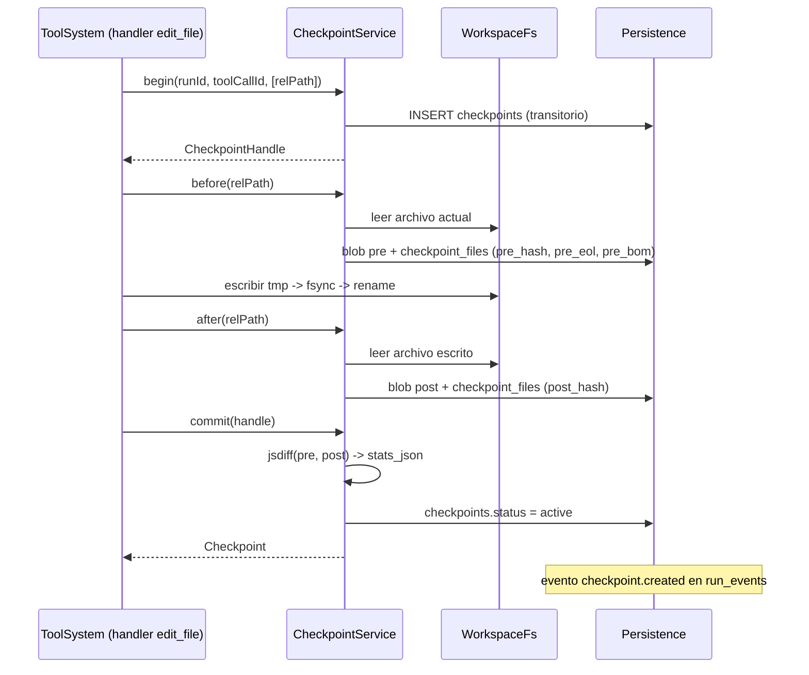

# Documento 09 — Protección del proyecto, checkpoints y revert

Propósito: especificar, de forma concreta y accionable, cómo SaurioLLM protege la carpeta del usuario mientras un agente la modifica — qué guarda, cómo lo guarda, cómo se revisa y se deshace, y qué queda explícitamente fuera de esa protección.

Leyenda: `[COMPROBADO EN EQUIPO]` `[VERIFICADO EN DOC OFICIAL]` `[DECISIÓN DE DISEÑO]` `[HIPÓTESIS A PROBAR]`

---

## 1. Objetivos y garantías explícitas

Este documento desarrolla la condición 5 del usuario y la sección 13 de la columna vertebral (`spine.md`). Los objetivos, en orden de prioridad, son:

1. **Ningún cambio del agente es irreversible dentro del workspace, para archivos de hasta 20 MB.** Todo archivo de ese tamaño que `edit_file`, `write_file` o `delete_file` toquen puede volver exactamente a su estado anterior, archivo por archivo, mientras ese estado anterior siga siendo reconstruible (ver límites, sección 6). Por encima de ese umbral el archivo queda con `blob_missing = 1` y esta garantía no aplica; la sección 6 explica exactamente qué se hace en ese caso.
2. **El agente nunca pierde el trabajo previo del usuario.** Si el usuario tenía cambios sin guardar o sin commitear antes de que el agente actuara, esos cambios no se sobrescriben en silencio: se detectan por hash y se resuelven con una decisión explícita del usuario.
3. **El `.git` del usuario es intocable.** SaurioLLM nunca ejecuta un comando de git que mute el repositorio del usuario por su cuenta, y no depende de `git` para poder ofrecer revert (ADR-4).
4. **La protección es transparente sobre sus límites.** El usuario ve, antes de aprobar una acción riesgosa, qué es lo que el checkpoint no va a poder deshacer.
5. **Todo queda auditado.** Qué se guardó, cuándo, qué se revirtió y quién lo autorizó es reconstruible desde SQLite, incluso después de un reinicio o un cierre inesperado (enlaza con el documento de fallos y recuperación, sección 12 de la columna vertebral).

Estas garantías son sobre **contenido de archivos dentro del workspace**, no sobre el estado del sistema del usuario en general. La sección 6 hace esa frontera explícita porque es la parte más fácil de sobre-prometer.

---

## 2. Diseño del checkpoint

### 2.1 Mecanismo: snapshot content-addressed por archivo, no por workspace completo

`[DECISIÓN DE DISEÑO]` (ADR-4 de la columna vertebral). SaurioLLM **no** copia el workspace completo en cada checkpoint. Guarda, por archivo, dos blobs con contenido exacto (bytes crudos, sin normalizar EOL ni BOM): la imagen "antes" de la primera modificación de ese archivo en la tool call, y la imagen "después" una vez aplicada la escritura.

Por qué archivo y no workspace completo:

- Un proyecto típico tiene miles de archivos (`node_modules` excluido); copiar todo en cada tool call sería lento y llenaría el disco sin necesidad — la mayoría de los archivos nunca los toca el agente.
- El checkpoint solo necesita poder revertir lo que el agente cambió. Todo lo demás nunca se lee ni se escribe (ver sección 4, "aislamiento").
- Direccionar por contenido (hash del blob) permite deduplicar: si dos tool calls distintas dejan un archivo con el mismo contenido exacto (por ejemplo, un `write_file` que reescribe lo mismo que ya había), el blob se reutiliza vía `refcount` en la tabla `blobs`, en vez de duplicarse en disco.

Se descartaron dos alternativas (tabla 1.2 de la columna vertebral):

- **Shadow git** (estilo algunas herramientas de la investigación de referencia): un repositorio git paralelo apuntando al mismo working tree. Riesgo real de interferir con `.git` del usuario si algo sale mal con `GIT_DIR`/`--work-tree`, y el revert de árbol completo de git puede pisar archivos que el usuario tocó fuera del alcance del agente.
- **Commits reales en el repositorio del usuario.** Descartado explícitamente por el usuario (condición 5 y decisión 4 de la columna vertebral): SaurioLLM no necesita que el proyecto tenga git, ni debe ensuciar su historial.

### 2.2 Dónde se guarda

- **Blobs:** `appData/blobs/<hash>`, un archivo por contenido único, con entrada en la tabla `blobs(hash, size, created_at, refcount)`. `appData` es la carpeta de datos de la app (fuera del workspace del usuario), no `N:\SaurioLLM` ni el proyecto que el usuario abrió.
- **Escritura atómica del propio blob** `[DECISIÓN DE DISEÑO]`. El `BlobStore` escribe con el mismo patrón que `WorkspaceFs` (sección 3.3): `appData/blobs/<hash>.tmp-<ulid>` → `fsync` → `rename` a `appData/blobs/<hash>`. La fila en `blobs` se inserta recién después de que ese `rename` termina con éxito, nunca antes. Esto evita dos escenarios de corrupción silenciosa: (a) un crash a mitad de la escritura del blob dejaría un archivo truncado cuyo nombre (el hash) ya no corresponde a su contenido, y la deduplicación por `refcount` daría por bueno ese archivo existente sin leerlo en un `before()` posterior con el mismo hash; (b) un crash entre el `INSERT` en `blobs` y la escritura real del archivo dejaría la tabla y el disco desincronizados sin ningún chequeo que lo detecte. Por eso `revert` y `diff` (secciones 3.6 y 5) **recalculan el hash del blob antes de usarlo**: si no coincide o el archivo no existe, ese archivo se trata como `blob_missing` (no restaurable, se avisa) en vez de escribir contenido corrupto sobre el archivo del usuario. `recover()` (documento 10, sección 5) incluye un barrido de `appData/blobs/*.tmp-*` huérfanos, igual que hace con los temporales del workspace (sección 3.3).
- **Metadatos del checkpoint:** tabla `checkpoints(id, run_id, chat_id, tool_call_id, iteration, label, kind, created_at, stats_json, status, reverted_at, git_head)` y `checkpoint_files(checkpoint_id, rel_path, change, pre_hash, post_hash, pre_eol, pre_bom, pre_encoding, pre_mode, blob_missing)`. La columna `git_head` guarda, si el proyecto tiene `.git`, el resultado de dos lecturas de solo lectura (`git rev-parse HEAD` y `git rev-parse --abbrev-ref HEAD`, permitidas por la sección 7 punto 2) tomadas en el momento del `begin()`; se usa en `planRevert` (sección 5.3) para detectar que el repositorio cambió de rama o de commit entre el checkpoint y el revert. Ninguna de estas dos lecturas escribe en `.git`.
- **Evento en el log:** `checkpoint.created` en `run_events`, con el objeto `Checkpoint` completo (interfaz de la sección 5 de la columna vertebral), para auditoría y para que la UI reaccione en vivo. **Corrección:** a diferencia de lo que decía una versión anterior de este documento, `checkpoints`, `checkpoint_files` y `blobs` **no son una proyección** del log y `saurio db rebuild` no las toca — así lo define el documento 03 sección 1 y lo confirma la sección 4 de la columna vertebral, y ese es el criterio que manda ante esta contradicción (sección 16 y sección 4 de la columna vertebral). La razón de fondo: `status` (`active`/`reverted`/`partial`) y `reverted_at` se escriben en `checkpoint.reverted`, **después** de `checkpoint.created`; si `rebuild` reconstruyera `checkpoints` reproyectando solo `checkpoint.created`, todo checkpoint ya revertido volvería a figurar como `active` y el usuario podría revertirlo dos veces. `checkpoints`/`checkpoint_files`/`blobs` tienen su propio ciclo de vida fuera del log, tal como las tablas `permission_*`, `models` y `settings` (documento 03 sección 1).

### 2.3 Qué archivos incluye

Un checkpoint agrupa **los archivos que una tool call mutante tocó**, no el workspace completo:

- `edit_file`, `write_file`, `delete_file` son las únicas tools con `mutating: true` sobre el sistema de archivos en el MVP (`ToolDefinition.mutating`, sección 5). Antes de que el `handler` de cualquiera de ellas corra, el runtime ya abrió un `CheckpointHandle` (ver flujo, sección 3).
- Una tool call puede tocar más de un archivo solo si su propio `handler` así lo decide explícitamente pasando varios `relPath` a `before`/`after` (en el MVP ninguna tool builtin hace multi-archivo en una sola llamada; se deja la interfaz preparada para tools futuras, principio 8).
- **`run_command` no genera checkpoint de archivos.** Es la limitación central de este diseño y se explica en la sección 6: el runtime no sabe, sin ejecutar el comando, qué archivos va a tocar un `npm install` o un script de build.

### 2.4 Por qué este diseño y no "todo el workspace" en cada paso

Se evaluó (y se descartó) snapshot del workspace completo por corrida:

- Costo de I/O y disco proporcional al tamaño del proyecto, no al tamaño del cambio; en un proyecto de decenas de miles de archivos esto es inviable para cada tool call.
- No resuelve el problema de fondo: un snapshot de workspace completo **tampoco** captura lo que hace `run_command` de manera más fiel que un snapshot por archivo — un `git diff --stat` posterior podría detectar los mismos archivos, pero copiar contenido completo antes/después de cada comando shell sigue siendo demasiado caro para el caso común (comandos de solo lectura, tests, linters).
- El shadow git de v0.3 (sección 4) cubre esa brecha de forma más barata: detecta **qué** cambió por un comando comparando el árbol de trabajo, sin necesitar una copia previa completa.

---

## 3. Flujo: checkpoint, escritura, diff

### 3.1 Antes de la primera escritura del run

Al recibir el primer `tool.registered` de una tool mutante en un run, el `RunController` invoca `CheckpointService.begin(runId, toolCallId, paths)`, que:

1. Crea la fila `checkpoints` en estado transitorio (aún no `active`; se confirma en `commit`).
2. Devuelve un `CheckpointHandle { checkpointId, before(relPath), after(relPath) }` que se inyecta en el `ToolContext.checkpoint` que recibe el `handler` de la tool (interfaz `ToolContext`, sección 5).

Este `begin` ocurre **una vez por tool call**, no una vez por run: cada tool call mutante tiene su propio checkpoint, encadenado al run por `run_id` (columna `checkpoints.run_id`) y, opcionalmente, agrupado visualmente por la UI ("este run cambió 12 archivos" agrega varios checkpoints del mismo run).

### 3.2 Snapshot "antes" por archivo

Antes de escribir, el `handler` de `edit_file`/`write_file`/`delete_file` llama a `checkpoint.before(relPath)`:

- Lee el archivo del disco tal cual está en ese instante (bytes crudos).
- Calcula el hash de contenido, detecta EOL dominante (`CRLF`/`LF` mixto se resuelve por mayoría de línea), BOM y codificación.
- Si el archivo no existe todavía (caso `write_file` que crea uno nuevo), se registra `change: 'created'` y no hay `pre_hash`.
- **Detección de binario / codificación no soportada** `[DECISIÓN DE DISEÑO]`. `before()` inspecciona los primeros 8 KB del archivo: BOM desconocido, bytes `NUL` presentes, o una decodificación UTF-8 inválida clasifican el archivo como binario o de codificación no soportada. En ese caso, `edit_file`/`write_file` **fallan** con `ToolCallErrorCode = 'path_denied'` y el mensaje "archivo binario o con codificación no soportada: SaurioLLM no lo edita", sin llegar a escribir nada. `delete_file` sigue permitido sobre ese archivo, con su checkpoint normal (borrar no requiere interpretar el contenido). Cuando el archivo es texto reconocible, la codificación detectada se guarda en `checkpoint_files.pre_encoding` junto a `pre_eol`/`pre_bom`, y la tool reescribe siempre con esa misma codificación — así se evita el caso silencioso de reescribir un archivo UTF-16LE o latin-1 como UTF-8.
- **Límite de tamaño de lectura.** `WorkspaceFs.readFile` tiene un límite duro configurable (por defecto 5 MB): por encima de ese tamaño, `read_file` exige `offset`/`limit` en vez de traer el archivo entero a un `string` en el proceso `main`. Esto es independiente del límite de 20 MB de la pre-imagen (siguiente punto): un archivo puede ser demasiado grande para leerlo entero de una sola vez y, a la vez, aun así calificar o no para pre-imagen.
- Si el archivo pesa más de 20 MB, se registra `blob_missing = 1`: se guarda el hash (para poder detectar si cambió) pero **no** el contenido — copiar binarios grandes en cada tool call no es sostenible en un `appData` de tamaño acotado. Este umbral es configurable en Settings, con el espacio libre de `appData` a la vista. Las consecuencias exactas de `blob_missing = 1` (qué tools quedan permitidas y qué ve el usuario) están en la sección 6.
- **Fallo de `before()` es fatal para la tool call** `[DECISIÓN DE DISEÑO]`. Si la lectura del archivo actual, el cálculo de hash o —el caso más importante— la escritura del blob en `appData/blobs/<hash>` fallan (por ejemplo `ENOSPC` con el disco `C:` lleno, `EPERM`, o cualquier otro error de I/O), el `handler` de la tool **no se invoca**: la tool call pasa directamente a `tool_calls.status = 'failed'` con `ToolCallErrorCode = 'disk_full'` (si el error es `ENOSPC`) o `'unknown'` (para el resto), se emite `tool.status` y ningún archivo del usuario se toca. El run pasa a `failed(db_write_failed)` únicamente si, además, falla la propia persistencia de ese resultado. El usuario ve "no se puede proteger el archivo antes de modificarlo: liberá espacio en C:" cuando el error es `disk_full`. Antes de `begin()`, el runtime hace además un chequeo previo de espacio libre mínimo en `appData` cuando la suma de tamaños de los archivos a tocar por la tool call lo supere, para fallar rápido sin siquiera intentar escribir el blob. El caso "fallo al escribir la pre-imagen" se agrega a la tabla de fallos y recuperación del documento 10 sección 5 (ver también la referencia cruzada en la sección 12 de la columna vertebral, caso "cierre inesperado a mitad de una tool").
- El blob se escribe (o se reutiliza vía `refcount`, tras la verificación de hash descrita en la sección 2.2) en `appData/blobs/<hash>` **antes** de que la tool aplique la escritura, de modo que un cierre inesperado justo después de `before()` deja el pre-estado ya guardado.

### 3.3 Escritura atómica (temp + rename)

`[DECISIÓN DE DISEÑO]`. `WorkspaceFs` nunca escribe directamente sobre la ruta final:

0. Adquiere un **lock por `rel_path`** dentro de `WorkspaceFs`, alcance proceso `main`, antes de llamar a `checkpoint.before()`. Si no puede obtenerlo dentro de un timeout corto, la tool falla con `ToolCallErrorCode = 'edit_conflict'` en vez de esperar indefinidamente. El lock se libera recién después de `checkpoint.after()`. Esto cubre el caso de dos runs (o dos tool calls del mismo run) escribiendo el mismo archivo a la vez — posible por diseño, porque un run está limitado a un chat (documento 05 sección 2.1) pero no a un proyecto — y evita que sus escrituras se intercalen.
1. Escribe el contenido nuevo en un archivo temporal en el mismo volumen y directorio que el destino, con el patrón de nombre fijo `<archivo>.saurio-tmp-<toolCallId>`, para garantizar que el `rename` posterior sea atómico a nivel de sistema de archivos (mismo filesystem).
2. `fsync` del archivo temporal.
3. `rename(tmp, destino)` — en NTFS esto reemplaza el archivo destino de forma atómica; nunca queda un archivo a medio escribir si el proceso muere entre el paso 1 y el 3 (o el archivo final tiene el contenido viejo completo, o tiene el nuevo completo).
4. Si el `rename` falla con `EPERM`/`EBUSY` (caso frecuente en Windows: antivirus con el archivo bajo escaneo, o el archivo abierto en un editor), se reintenta con backoff: 3 intentos a 50/150/400 ms. Si persiste, la tool falla con `ToolCallErrorCode = 'path_locked'` y el mensaje accionable "cerrá el archivo en el editor y reintentá". **No hay fallback in-place**: escribir directo sobre el destino cuando el `rename` falla rompería la garantía "archivo entero o intacto" que este mecanismo existe para sostener. Esta es la única redacción válida del comportamiento ante `EPERM`/`EBUSY`; el documento 05 sección 2.8 y el documento 12 ADR-017 deben decir lo mismo (reintento + `path_locked`, nunca escritura in-place).

Este mecanismo es lo que permite que la fila "Cierre inesperado a mitad de una tool" de la tabla de la sección 12 de la columna vertebral (y el caso (8) del documento 10) prometa "escritura atómica garantiza archivo entero o intacto" ante un cierre a mitad de una tool.

**Limpieza del temporal.** El patrón `*.saurio-tmp-*` es un patrón ignorado por defecto en `WorkspaceFs.isIgnored()` (sección 8): ni `list_files`, ni `search_code`, ni el `ProjectIndexer` lo ven nunca, para que un temporal que sobreviva a un crash no aparezca en resultados de búsqueda, en el watcher del dev server del usuario ni en un commit. `recover()` (documento 10, sección 5) y el cierre limpio de la app barren el workspace y borran los `*.saurio-tmp-*` cuyo `toolCallId` no pertenezca a un run vivo, registrando cada borrado en `audit_log`. Si el directorio destino es de solo lectura, el temporal se crea igual ahí (nunca fuera del workspace) y el fallo se reporta como `path_denied`.

`delete_file` usa el mismo mecanismo de checkpoint que `edit_file`/`write_file`, sin cuarentena, para el caso normal: `before(relPath)` guarda el blob de la pre-imagen y la fila `checkpoint_files` con `change: 'deleted'` → `fs.unlink(relPath)` → `commit`. Como `before()` ya deja el contenido a salvo en `appData/blobs/<hash>` antes de tocar el archivo (sección 3.2), no hace falta mover nada a una zona intermedia: el blob **es** el respaldo. El único caso no cubierto por este camino directo es el archivo con `blob_missing = 1` (mayor a 20 MB, sección 3.2): ahí no hay contenido guardado, así que borrarlo sería irreversible sin aviso. Para ese caso, `delete_file` **no** ejecuta el camino directo; ver sección 6 para el comportamiento exacto (denegar por defecto, o mover a una cuarentena de `appData` conservada hasta que el usuario la purgue explícitamente, si el usuario habilitó esa opción). Cuando se usa esa cuarentena, el orden es: (1) `before()` registra `checkpoint_files` con `change: 'deleted'` y `blob_missing = 1`, (2) recién entonces se mueve el archivo a `appData/quarantine/<toolCallId>/<rel_path codificado>`, (3) `commit`, (4) el archivo de cuarentena se borra solo después de que el usuario decide purgarlo — nunca automáticamente y nunca antes del `commit` exitoso. `recover()` (documento 10, sección 5) barre cuarentenas huérfanas (sin `commit` asociado) y las lista en la tarjeta de run interrumpido en vez de borrarlas.

### 3.4 Snapshot "después" por archivo

Tras la escritura exitosa, el `handler` llama a `checkpoint.after(relPath)`:

- Lee el archivo recién escrito, calcula su hash, y lo guarda como blob `post`.
- Si la tool fue `delete_file`, no hay `post_hash` (`change: 'deleted'`).

### 3.5 Commit del checkpoint

`CheckpointService.commit(handle)`:

1. Cierra la fila `checkpoints` (pasa a `status: 'active'`).
2. Calcula `stats_json` (`{ files, added, removed }`) corriendo `jsdiff` sobre los pares pre/post de cada archivo del checkpoint — **nunca** confiando en lo que el modelo dice que cambió. Por encima de un umbral de tamaño configurable, `commit` **no** corre `jsdiff` de forma síncrona en el proceso `main`: guarda `stats_json = { files, added: null, removed: null, reason: 'too_large' }`, y el diff completo del panel (sección 3.6) se calcula bajo demanda en el `utilityProcess`, nunca bloqueando la UI.
3. Emite `checkpoint.created` en `run_events` con el objeto `Checkpoint` completo.
4. Solo después de este commit el `tool_calls.status` pasa a `done`. Si el proceso muere entre la escritura (3.3) y el commit, `recover()` encuentra la tool en `running` → la marca `orphaned`. El diagnóstico **no** es una comparación binaria de `hash(archivo actual)` contra `pre_hash`/`post_hash`: como `post_hash` se escribe recién en este paso 3.5, después del `rename` atómico de 3.3, un corte justo entre el `rename` y el commit deja `post_hash` en `NULL` aunque la escritura ya haya terminado, y una comparación de dos casos no distingue ese escenario de "nunca llegó a escribir". Por eso `recover()` evalúa las **cuatro reglas en orden** de doc 10 § 5.4 (mismo algoritmo, sin duplicar aquí la tabla): `post_hash` no nulo e igual a `hash(actual)` → "se aplicó completa"; `hash(actual)` igual a `pre_hash` (con o sin `post_hash`) → "no se aplicó"; `post_hash` NULL y `hash(actual)` distinto de `pre_hash` → "se aplicó pero no se registró" (`recover()` completa `post_hash` y `stats_json` a partir del hash real y deja el checkpoint en `active`); cualquier otro caso → "estado distinto a ambos (¿editado después?)", para decisión manual.

### 3.6 Diff por archivo

`CheckpointService.diff(checkpointId, relPath)` reconstruye el diff unificado **on demand**, leyendo los dos blobs (pre/post) desde `appData/blobs/` y corriendo `jsdiff` — no se persiste un diff calculado, solo los blobs y los hashes. Esto mantiene la tabla `checkpoint_files` liviana y permite recalcular el diff con distintas opciones de visualización sin volver a tocar el disco del proyecto.

---

## 4. Revisión de cambios (UI de diff, aceptar/rechazar por archivo)

`[DECISIÓN DE DISEÑO]`. La revisión ocurre en dos momentos posibles, y el diseño soporta ambos sin cambiar el mecanismo de checkpoint:

- **Antes de aplicar** (permiso): cuando `PermissionEngine` decide `ask` para una tool `write`, la `PermissionRequest` incluye `preview.diff` — un diff en seco calculado por la tool sobre lo que *va a* escribir, comparado contra el contenido actual leído en ese instante (no un checkpoint todavía, porque el checkpoint recién se abre si el usuario aprueba). Esto es lo que la sección 15 (recorrido de validación) llama "diff en seco `+12 −3`".
- **Después de aplicar** (revisión post-hoc): la pestaña Diff de la UI lee `checkpoint:diff(checkpointId, relPath)` y muestra antes/después lado a lado con CodeMirror 6 (`@codemirror/merge`), como especifica la sección 2.1 de la columna vertebral.

**Aceptar/rechazar por archivo** en el MVP se resuelve así: aceptar un cambio ya aplicado no requiere acción (el archivo ya quedó escrito); "rechazar" un archivo puntual de un checkpoint con varios archivos es, en términos de esta arquitectura, un **revert parcial** — se cubre con la resolución por archivo del flujo de revert (sección 5), no con un mecanismo aparte. No hay una tabla `checkpoint_review_decisions` separada: la decisión del usuario sobre qué archivos restaurar y cuáles conservar queda en el `resolution` que se le pasa a `CheckpointService.revert`, y ese `resolution` se persiste en `audit_log` (sección 7).

---

## 5. REVERT: semántica exacta

### 5.1 Alcance

El revert opera **solo sobre archivos tocados por el agente**, identificados por las filas `checkpoint_files` de los checkpoints seleccionados. Nunca toca ningún archivo que no aparezca en esa tabla para esos checkpoints, sin importar qué más haya cambiado en el proyecto.

**El revert es una acción del usuario, no del agente** `[DECISIÓN DE DISEÑO]`. Por eso omite `.saurioignore` y los protected paths (sección 8) para los archivos que ya figuran en `checkpoint_files` de los checkpoints seleccionados — nunca para ningún otro archivo. Esto resuelve el caso en que el usuario agrega una ruta a `.saurioignore` *después* de que el agente ya la editó (una reacción razonable a que el agente haya tocado algo que no debía): si el revert respetara `.saurioignore` como lo hacen las tools del agente, el mecanismo pensado para proteger terminaría impidiendo deshacer justo lo que motivó la protección. Si el path está hoy ignorado o protegido, el diálogo de revert lo marca con un ícono y la leyenda "este archivo hoy está protegido; restaurarlo lo modifica igual" y pide una confirmación extra antes de aplicarlo. La sección 8 documenta esta excepción explícitamente para que no quede como contradicción con "independientemente de permisos".

### 5.2 Reglas por tipo de cambio

| `change` en `checkpoint_files` | Qué hace el revert cuando es restaurable |
|---|---|
| `modified` | Se restaura el `pre_hash` (contenido, EOL y BOM originales) sobre la ruta actual, con escritura atómica (temp + rename, igual que en la aplicación original). |
| `created` | El archivo creado por el agente **se borra**. No queda ninguna versión "pre" porque no existía. |
| `deleted` | El archivo **se restaura** con el contenido del `pre_hash` guardado antes del borrado. |

### 5.3 Plan de revert: `planRevert`

`CheckpointService.planRevert(checkpointIds)` no escribe nada; devuelve, por archivo:

- `restorable: string[]` — archivos donde el hash actual coincide con el `post_hash` esperado (ver el algoritmo de `expectedHash` más abajo). El agente es el último que tocó ese archivo; revertir es seguro y no pierde nada del usuario.
- `conflicts: { relPath, pre?, post?, current, editedBy? }[]` — archivos donde el hash actual **no** coincide con el `post_hash` esperado. Esto significa que alguien (el usuario, otra herramienta, otro run) editó el archivo después de que el agente lo dejó.
- `uncoveredEffects: { toolCallId, toolName, command, category, finishedAt }[]` — las tool calls `run_command` en estado `done`/`failed` del mismo run cuyo `finished_at` cae entre el `created_at` del checkpoint más viejo y el del más nuevo de la selección. No son archivos con conflicto: son efectos de comandos que el revert de archivos no deshace (ver sección 5.4 y sección 6).
- `branchChanged?: { was: { sha, branch }, now: { sha, branch } }` — presente solo si el proyecto tiene `.git` y el `git_head` guardado en algún checkpoint de la selección (sección 2.2) difiere del `git rev-parse HEAD` / `--abbrev-ref HEAD` actual (ambas, lecturas).

**Algoritmo de conflicto con varios checkpoints (corrige una definición anterior de este documento).** Comparar siempre `post_hash` contra el hash del disco actual es incorrecto cuando la selección incluye más de un checkpoint sobre el mismo archivo (el caso normal de "deshacer todo un run" con dos `edit_file` sobre el mismo `rel_path`): el checkpoint más viejo de ese archivo tendría un `post_hash` distinto del disco actual por construcción — el archivo pasó por una escritura más después — y se reportaría como conflicto falso. En vez de eso, `planRevert` simula la secuencia de aplicación (que es del más nuevo al más viejo, sección 5.5): mantiene un `expectedHash` por `rel_path`, inicializado en `hash(disco actual)`; después de considerar cada checkpoint de la selección para ese archivo, `expectedHash` pasa a ser el `pre_hash` de ese checkpoint (el estado que quedaría si se revirtiera). Un checkpoint se marca en conflicto para ese archivo solo cuando su `post_hash` **no** coincide con el `expectedHash` vigente en el momento de evaluarlo — es decir, cuando lo que hay para deshacer no es lo que el propio plan de revert dejó como "esperado" al deshacer los checkpoints más nuevos ya considerados. Con un solo checkpoint por archivo, esto se reduce exactamente a la comparación `hash(actual) === post_hash` de antes.

**Atribución del conflicto (no siempre es "el usuario").** Antes de mostrar "el usuario editó después", `planRevert` busca la fila `checkpoint_files` más reciente (de cualquier checkpoint, no solo los seleccionados) cuyo `post_hash` sea igual a `hash(actual)`. Si existe, el conflicto se rotula "modificado por otro run (`<runId>`, chat `<título>`) el `<fecha>`" en `editedBy`, porque el estado actual también lo dejó un agente, no necesariamente el usuario; si no existe ninguna fila así, se mantiene "el usuario editó después". Revertir un run **no** revierte los cambios que otro run haya hecho sobre los mismos archivos — eso se resuelve archivo por archivo con el flujo de conflicto de la sección 5.4, igual que cualquier otro conflicto.

Esta comparación sigue siendo la "detección de ediciones posteriores del usuario" pedida en el brief: **hash de lo que se espera encontrar en el disco (el `post_hash` del checkpoint que se está evaluando, ajustado por los checkpoints más nuevos ya aplicados) contra el contenido actual**, no contra el "antes". Si coinciden, no hubo edición posterior (del usuario ni de otro run); si no coinciden, sí la hubo.

### 5.4 Qué se hace ante conflicto

`[DECISIÓN DE DISEÑO]`, regla dura: **nunca se pisa en silencio**. Antes de mostrar cualquier archivo, el diálogo de revert presenta dos advertencias, cuando aplican, encima de la lista de archivos:

- **`uncoveredEffects` ("esto NO se deshace")**: si `planRevert` devolvió comandos `run_command` dentro del rango de la selección, se listan con su comando y en qué momento corrieron; cuando el `CommandParser` reconoce un patrón de instalación o migración (sección 6), se agrega la sugerencia concreta (por ejemplo, "puede que necesites volver a correr `npm install` después de restaurar `package.json`"). Esto cubre el caso "se ejecutó `npm install` y el usuario revierte `package.json`": la tabla de límites de la sección 6 se muestra en el `PermissionRequest`, *antes* de aprobar el comando, pero acá — en el momento del revert, que es cuando el malentendido realmente importa — se repite ligada a los comandos que efectivamente corrieron, no como texto genérico.
- **`branchChanged` ("el repositorio cambió de rama o de commit")**: si el `git_head` del checkpoint difiere del `HEAD` actual, se muestra "el repositorio cambió de rama o de commit desde este checkpoint (era `<sha>` en `<rama>`, ahora `<sha>` en `<rama>`); restaurar puede mezclar contenido de otra rama", de forma bloqueante antes de habilitar `restore`, con `keep_mine` preseleccionado en todos los archivos. Esto cubre el escenario "el usuario hace `git checkout` a otra rama entre el checkpoint y el revert": sin este chequeo, `planRevert` marcaría todos los archivos como conflicto por hash y el usuario podría elegir `restore` creyendo que deshace un cambio del agente, cuando en realidad estaría inyectando contenido de otra rama en su working tree. Ninguna de las dos lecturas de git usadas acá escribe en `.git`.

Para cada archivo en `conflicts`, la UI muestra además una vista de tres vías:

- **pre** — el blob guardado antes de que el agente lo tocara.
- **post** — el blob que el agente dejó (lo que se intentaría restaurar en un revert simple).
- **actual** — el contenido presente en el disco ahora mismo, con la etiqueta de autoría que calculó `planRevert` (`editedBy`): "el usuario editó después" cuando no se encontró otro run detrás del contenido actual, o "modificado por otro run (`<runId>`, chat `<título>`) el `<fecha>`" cuando sí se encontró.

El usuario resuelve por archivo, vía el parámetro `resolution: Record<relPath, 'restore' | 'keep_mine' | 'skip'>` de `CheckpointService.revert`:

- `restore`: aplica el `pre_hash` de todas formas, descartando lo que haya en disco ahora (el usuario decide explícitamente que quiere volver al estado previo al agente, aun perdiendo la edición posterior).
- `keep_mine`: no toca ese archivo; queda tal como está ahora.
- `skip`: equivalente a `keep_mine` para efectos de esta operación, pero se registra distinto en `audit_log` (el usuario decidió "no ahora" en vez de "conservar explícitamente lo mío").

No existe una cuarta opción de "mezclar automáticamente" en el MVP: si el usuario quiere combinar manualmente, copia lo que necesite del panel de tres vías y elige `keep_mine`.

### 5.5 Orden de aplicación con varios checkpoints

Cuando `revert` recibe varios `checkpointIds` (por ejemplo, deshacer un run completo con 3 tool calls sobre 5 archivos), se aplican **del más nuevo al más viejo**. Esto importa cuando el mismo archivo fue tocado por más de un checkpoint del conjunto: el resultado final debe ser el estado anterior al primero de los checkpoints seleccionados, no un estado intermedio.

### 5.6 El revert es en sí mismo reversible

`[DECISIÓN DE DISEÑO]`, explícito en la columna vertebral (sección 13). Ejecutar `revert` genera un nuevo `checkpoint` con `kind: 'revert'`, con su propio pre/post por archivo (el "pre" del revert es el estado justo antes de revertir; el "post" es el estado restaurado). Esto significa que deshacer un revert es, mecánicamente, otro revert — no hay una operación especial de "redo"; se resuelve con el mismo flujo.

### 5.7 Estado de los checkpoints revertidos

Al confirmarse un revert, los checkpoints originales pasan `status: 'active' → 'reverted'` (o `'partial'` si, por conflictos, solo algunos de sus archivos se restauraron). `reverted_at` se completa. El checkpoint de tipo `revert` queda `active`. Ningún checkpoint se borra nunca — es historial, no estado mutable de un solo uso.

---

## 6. Límites explícitos: lo que el checkpoint NO deshace

Esta es la sección que se muestra al usuario **antes** de que apruebe una acción que cae fuera de la cobertura del checkpoint, y también queda fija en la tarjeta de cada checkpoint y en el diálogo de revert (texto literal exigido por la columna vertebral, sección 13).

| Efecto NO cubierto | Por qué no se puede deshacer | Cómo se advierte antes |
|---|---|---|
| `npm install` / `pnpm install` y similares | Modifican `node_modules`, lockfiles y potencialmente el registro de paquetes global; el volumen de archivos y su naturaleza binaria hacen inviable un snapshot completo por comando | `PermissionEngine` clasifica el comando como categoría `terminal`; el `PermissionRequest` incluye el texto literal "Este comando puede instalar o modificar dependencias; SaurioLLM no puede deshacer sus efectos" cuando el `CommandParser` reconoce el patrón (heurística por nombre de binario: `npm`, `pnpm`, `yarn`, `pip`, `cargo`, etc. — lista abierta, no exhaustiva `[DECISIÓN DE DISEÑO]`) |
| Migraciones de base de datos | Ejecutan contra un motor externo (Postgres, SQLite del propio proyecto del usuario, etc.) fuera del alcance de archivos del workspace | Mismo mecanismo: el `CommandParser` reconoce patrones de herramientas de migración conocidas (`prisma migrate`, `drizzle-kit`, `alembic`, etc.) y agrega la advertencia específica "esto modifica una base de datos, no un archivo; no hay revert" |
| Borrados fuera del workspace | El `WorkspaceFs` confina las tools de archivos (`edit_file`, `write_file`, `delete_file`) a `projectRoot`, pero `run_command` puede invocar `rm`/`Remove-Item` con rutas absolutas fuera del proyecto | La categoría `delete` vía comando cae en `PermissionEngine` como `terminal` de riesgo alto si el `CommandParser` detecta un patrón de borrado con ruta fuera de `cwd`; aun así, si el usuario aprueba, no hay backup previo — se advierte explícitamente antes de aprobar |
| `git push` | Efecto en un servidor remoto, irreversible desde el cliente | `git_push` (tool v0.2) pasa siempre por `ask` (política de la condición 7 del usuario), nunca por regla "permitir siempre"; el `PermissionRequest` dice "esto publica en un remoto; no hay forma de deshacerlo desde acá" |
| Cambios en servicios externos (llamadas de red, APIs de terceros, efectos en Ollama como `pull`/`delete` de modelos) | Ocurren fuera del filesystem del workspace | Cada una de estas acciones (categoría `network`, y las tools `models:pull`/`models:delete` del Centro de modelos) tiene su propio texto de advertencia en el punto de confirmación correspondiente, fuera del mecanismo de checkpoint |
| Artefactos de build fuera de rutas conocidas | Un build puede escribir en cualquier ruta que su configuración indique, incluso fuera del workspace en casos raros | No hay detección específica en el MVP; el shadow git de v0.3 (sección 4 de este documento) ayuda solo para lo que cae dentro del workspace |
| Archivos mayores a 20 MB tocados por `edit_file`/`write_file`/`delete_file` | Se registran con `blob_missing = 1` (sección 3.2): se guarda el hash para detectar cambios, pero no el contenido, porque copiar binarios grandes en cada tool call no es sostenible en `appData` | La tarjeta del archivo y el `PermissionRequest` muestran, antes de que la tool corra, la advertencia literal "este archivo es demasiado grande para guardar una copia; si se modifica o se borra, el cambio NO se puede deshacer". Por diseño, `delete_file` sobre un path con `blob_missing = 1` falla con `ToolCallErrorCode = 'path_denied'` y el modelo recibe la instrucción de pedírselo al usuario directamente; si el usuario prefiere permitirlo igual, puede habilitar en Settings que ese borrado use la cuarentena de `appData` descrita en la sección 3.3, conservada sin límite hasta que el usuario la purgue explícitamente |

**Regla general que resume la tabla:** el checkpoint cubre exactamente lo que las tools `edit_file`/`write_file`/`delete_file` tocan **hasta 20 MB por archivo** (garantía 1 de la sección 1 corregida en el mismo sentido), porque son las únicas tools que pasan por `CheckpointService.begin/commit` y porque un archivo mayor queda con `blob_missing = 1` sin contenido reversible. Todo lo que un proceso lanzado por `run_command` haga por su cuenta —sin pasar por esas tres tools— está fuera de esa cobertura por diseño, no por un descuido a corregir después. Cerrar esa brecha del todo requeriría un mecanismo de sandboxing de procesos (contenedores, filesystem overlay) que la columna vertebral no incluye ni para v0.3 ni v0.4; queda fuera de alcance de este documento y se anota como pregunta abierta si el usuario quiere evaluarlo (sección 9).

---

## 7. Aislamiento del `.git` del usuario

`[DECISIÓN DE DISEÑO]`, condición dura del usuario. Mecanismos concretos:

1. **`.git` es protected path de escritura.** `WorkspaceFs` rechaza cualquier intento de `edit_file`/`write_file`/`delete_file` cuyo `relPath` resuelva dentro de `.git/`, sin excepción y sin pasar por `PermissionEngine` (se rechaza antes, como error de la tool, no como un `ask`).
2. **El runtime nunca invoca comandos git mutantes por su cuenta.** `git add`, `git commit`, `git reset`, `git checkout`, `git stash`, `git clean` no forman parte de ninguna tool builtin del MVP. Las únicas dos formas en que git participa en el MVP son lecturas: `git status --porcelain` (al abrir el proyecto, para avisar "hay cambios sin commitear") y `git diff --stat` (mismo propósito, en modo `agent`).
3. **Comandos git destructivos vía `run_command` quedan bloqueados por defecto.** El `CommandParser` de la categoría `terminal` reconoce el patrón `git reset --hard`, `git clean -f`, `git checkout -- <path>` (cuando el path no es uno que el propio run tocó) y otros equivalentes, y los clasifica como `risk: 'high'` con decisión por defecto `deny` en el preset `balanced` (regla del `PermissionEngine`, documento de permisos). El usuario puede autorizarlos igual, pero nunca son "allow" implícito.
4. **`git_commit` y `git_push` (v0.2) son tools separadas, no `run_command` libre.** Cuando existan, siempre pasan por `ask` (nunca por "permitir siempre", condición 7 del usuario) y operan con `--` más un pathspec limitado a los archivos que el propio run tocó (`checkpoint_files.rel_path` de los checkpoints del run), nunca con `git add -A` ni `git add .`. Esto evita que un commit hecho por el agente incluya cambios del usuario que no pasaron por el run.

### 7.1 Si se usa shadow git (v0.3), cómo se garantiza que no interfiere

El shadow git de v0.3 (mencionado en la sección 13 de la columna vertebral) es **estrictamente un detector**, no un mecanismo de revert, y su aislamiento del `.git` real se garantiza así:

- `GIT_DIR=<appData>/shadow/<hash-del-proyecto>` — el directorio de git del shadow vive completamente fuera del proyecto del usuario, dentro de `appData`.
- `--work-tree=<projectRoot>` — el árbol de trabajo apunta al proyecto, pero como el `GIT_DIR` está afuera, cualquier operación de este shadow repo nunca escribe dentro de `<projectRoot>/.git`.
- `core.excludesFile` / `info/exclude` del shadow repo incluye el propio `.git/` del proyecto (para que el shadow nunca intente indexar el repositorio real como si fuera contenido), más el `.gitignore` del usuario y un límite de tamaño de archivo (para no copiar binarios grandes al índice del shadow).
- Cada operación del shadow usa `git --git-dir=<...> --work-tree=<...> add -- ':!**/.git' ...` con pathspec que excluye explícitamente cualquier ruta `.git`, como cinturón de seguridad adicional al hecho de que el `GIT_DIR` ya es otro.
- **Nunca se ejecuta `git rm`, `reset` ni `checkout` sobre el `work-tree` real** desde el shadow; su única función es `git diff`/`git status` contra su propio índice, para reportar "estos archivos cambiaron desde el último checkpoint y no fueron tocados por ninguna tool" — la decisión de qué hacer con eso queda en el usuario, igual que con cualquier conflicto de revert (sección 5.4).
- El shadow repo no interactúa jamás con el repositorio real del usuario (`<projectRoot>/.git`): son dos objetos de git completamente independientes que comparten el mismo directorio de contenido pero no el mismo `GIT_DIR`, y git en sí mismo no permite que un `GIT_DIR` externo escriba en otro sin que se le pase explícitamente su ruta.

Si el proyecto del usuario **no tiene** `.git` (como es el caso hoy de `N:\SaurioLLM`, condición del entorno), el shadow repo funciona igual — de hecho es más simple, porque no hay riesgo alguno de interferencia con un repositorio real ausente.

---

## 8. Archivos ignorados y untracked

`[DECISIÓN DE DISEÑO]`:

- **`.saurioignore`** (formato de patrones estilo `.gitignore`, propio de SaurioLLM) define rutas que `WorkspaceFs` no deja leer ni escribir a **las tools del agente**, independientemente de permisos. Es la forma de que el usuario proteja, por ejemplo, una carpeta de secretos o un directorio de datos grandes sin depender de que el agente "decida" no tocarlos. **Excepción explícita:** el `revert` (sección 5.1) es una acción del usuario, no del agente, y por lo tanto omite esta restricción únicamente para los archivos que ya figuran en `checkpoint_files` de los checkpoints que se están revirtiendo — nunca para otros. Esto no debilita la protección contra las tools del agente; solo evita que agregar una ruta a `.saurioignore` después de que el agente la tocó bloquee la posibilidad de deshacer ese mismo cambio.
- **El `.gitignore` del proyecto** se usa solo para dos cosas: (a) que `ProjectIndexer` y `search_code`/`list_files` no indexen ni listen `node_modules`, `dist`, etc. por defecto (ruido, no protección), y (b) como entrada del `info/exclude` del shadow git de v0.3. **No** implica automáticamente que esas rutas estén protegidas de escritura — un archivo ignorado por git puede seguir siendo editado por el agente si el usuario lo permite; ignorado y protegido son conceptos distintos.
- **Archivos untracked** (nuevos, no agregados a git) se checkpointean exactamente igual que cualquier otro: el mecanismo de checkpoint no consulta el estado de git en absoluto, opera sobre el filesystem. La única relación con git es informativa: `git status --porcelain` al abrir el proyecto avisa si hay untracked/modified antes de que el agente empiece, para que el usuario sepa que ese trabajo no está en el checkpoint de nadie más que del propio git del usuario (si decide commitearlo aparte).

---

## 9. Auditoría

Toda decisión relevante para la protección del proyecto queda en `audit_log(id, ts, kind, payload_json)`, además de lo que ya vive en `run_events` (que es la fuente de verdad para checkpoints y su ciclo de vida). `audit_log.kind` es texto libre indexado por `(kind, ts DESC)`; para que un filtro o una pantalla de auditoría no tenga que conocer dos convenciones a la vez, este documento usa **snake_case**, coherente con los `ToolCallErrorCode` y con la convención del documento 06 sección 11 (`permission_rule_created`, `locality_blocked`, `critical_command_confirmed`), en vez de la notación de puntos usada en una versión anterior. El conjunto cerrado de `kind` que introduce este documento —y que debería listarse junto al resto en el DDL de `audit_log` del documento 03 sección 4.8— es:

- `checkpoint_revert_requested` — `checkpointIds`, usuario, timestamp.
- `checkpoint_revert_resolution` — el `resolution` completo elegido por archivo (`restore`/`keep_mine`/`skip`), para poder responder después "¿por qué este archivo no se revirtió?", junto con `uncoveredEffects` (sección 5.3) mostrados en ese revert.
- `checkpoint_revert_applied` — resultado real (`restored`, `skipped`, `revertCheckpointId`).
- `permission_destructive_command_allowed` — cuando el usuario aprueba explícitamente un comando que la tabla de la sección 6 marca como no cubierto (por ejemplo un `git push` o un borrado fuera del workspace), para dejar registro de que se avisó y se aprobó de todas formas.
- `tmp_orphan_cleaned` — cada `*.saurio-tmp-*` del workspace o `*.tmp-*` de `appData/blobs/` borrado por el barrido de `recover()` o del cierre limpio (sección 3.3 y 2.2), con el `toolCallId` asociado cuando se pudo determinar.

`run_events` sigue siendo la fuente de verdad reproducible (permite `saurio db rebuild`); `audit_log` es un registro plano, de solo lectura para el usuario, pensado para responder "¿qué pasó con este archivo/checkpoint?" sin tener que reproyectar el log completo. `audit_log` **no** se toca en `saurio db rebuild` (tabla de la sección 4 de la columna vertebral la lista explícitamente entre lo que no se reconstruye).

La UI expone esta auditoría como parte del historial del checkpoint (quién decidió qué, cuándo) más que como una pantalla separada — no hay, en el MVP, un "panel de auditoría" independiente; es previsto para más adelante si el volumen de decisiones lo justifica.

---

## Imprescindible para el MVP

- `CheckpointService` completo: `begin`, `before`, `after`, `commit`, `diff`, `planRevert`, `revert`, con escritura atómica temp+rename en `WorkspaceFs` y lock por `rel_path` entre `before()` y `after()`.
- Tablas `checkpoints` (con `git_head`), `checkpoint_files` (con `pre_encoding`), `blobs`, con `refcount` y `blob_missing` para archivos > 20 MB; escritura atómica temp+rename también para el propio `BlobStore`.
- Detección de binario/codificación no soportada en `before()`; límite de lectura configurable en `WorkspaceFs.readFile` (5 MB por defecto) con `offset`/`limit`; `commit` sin `jsdiff` síncrono por encima de un umbral de tamaño.
- Manejo explícito de fallo de `before()` (`disk_full`/`unknown`, tool call `failed`, sin invocar el `handler`) y chequeo previo de espacio libre en `appData`.
- `delete_file` sin cuarentena para archivos con blob (`before` → `unlink` → `commit`); `path_denied` por defecto sobre archivos con `blob_missing = 1`, con cuarentena opcional en `appData/quarantine/` solo si el usuario la habilita.
- Reintento con backoff y `path_locked` ante `EPERM`/`EBUSY` en el `rename`, sin fallback in-place; barrido de `*.saurio-tmp-*` y `*.tmp-*` huérfanos en `recover()` y en el cierre limpio.
- Revert por archivo con las tres reglas de la sección 5.2; `planRevert` con el algoritmo de `expectedHash` para varios checkpoints, atribución de conflicto a otro run cuando corresponda, `uncoveredEffects` y `branchChanged`; conflicto por hash con vista de tres vías, y resolución `restore | keep_mine | skip`. El revert omite `.saurioignore`/protected paths solo para los archivos ya cubiertos por los checkpoints seleccionados.
- El revert genera su propio checkpoint (`kind: 'revert'`) y es en sí mismo reversible.
- `.git` como protected path de escritura; ninguna tool builtin del MVP ejecuta comandos git mutantes; `git status`/`git diff --stat`/`git rev-parse` como únicas lecturas.
- Tabla de límites (sección 6, incluida la fila de archivos > 20 MB) visible en el `PermissionRequest` y repetida, ligada a los comandos que realmente corrieron, en el diálogo de revert.
- `.saurioignore` funcionando como protected path adicional configurable por el usuario.
- `audit_log` (valores `kind` en snake_case) para decisiones de revert, `uncoveredEffects` y aprobaciones de acciones no cubiertas.
- `checkpoints`/`checkpoint_files`/`blobs` fuera de `saurio db rebuild` (no son proyección del log).

## Previsto para más adelante

- Shadow git (v0.3) como detector de cambios por comando dentro del workspace, con el aislamiento de `GIT_DIR`/`--work-tree` descrito en la sección 7.1.
- Tools `git_commit`/`git_push` (v0.2), siempre con `ask` y pathspec limitado a archivos tocados por el run.
- Panel de auditoría dedicado en la UI (más allá del historial embebido en cada checkpoint).
- Detección más fina de comandos riesgosos (lista de patrones del `CommandParser` crece con uso real; hoy es una heurística abierta, no exhaustiva).
- Cualquier forma de sandboxing de procesos para cerrar la brecha de `run_command` (fuera de alcance de la columna vertebral actual; ver pregunta abierta).

---

## Nomenclatura agregada

Se agregan a la nomenclatura de la columna vertebral (compatibles con sus secciones 2, 3, 4, 5 y 13, no la reemplazan): las columnas `checkpoints.git_head` y `checkpoint_files.pre_encoding`; los códigos `ToolCallErrorCode` `disk_full`, `path_locked` y `edit_conflict`; el campo `uncoveredEffects` y `branchChanged` como salida de `planRevert`; y los valores de `audit_log.kind` en snake_case listados en la sección 9 (que reemplazan la notación de puntos de una versión anterior de este documento). Todos los demás nombres (`CheckpointService`, `CheckpointHandle`, `BlobStore` como concepto de `appData/blobs/<hash>`, `checkpoints`, `checkpoint_files`, `blobs`, `WorkspaceFs`, `.saurioignore`, `audit_log`, `run_events`, eventos `checkpoint.created`/`checkpoint.reverted`) provienen directamente de la columna vertebral. La cuarentena de `appData/quarantine/<toolCallId>/<rel_path codificado>` (sección 3.3) queda acotada al caso `blob_missing = 1` de `delete_file`, como red de seguridad opcional — el respaldo general de `delete_file` es el blob de `before()`, no la cuarentena.

## Desvíos respecto de la columna vertebral

1. **Qué:** se interpretó "aceptar/rechazar por archivo" (pedido en el brief) como equivalente a un revert parcial por archivo usando el `resolution` de `CheckpointService.revert`, en vez de proponer una tabla o mecanismo nuevo de "revisión" separado del revert. **Por qué:** la columna vertebral no define ninguna interfaz de revisión/aprobación de diffs *después* de aplicados, distinta del revert; agregar una tabla `checkpoint_review_decisions` nueva violaría el principio 8 (ninguna abstracción sin una implementación del MVP que la use) y duplicaría lo que `revert` con `resolution` ya resuelve. Se documenta aquí para que el usuario lo confirme si prefería un mecanismo de "aceptar cambios" distinto al de deshacer.
2. **Qué:** una versión anterior de este documento proponía que `delete_file` moviera el archivo a una zona de cuarentena general antes de cada `commit`, y que `checkpoints`/`checkpoint_files`/`blobs` fueran reconstruibles por replay del log (`saurio db rebuild`). **Por qué se corrigió:** ambas cosas contradecían el resto del diseño y a otros documentos — la cuarentena general era redundante con el blob que `before()` ya guarda (sección 3.3), y la reconstrucción por replay contradice el documento 03 sección 1 y la sección 4 de la columna vertebral, que excluyen explícitamente estas tablas de `rebuild`. Se corrigieron ambas en el cuerpo del documento (secciones 2.2 y 3.3) en vez de dejarlas como desvío, porque la columna vertebral y el documento 03 son la fuente de verdad y no hay ambigüedad que justifique mantenerlas como una decisión propia de este documento.

## Preguntas abiertas

Ninguna que cambie el diseño de este documento. La pregunta abierta 6 de la columna vertebral (comprobados del relevamiento 4) ya quedó resuelta por la condición 12 del brief y no se repite aquí. Si el usuario quisiera evaluar sandboxing de procesos para cerrar la brecha de `run_command` descrita en la sección 6, es una decisión de alcance mayor (afecta el modelo de permisos y de ejecución de comandos completo) que excede este documento y debería tratarse como una pregunta nueva sobre el roadmap, no como un ajuste a la protección del proyecto tal como está diseñada hoy.
