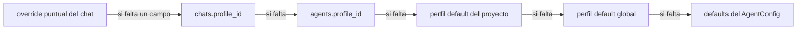

# SaurioLLM — Documento 15: Banco de pruebas y perfiles

Diseño del componente `Benchmark` (comparación reproducible de modelos en el equipo del usuario) y del sistema de `profiles` (perfiles rápido / equilibrado / máxima calidad), su alcance MVP vs después y su integración con `ModelManager` y `ModelGateway` sin duplicar responsabilidades.

Leyenda: `[COMPROBADO EN EQUIPO]` `[VERIFICADO EN DOC OFICIAL]` `[DECISIÓN DE DISEÑO]` `[HIPÓTESIS A PROBAR]`

---

## 0. Objetivo

Este documento responde a la condición 11.C: dar a SaurioLLM una forma de **medir** (no estimar) cómo se comporta cada modelo instalado con una tarea fija en el equipo real del usuario, guardar ese resultado como **compatibilidad probada**, y exponer perfiles (`rapido` / `equilibrado` / `calidad`) que fijan los parámetros de un agente sin que el usuario tenga que tocarlos turno a turno `[DECISIÓN DE DISEÑO]`.

Dos piezas separadas que comparten datos pero no responsabilidades:

- **Banco de pruebas (`Benchmark`, v0.3).** Corre una tarea fija contra uno o varios modelos, en cola, un modelo por vez, y persiste tiempos, tokens/segundo, contexto usado, VRAM/RAM medidas y (si la tarea es verificable) una nota de calidad. Es el **único** componente que escribe `model_compat` y `benchmark_runs` (§9 de la columna vertebral). No estima nada.
- **Perfiles (`profiles`, v0.2 activo / MVP como preset implícito).** Es configuración, no medición: fija modelo, `num_ctx`, `temperature`, `think`, política de contexto y `maxIterations` para un chat, un agente o un proyecto. Puede sugerir un perfil según lo que el Banco de pruebas midió, pero nunca se autoaplica sin que quede visible y reversible (ADR-7, principio 6).

Frontera que no se duplica: `ModelManager` sigue siendo el único que estima (`fits()`, `MemoryEstimator`) y el único que consulta `/api/ps` en vivo; `Benchmark` es el único que mide con una corrida real y controlada; `Telemetry` es el único que muestrea CPU/RAM/GPU del sistema durante esa corrida; `ModelGateway`/`InferenceScheduler` siguen siendo el único camino de inferencia y el único que otorga el slot. `Benchmark` no reimplementa ninguna de las tres cosas: las **usa**.

---

## 1. Alcance temporal

Todo este documento es **v0.3** salvo lo explícitamente marcado como MVP en §8. En el MVP (hito 1) no existe UI de banco de pruebas ni `profiles` activa; existe sí, desde el día 1, el `profile_id` nullable en `agents`, `chats` y `run.effectiveConfig` (regla 8: la columna existe porque migrarla después cuesta una migración, no una línea) y el harness `eval/` que corre una batería mínima de tareas de tool-calling como criterio de "listo" del roadmap (tabla §10 de la columna vertebral: "harness `eval/` con 5 tareas: tarea 1 ≥ 60 % con Qwen3-8B `[HIPÓTESIS A PROBAR el umbral]`"). Ese harness **no es** el Banco de pruebas de este documento: es un gate de regresión de calidad de tool-calling para el propio desarrollo de SaurioLLM, con su propia base `eval_runs` (SQLite aparte, carpeta `eval/`) y sus fixtures en `eval/fixtures`. El Banco de pruebas de v0.3 **reutiliza las mismas tareas verificables** de `eval/tasks/` para su suite `quality` (§3.4), pero persiste los resultados en `saurio.db` (`benchmark_runs`, `model_compat`) porque ahí es donde el Centro de modelos los necesita. Esta relación se documenta para que no se confundan ambos mecanismos en el scaffolding.

---

## 2. Definición de tarea (benchmark task)

**Tipos de tarea** `[DECISIÓN DE DISEÑO]`, ambos ejecutados a través del mismo `ModelGateway.chat` que usa el resto de la app (nunca un cliente HTTP paralelo):

```ts
// packages/runtime/src/benchmark/types.ts
// Nombre distinto de la interfaz de ejecución `BenchmarkSuite` (doc 04 §15, `run(model, gateway, manager, config)`):
// acá solo clasificamos una tarea, no ejecutamos nada — ver Nomenclatura agregada y Desvíos.
export type BenchmarkSuiteKind = 'speed' | 'quality';

export interface BenchmarkTask {
  id: string;                       // eval/tasks/<id>.json
  suite: BenchmarkSuiteKind;
  kind: 'fixed_prompt' | 'verifiable';
  prompt: string;                   // fixed_prompt: texto fijo, sin fecha ni valores aleatorios
  promptTokensApprox: number;       // 'corto' ~200, 'largo' ~2000, para elegir en la suite speed
  cacheBuster?: 'uuid_prefix';      // fixed_prompt: agrega un UUID al principio del prompt para anular el prompt cache entre corridas
  tools?: string[];                 // verifiable: subset de ToolRegistry habilitado para la tarea
  fixtureDir?: string;              // verifiable: carpeta bajo eval/fixtures/ copiada a un workspace temporal antes de correr
  check:                             // verifiable: cómo se decide acierto/error, siempre determinista
    | { type: 'regex'; pattern: string }
    | { type: 'json_schema'; schema: object }
    | { type: 'tool_call_shape'; toolName: string; argsSchema: object }
    | { type: 'file_diff'; relPath: string; expectedUnifiedDiff: string }
    | { type: 'command_exit_code'; command: string; expectedCode: number };  // p. ej. correr un test que debe pasar
}
```

- **`fixed_prompt` (suite `speed`).** Un prompt de código real (extraído de un repo fixture, nunca generado al vuelo) en dos tamaños: corto (~200 tokens) y largo (~2.000 tokens), sin tools obligatorias. Sirve para medir latencia y tokens/s puros, sin la varianza de si el modelo "acierta" o no.
- **`verifiable` (suite `quality`, opcional).** 8-10 tareas deterministas tomadas de `eval/tasks/` (reglas 11.C del brief: "un test que debe pasar" cae en `command_exit_code`, p. ej. `npm test -- tarea_x` sobre un fixture donde el agente tiene que aplicar un `edit_file` correcto para que el test pase). Cada tarea corre en un **workspace temporal descartable** (copia de `fixtureDir` bajo `appData/bench-workspaces/<runId>`, nunca el proyecto real del usuario) con el set de `tools` que declara la tarea — hoy son 6-10 de los 10 builtins del `ToolRegistry` según si la tarea simula modo `plan` o `agent` (corrección de nomenclatura: la columna vertebral tiene 10 tools builtin en el registro — `list_files, search_code, read_file, read_output, edit_file, write_file, delete_file, run_command, task_update, finish` —, de las cuales 6 son visibles en modo `plan`; ver §13(a) del brief). El acierto se decide por `check`, nunca por juicio del propio modelo ni de otro LLM (evita el sesgo de "juez LLM", que además no está disponible hasta v0.4 según §7).

**Parámetros fijos por corrida** (persistidos en `benchmark_runs.config_json`, todos explícitos, ninguno "por defecto del modelo"):

| Parámetro | Valor de la suite | Motivo |
|---|---|---|
| `options.num_ctx` | El que se está probando (eje de la comparación) | Siempre explícito; nunca se deja que Ollama use su default (256K en la app de bandeja de este equipo `[COMPROBADO EN EQUIPO]`, ver riesgo de ADR-7 y §17 de la columna vertebral) |
| `options.temperature` | `0` para `quality`; `0` también para `speed` (no afecta velocidad, evita que la varianza de muestreo contamine tiempos) | Reproducibilidad |
| `options.seed` | `42` fijo | Reproducibilidad donde el backend lo respete `[HIPÓTESIS A PROBAR: soporte real de seed en llama.cpp/CUDA, no determinista al 100 % entre builds]` |
| `options.num_predict` | `256` para `speed`; el `maxIterations`/`numPredict` de la tarea para `quality` | Limita cola de generación en la suite de velocidad |
| `think` | `false` salvo que la tarea lo declare (algunas tareas `quality` prueban modo plan con `think: true`) | Aísla el efecto del razonamiento visible del efecto del tool-calling puro |
| `kv_cache_type` | `f16` en modo attach (no configurable); `f16`/`q8_0` como dos corridas separadas en modo managed (v0.3) | En attach no es consultable por API (§9 columna vertebral); no se inventa un valor |
| `keep_alive` | `'5m'` durante la suite, `0` al terminar (unload explícito) | No deja el modelo cargado compitiendo por VRAM con el uso normal después del benchmark |

---

## 3. Ejecución a través del Scheduler

**Regla central `[DECISIÓN DE DISEÑO]`:** el Banco de pruebas nunca esquiva la cola. Adquiere un slot del `InferenceScheduler` con `priority: 'benchmark'`, que es la prioridad más baja de las cuatro (`interactive > subagent > benchmark > warmup` según §9 de la columna vertebral — nota: `benchmark` está por delante de `warmup` únicamente porque un benchmark es una acción explícita del usuario y un precalentamiento no). Si el usuario está chateando mientras corre el benchmark, sus turnos `interactive` pasan adelante en la cola del mismo modelo; el job de benchmark queda en `queued` visible en el panel, no se cancela.

**Con 1 slot (este equipo, `[COMPROBADO EN EQUIPO]` VRAM 8192 MiB según nvidia-smi):** todo se serializa. Ejecutar una comparación de 3 modelos en una PC de 1 slot tarda la suma de las tres cargas más las tres corridas; el panel muestra "modelo 2 de 3, en cola detrás de tu chat activo" cuando corresponde. **Con N slots** (hardware con más VRAM o varios providers): el Scheduler podría medir dos modelos en paralelo si hay slots libres, pero el MVP de este documento (v0.3) **no lo pide**: agrupa por modelo igual que el resto del Gateway (§9) para no generar cold-loads cruzados; correr benchmarks en paralelo entre modelos distintos es una optimización explícitamente diferida (§8).

**Carga fría vs caliente, separadas `[DECISIÓN DE DISEÑO]`:**

1. **Precondición.** `ModelManager` consulta `/api/ps`; si hay algo cargado que no es el modelo a probar, `Benchmark` pide `unload(keep_alive: 0)` a través del Gateway (nunca low-level directo al provider) y espera a que la cola de ese modelo esté vacía. Se muestrean VRAM/RAM libres como línea base (`baseline_vram_mib`, `baseline_ram_mib`) antes de tocar nada.
2. **Carga fría.** `ModelGateway.ensureLoaded(ref, numCtx)` con el modelo descargado; se captura `load_duration` del primer `/api/chat` (Ollama lo reporta en la respuesta de carga, `[VERIFICADO EN DOC OFICIAL: api.md campo load_duration]`) o, si el provider no lo expone en esa llamada, el tiempo de reloj entre el pedido y el primer chunk de `/api/ps` con `size_vram > 0`. Este número es el que ve el usuario como "tiempo de carga (frío)".
3. **`/api/ps` post-carga.** Se leen `size`, `size_vram`, `context_length` reales — este es el momento en que `size_vram == size` o no decide `model_compat.status` (`fits` / `partial`).
4. **Carga caliente.** Para separar "cuánto tarda cargar" de "cuánto tarda generar", la suite de velocidad corre **con el modelo ya caliente** (mismo `keep_alive` extendido) para las repeticiones 2 a N; solo la repetición 1 de cada `num_ctx` probado paga la carga fría. `benchmark_runs.results_json` guarda `load_ms` (frío, una sola medición por `num_ctx`) separado de `prompt_tps`/`gen_tps` (medidos en caliente, repeticiones 2..N) para que un modelo no parezca "lento" solo porque tarda en cargar la primera vez.

```mermaid
sequenceDiagram
  participant UI
  participant BM as Benchmark
  participant MM as ModelManager
  participant GW as ModelGateway (+Scheduler)
  participant TEL as Telemetry
  participant DB as Persistence
  UI->>BM: bench:run({ suite, models[], numCtxList[] })
  BM->>DB: benchmark_runs(queued) por cada (modelo, num_ctx)
  loop por cada (modelo, num_ctx) en cola
    BM->>MM: describeModel + fits (para etiquetar la fila con el estimado previo)
    BM->>GW: unload() de lo que esté cargado si no es el actual
    BM->>TEL: sampleBaseline()
    BM->>GW: chat(ref, req, { priority: 'benchmark' }) — carga fría, repetición 1
    GW-->>BM: metrics (load_ms incluido)
    BM->>MM: /api/ps -> size, size_vram, context_length
    loop repeticiones 2..N (modelo caliente)
      BM->>GW: chat(ref, req, { priority: 'benchmark' })
      GW-->>BM: metrics (prompt_tps, gen_tps, ttft)
      BM->>TEL: samplePeak() durante la corrida
    end
    BM->>BM: mediana + IQR de las repeticiones; quality_score si suite=quality
    BM->>DB: model_compat(status, hardware_fingerprint, ...) + benchmark_runs(done, results_json)
    BM-->>UI: bench:progress
  end
  BM->>GW: unload(keep_alive: 0) del último modelo probado
  BM-->>UI: bench:done
```

---

## 4. Medidas capturadas

Todas con etiqueta de calidad explícita (principio 6: medido ≠ estimado); el Banco de pruebas **solo produce filas `measured`**, nunca `estimated`, porque para eso ya existe `ModelManager.fits()`.

| Medida | Fuente | Cómo se calcula |
|---|---|---|
| Tiempo de carga (frío) | `load_duration` del provider o reloj de cliente hasta `/api/ps` con `size_vram > 0` | Una medición por `(modelo, num_ctx)` |
| `prompt_tps` | `prompt_eval_count / prompt_eval_duration` `[VERIFICADO EN DOC OFICIAL: api.md]` | Mediana de repeticiones 2..N (caliente) |
| `gen_tps` | `eval_count / eval_duration` | Mediana de repeticiones 2..N |
| `ttft_ms` | Reloj de cliente en el Gateway (primer chunk con contenido − envío), igual que en uso normal (§18 columna vertebral) | Mediana |
| Contexto usado | `prompt_eval_count` real devuelto por el provider, no el `TokenEstimator` | Por repetición, para detectar si el `TokenEstimator` necesita más calibración |
| `size_vram` / `size` / `offload_ratio` | `/api/ps` tras la carga | `offload_ratio = size_vram / size`; `< 1` implica offload a CPU/RAM |
| `peak_vram_mib` | `Telemetry` muestreando `nvidia-smi -lms 500` en paralelo a la corrida (Windows sin NVIDIA: `Get-Counter`, v0.2 en adelante) | Máximo durante la ventana de la corrida, con la línea base restada y también reportada por separado |
| `peak_ram_mib` | `Telemetry` (`os.freemem()` con muestreo) | Igual que VRAM; relevante porque en Windows+CUDA la porción en CPU de un modelo con offload usa RAM del sistema, no solo VRAM |
| `quality_score` | Suite `quality`: proporción de `check` acertados sobre el total de tareas verificables | Solo si la suite se corrió; `null` si no |
| `per_task_json` | Detalle tarea por tarea (tool calls emitidas, diffs, salida de comando, tiempo) | Para depurar por qué falló una tarea puntual, no solo el agregado |

**Repeticiones y mediana `[DECISIÓN DE DISEÑO, siguiendo el patrón de `llama-bench` `[VERIFICADO EN DOC OFICIAL: tools/llama-bench/README.md]`]:** 1 repetición de warm-up descartada (no entra en la mediana; sirve para estabilizar caches del SO y del driver) + N = 5 repeticiones medidas por defecto, configurable entre 3 y 10 desde la UI del banco. Se reporta **mediana e IQR** (rango intercuartílico), no promedio ni desvío estándar, porque las colas largas por interferencia térmica o de otros procesos distorsionan más al promedio. Cada prompt de la suite `speed` lleva un UUID al principio para anular el prompt cache entre repeticiones y no medir "qué tan bien cachea" sino "qué tan rápido genera desde cero" — el `cacheHitRatio` de uso normal (§8 columna vertebral) es una métrica distinta, medida en producción, no acá.

---

## 5. Comparación lado a lado

La UI del Banco de pruebas (v0.3) muestra una tabla con una fila por `(modelo, tag, num_ctx)` y columnas: tiempo de carga frío, `prompt_tps` (mediana ± IQR), `gen_tps` (mediana ± IQR), TTFT, `offload_ratio`, VRAM pico, RAM pico, `quality_score` (si se corrió), y un badge `fits` / `partial` / `failed`. Se puede ordenar por cualquier columna y filtrar por uso declarado (coding / chat / análisis / visión, mismo vocabulario que el Centro de modelos, §17 columna vertebral). Un botón "Usar este resultado en un perfil" pre-llena `profiles.config_json.model` y `numCtx` con la fila elegida (el usuario todavía confirma y puede editar antes de guardar — nunca se crea o modifica un perfil sin acción explícita).

**Limitaciones honestas, mostradas en la UI junto a la tabla, no escondidas en un tooltip** (brief 11.C, principio 3):

- **Variabilidad térmica.** Una GPU que lleva 20 minutos corriendo benchmarks puede hacer *throttling* y medir más lento que la primera corrida del día; se muestra la temperatura máxima observada (`gpu_temp_max` de `metrics_minute`/muestreo puntual) junto al resultado, no solo el número de tok/s `[HIPÓTESIS A PROBAR: umbral de throttling de la RTX 3060 Ti en este chasis]`.
- **Otros procesos.** El navegador, un juego en segundo plano o el propio Ollama de bandeja con otro modelo cargado consumen VRAM/CPU ajenos; el pico reportado es **VRAM/RAM del sistema completo**, no exclusiva del proceso de Ollama (mismo criterio que §18 de la columna vertebral), y la línea base se muestra restada aparte para que el usuario vea cuánto es "ruido de fondo" (~950 MiB observados en reposo en este equipo antes de correr nada `[COMPROBADO EN EQUIPO]`).
- **`kv_cache_type` en attach.** No es consultable por API en modo attach; toda fila corrida en attach se etiqueta "kv_cache_type asumido f16" en vez de inventarse que se sabe con certeza.
- **Decodificación especulativa.** Si el modelo usa un draft model interno (mencionado como riesgo para `gemma4` en §19 de la columna vertebral), el `gen_tps` puede depender de cuánto acierta el draft con *ese* prompt puntual, no ser una propiedad fija del modelo `[HIPÓTESIS A PROBAR]`; se anota en la fila cuando el `model_info` reporta arquitectura con draft.
- **`seed` no garantiza reproducibilidad exacta.** Sirve para reducir varianza entre corridas del mismo binario, no para garantizar salidas idénticas byte a byte entre versiones de Ollama/CUDA `[HIPÓTESIS A PROBAR]`.
- **Tamaño de muestra chico.** 5 repeticiones no son un benchmark estadístico riguroso; son suficientes para comparar modelos entre sí en la misma sesión, no para publicar un número absoluto de tok/s del modelo en general.

---

## 6. Persistencia como "compatibilidad probada"

**Clave de identidad `[DECISIÓN DE DISEÑO]`:** una fila de `model_compat` es válida para exactamente una tupla `(model_name, model_digest, num_ctx, hardware_fingerprint)`, más `kv_cache_type` y `think` porque también afectan el resultado. `hardware_fingerprint = hash(gpu_uuid, vram_total, cpu_model, ram_total)` (ya definido en §19 de la columna vertebral) — cambiar de GPU, de driver relevante para CUDA, de versión de Ollama, o que el `digest` del modelo cambie (el usuario bajó una versión nueva del mismo tag) **invalida** la fila; no se borra (auditoría), pero el Centro de modelos deja de mostrarla como vigente y ofrece "esta prueba es de una versión anterior del modelo/driver — repetir".

```sql
-- Ya definida en la columna vertebral §4; se repite acá como contrato de este documento
CREATE TABLE model_compat (id TEXT PRIMARY KEY, provider_id TEXT, model_name TEXT, model_digest TEXT,
  hardware_fingerprint TEXT NOT NULL, num_ctx INTEGER, kv_cache_type TEXT, think TEXT,
  ollama_version TEXT, driver_version TEXT, size INTEGER, size_vram INTEGER, offload_ratio REAL,
  load_ms INTEGER, prompt_tps REAL, gen_tps REAL, ttft_ms INTEGER, peak_vram_mib INTEGER, peak_ram_mib INTEGER,
  quality_score REAL NULL, status TEXT NOT NULL,         -- fits|partial|failed
  error TEXT, tested_at INTEGER);                        -- escrita SOLO por Benchmark

CREATE TABLE benchmark_runs (id TEXT PRIMARY KEY, suite_id TEXT, model_name TEXT, model_digest TEXT,
  config_json TEXT, results_json TEXT, per_task_json TEXT, compat_id TEXT NULL, created_at INTEGER);
```

`model_compat.baseline_vram_mib` y `.baseline_ram_mib` **no** están en la tabla de la columna vertebral; se registran dentro de `benchmark_runs.results_json` (que es de formato libre) en lugar de agregar columnas a `model_compat`, para no tocar el DDL ya aprobado — ver "Nomenclatura agregada".

**Consumo por el Centro de modelos (§17 columna vertebral).** `ModelManager`/`RecommendationEngine` **leen** `model_compat`, nunca la escriben (regla explícita de §2 y §17). Una tarjeta de modelo en el Centro de modelos muestra "Probado el DD/MM: 42 tok/s a 16k `[COMPROBADO EN EQUIPO]`" **únicamente** si existe una fila `model_compat` vigente con `status = 'fits'` para el `hardware_fingerprint` actual; si no existe, la tarjeta sigue mostrando el estimado de `MemoryEstimator` etiquetado `[HIPÓTESIS A PROBAR]`, nunca mezcla ambos números sin distinguirlos.

**Ejemplo concreto de este equipo.** El relevamiento de `server-1.log` del 17/09 registra un intento real de `gemma4:31b` con `num_ctx = 262144` que falló con `cudaMalloc failed: out of memory` al reservar el buffer de cómputo, tras `llama_kv_cache size = 20480 MiB` `[COMPROBADO EN EQUIPO]`. Si el usuario corre el Banco de pruebas con `gemma4:31b` y ese mismo `num_ctx`, el resultado esperado es una fila `model_compat.status = 'failed'` con `error` = el texto de `cudaMalloc failed`, **no** un intento silencioso de reducir el contexto por su cuenta (ADR-7: el único ajuste automático es capear a `contextMax` del modelo, no bajar por debajo de eso para que entre en VRAM). El Banco de pruebas debe ofrecer, en la UI, "repetir con `num_ctx` menor" como una **corrida nueva**, explícita, no un reintento automático.

---

## 7. Perfiles

**Qué fija un perfil `[DECISIÓN DE DISEÑO]`** (`profiles.config_json`, ya definida en §19 de la columna vertebral, repetida acá con el detalle de cada campo):

**Unificación de `think` `[DECISIÓN DE DISEÑO — ver Desvíos]`.** El campo `think` tenía hasta este documento tres tipos distintos conviviendo sin regla de conversión: `AgentConfig.thinking: 'off'|'on'|'auto'` (doc 04 §5), `ChatRequest.think?: boolean|'low'|'medium'|'high'|'max'` (doc 04 §3, el wire real de Ollama) y el `ProfileConfig.think` de este documento. Se define un único tipo de configuración `ThinkSetting` en `packages/shared/src/enums.ts`, usado tanto por `AgentConfig.thinking` como por `ProfileConfig.think` (doc 04 debe adoptarlo en su próxima revisión de §5 — queda anotado en Desvíos), y una función de mapeo explícita hacia el wire de Ollama:

```ts
// packages/shared/src/enums.ts
export type ThinkSetting = 'off' | 'on' | 'auto' | 'low' | 'medium' | 'high';

// packages/runtime/src/agent/think.ts
// Traduce la configuración (agente/perfil) al campo que viaja en ChatRequest.think.
// 'auto': en modo plan, true si el modelo declara capabilities.thinking; en modo agent, false
//   (evita gastar tokens de razonamiento visible en el loop de tools, salvo que el perfil pida otra cosa).
// 'off' -> false; 'on' -> true; 'low'|'medium'|'high' -> se pasan tal cual si el modelo los soporta,
//   si no, colapsan a true (capabilities.thinking) o false (sin thinking), nunca error.
export function toChatThink(setting: ThinkSetting, capabilities: ModelCapabilities): ChatRequest['think'];
```

```ts
// packages/shared/src/domain.ts (extensión — ver Nomenclatura agregada)
export interface ProfileConfig {
  model?: ModelRef;                 // opcional: si no está, hereda el del agente
  fallbackModel?: ModelRef;         // v0.2: si 'model' no fits, usar este sin preguntar de nuevo cada vez
  numCtx: number;
  temperature: number;
  topP?: number;
  think: ThinkSetting;               // ver 'Unificación de think' arriba; ya no es un union propio de perfiles
  numPredict?: number;
  keepAlive: string | number;
  contextPolicy: Partial<ContextPolicy>;   // override parcial sobre el default del agente
  maxIterations: number;
  permissionPreset?: 'strict' | 'balanced' | 'trusting';
  timeouts?: { commandMs?: number; firstTokenMs?: number };
  kvCacheType?: 'f16' | 'q8_0' | 'q4_0';   // solo aplica en modo managed; ignorado en attach
}
```

**Los tres perfiles built-in** (`profiles.is_builtin = 1`, `id` estable `rapido` | `equilibrado` | `calidad`, `project_id NULL` = alcance global):

| Perfil | Uso previsto | `numCtx` | `think` | `maxIterations` | Modelo sugerido para este equipo `[HIPÓTESIS A PROBAR]` |
|---|---|---|---|---|---|
| `rapido` | Preguntas cortas, exploración liviana | 16k | `off` | 15 | `qwen3:4b` |
| `equilibrado` | Uso diario en modo `agent` | 16k (32k si `model_compat` confirma que entra con `kv_cache_type: q8_0` en managed) | `low` | 30 | `qwen3:8b` o `qwen2.5-coder:7b` |
| `calidad` | Tareas difíciles, tiempo no es problema | 16-32k | `on` | 40 | `gemma4:26b`, **solo** con aviso "lento: X tok/s medidos" y **solo** después de que exista una fila `model_compat` con `status ≠ failed` — nunca se ofrece `calidad` apuntando a un modelo sin medir |

Los tres son editables por el usuario (quedan como una fila más en `profiles`, se pierde el flag `is_builtin` al guardarse como copia, no se sobreescribe el original) y se pueden clonar para crear perfiles nuevos por proyecto o por agente.

**Alcance y precedencia `[DECISIÓN DE DISEÑO, no estaba explícita en la columna vertebral — ver Desvíos]`.** `profiles.project_id` distingue global (`NULL`) de proyecto; `agents.profile_id` y `chats.profile_id` ya existen como columnas nullable en el modelo de datos (§4 y §5 de la columna vertebral). La resolución de `EffectiveConfig` para un run sigue este orden, de mayor a menor precedencia, y se detiene en el primer nivel que define cada campo (un perfil no tiene que definir todos los campos de `ProfileConfig`; los que omite se heredan del nivel siguiente):

1. **Override puntual del chat** (**v0.2, no disponible en el MVP** — ver nota siguiente), si el usuario cambió algo "solo para esta conversación" desde el selector rápido: no crea una fila de `profiles`, se guarda directo en `chats.model_ref_json` / un `chats.override_json` — ver Nomenclatura agregada.

**Nota de disponibilidad `[DECISIÓN DE DISEÑO — ver Desvíos]`.** `chats.override_json` es una columna que este documento propone para v0.2 (junto con `profiles` activa); el DDL vigente de `chats` en la columna vertebral y en el doc 03 (fuente de verdad del scaffolding) **no la incluye todavía**. Hasta que el doc 03 agregue esa columna en una migración de v0.2, el nivel 1 de esta lista **no existe**: la resolución de `EffectiveConfig` en el MVP empieza directamente en el nivel 6 (§8 de la columna vertebral, "perfil implícito por chat"), tal como ya aclara el párrafo de "MVP (perfil implícito...)" más abajo. Este documento no la trata como disponible hoy.
2. **`chats.profile_id`**, si el usuario asignó un perfil a este chat en particular.
3. **`agents.profile_id`**, el perfil por defecto del agente (por ejemplo, un agente "Reviewer" siempre usa `calidad`).
4. **Perfil por defecto del proyecto** (`profiles` con `project_id = <este proyecto>` y una marca `is_default` — ver Nomenclatura agregada — o, en su ausencia, el primer perfil con ese `project_id`).
5. **Perfil global por defecto** (`settings.defaultProfileId`, apunta a uno de los tres built-in; `equilibrado` de fábrica).
6. **Defaults del propio `AgentConfig`** (`temperature`, `contextPolicy`, `maxIterations` ya definidos en la fila de `agents`), si ningún nivel anterior definió el campo — esto es lo que pasa siempre en el MVP, donde `profiles` todavía no está activa.



**UI.** Selector de perfil en la cabecera del chat (junto al selector de modelo y de modo); eligiendo un perfil que trae `model` distinto al que el agente tiene configurado dispara el mismo flujo de `fits`/aviso que cambiar de modelo a mano — nunca se carga en silencio un modelo más grande. Un ícono junto al selector muestra de dónde viene la configuración efectiva actual ("de: perfil `equilibrado` del proyecto") para que el usuario entienda la precedencia sin tener que adivinarla. Pantalla de Settings → Perfiles: tabla editable de los `profiles` con alcance, botón "Duplicar", botón "Ver comparación" que abre el Banco de pruebas filtrado por el modelo de ese perfil.

**MVP (perfil implícito, sin tabla `profiles` activa).** Tal como ya fija §16 de la columna vertebral: "Perfil implícito por chat (modelo + `numCtx` + `think`)"; es decir, el nivel 6 de la lista de precedencia de arriba es el único que existe. La UI no muestra selector de perfil todavía; sí guarda `effective_config_json.profileId = null` para que activar `profiles` en v0.2 sea agregar filas y UI, no migrar el esquema.

---

## 8. Ajustes automáticos: qué, cómo se notifica, cómo se revierte

**Qué puede ajustar el sistema sin preguntar, y solo esto `[DECISIÓN DE DISEÑO, ADR-7]`:** capear `options.num_ctx` al `<arch>.context_length` real del modelo (`contextMax`), porque si no lo hace SaurioLLM, lo hace Ollama igual y en silencio con un mensaje de error distinto según la versión `[VERIFICADO EN DOC OFICIAL: llm/llama_server.go, mensaje "requested context size too large for model"]`. Ningún otro ajuste (bajar por OOM, cambiar `kv_cache_type`, cambiar de modelo, bajar `maxIterations`) se hace solo en el MVP ni en v0.2: si `MemoryEstimator.fits()` devuelve `partial_offload` o `no_fit`, o si el Banco de pruebas ya registró un `model_compat.status = 'failed'` para esa combinación, SaurioLLM **avisa y pregunta** ("continuar igual" / "bajar `num_ctx` a X" / "cambiar de modelo"), tal como ya está descripto en el paso 2 del flujo de ejecución (§6 de la columna vertebral). Los ajustes con evidencia real (`evidence_compat_id` apuntando a una fila de `model_compat`) para sugerir automáticamente una alternativa mejor llegan recién en v0.2, y siguen requiriendo confirmación explícita — "con evidencia" cambia **qué se sugiere**, no si se pregunta.

**Registro de cada ajuste**, siempre, tanto el automático de `num_ctx` del MVP como cualquier ajuste con evidencia de v0.2:

```sql
-- Ya definida en la columna vertebral §4
CREATE TABLE run_adjustments (id TEXT PRIMARY KEY, run_id TEXT NOT NULL, param TEXT NOT NULL,
  requested_json TEXT, applied_json TEXT, reason TEXT, source TEXT NOT NULL, -- auto|user
  evidence_compat_id TEXT NULL, reverted INTEGER DEFAULT 0, created_at INTEGER);
```

**Cómo se notifica.** Evento `run.adjustment` (ya en el `RunEvent` discriminado de §5 de la columna vertebral) se renderiza como un mensaje de sistema dentro del propio chat, en el punto del historial donde ocurrió — no en un toast que desaparece — con el texto: `"num_ctx 32768 → 16384: en la prueba del 18/09, 32k dejó 40 % del modelo en CPU"` cuando hay `evidence_compat_id`, o `"num_ctx ajustado a 16384: es el máximo que soporta qwen3:8b"` cuando es el ajuste simple de ADR-7 sin evidencia de banco. Además queda visible de forma permanente (no solo en el momento) en el panel "Config efectiva" del chat, con un botón por cada ajuste.

**Cómo se revierte.** El botón **"Usar lo pedido"** junto a cada ajuste crea un **run nuevo** (nunca reescribe el run ya corrido) con el valor original solicitado en `EffectiveConfig`, y marca `run_adjustments.reverted = 1` en la fila del ajuste original — la fila no se borra, queda como historial de que el usuario decidió ir contra la sugerencia. Si ese run nuevo vuelve a fallar (por ejemplo, un verdadero OOM al forzar `num_ctx` más alto de lo que entra), el error se registra igual que cualquier `failed(oom_load)` de §12 de la columna vertebral, y **no** se reintenta automáticamente con el valor ajustado — quedaría en loop de "ajusto - el usuario revierte - fallo - ajusto" si el sistema decidiera por su cuenta; se pregunta de nuevo.

**Perfil vs ajuste — distinción explícita.** Cambiar de perfil es una decisión del usuario (aunque el perfil haya sido sugerido con evidencia del Banco de pruebas); un ajuste (`run_adjustments`) es algo que el runtime modificó dentro de un run ya en curso, respecto de lo que el perfil/agente pedían. El runtime **nunca** escribe en `profiles` ni cambia `chats.profile_id` por su cuenta — eso violaría "ajustes visibles y reversibles" convirtiéndolos en cambios de configuración persistente sin acción explícita.

---

## 9. Integración con Model Manager y Scheduler sin duplicar responsabilidades

| Responsabilidad | Dueño único | Lo que `Benchmark`/`profiles` hacen con eso |
|---|---|---|
| Estimar si un modelo entra (`fits()`) antes de medir nada | `ModelManager.MemoryEstimator` | `Benchmark` **lee** el estimado para decidir el orden de la cola de corridas (probar primero los que "deberían" entrar) y para poner el estimado al lado del medido en la UI de comparación, nunca los mezcla en la misma columna |
| Poll de `/api/ps` | `ModelManager` (único poller, §9 columna vertebral) | `Benchmark` no abre su propio polling; pide a `ModelManager` una lectura puntual después de cada carga, reutilizando la misma llamada que ya existe |
| Adquirir/liberar el slot, cola por modelo, `load`/`unload` | `ModelGateway` + `InferenceScheduler` | `Benchmark` es un **cliente más** del Gateway, con `priority: 'benchmark'`; no implementa su propia cola ni llama al provider directo |
| Muestreo de CPU/RAM/GPU del sistema | `Telemetry.SystemSampler` | `Benchmark` le pide una ventana de muestreo de alta frecuencia (`nvidia-smi -lms 500`) alrededor de cada corrida en vez de tener su propio sampler; en el MVP de Telemetry (bajo demanda) esto ya empuja a que el sampler continuo de v0.2 exista antes de activar el Banco de pruebas — ver dependencia en §10 |
| Catálogo de modelos instalados, capabilities | `ModelManager` | `Benchmark` solo necesita `describeModel()` para saber `contextMax`, `capabilities.tools` (para elegir si la tarea `verifiable` usa transporte nativo o texto) |
| Recomendar modelos | `RecommendationEngine` (v0.3, dentro de `ModelManager`) | **Lee** `model_compat` escrita por `Benchmark`; `Benchmark` no recomienda nada, solo mide |
| Aplicar permisos sobre las tools que la tarea `verifiable` ejecuta | `PermissionEngine` | La suite `quality` corre con `permissionPreset: 'trusting'` **dentro del workspace temporal descartable** (nunca en el proyecto real), documentado así para que quede claro que el Banco de pruebas no es una forma de saltarse permisos en un proyecto real |

**Dependencia declarada:** el Banco de pruebas (v0.3) necesita que el muestreo continuo de `Telemetry` (`SystemSampler` de v0.2, con `metrics_minute`) ya exista para poder capturar picos de VRAM/RAM confiables durante una corrida de varios segundos; si se implementara antes, tendría que traer su propio sampler efímero solo para la corrida, duplicando lógica. El roadmap ya pone Telemetry continua en v0.2 y Benchmark en v0.3 (§10 columna vertebral), así que el orden ya es el correcto — se deja constancia acá para que no se reordene sin darse cuenta.

---

## 10. Eventos e IPC

Coherente con el mapa de eventos de §5 y con el patrón de `download:*` de §17 de la columna vertebral (nuevo bloque, no estaba en el extracto de `ipc.ts` — ver Nomenclatura agregada):

```ts
// Eventos main -> renderer (webContents.send), agregado a la lista de la columna vertebral §5
//   'bench:progress'  { benchmarkRunId, status: BenchmarkJobStatus, current: { model, numCtx, suite }, completed, total }
//   'bench:done'       { benchmarkRunId, compatIds: string[] }
//   'bench:failed'      { benchmarkRunId, error: string }

// IPC ya declarado en la columna vertebral (§5): 'bench:run' { input: BenchRequestSchema, output: { benchmarkRunId } }
// Agregado:
//   'bench:cancel'     { input: { benchmarkRunId }, output: void }
//   'bench:list'       { input: { modelName?: string }, output: BenchmarkRun[] }
//   'profiles:list'    { input: { projectId?: string }, output: Profile[] }
//   'profiles:save'    { input: ProfileSchema, output: Profile }
//   'profiles:setDefault' { input: { scope: 'global'|'project', projectId?: string, profileId: string }, output: void }
```

`BenchmarkJobStatus` (nuevo enum, no confundir con `RunState`): `'queued' | 'unloading' | 'loading' | 'warming_up' | 'measuring' | 'scoring' | 'done' | 'failed' | 'cancelled'`. No se modela como `RunState` porque un job de benchmark no es un `run` de chat (no tiene `chatId`, no pasa por `PermissionEngine` salvo dentro del workspace temporal, y corre varias combinaciones `(modelo, num_ctx)` en una sola invocación de `bench:run`) — ver Desvíos.

---

## 11. Imprescindible para el MVP / Previsto para más adelante

| Ítem | MVP | Después |
|---|---|---|
| Tabla `model_compat`, `benchmark_runs` en el esquema | Sí (migración 1, regla 8: existen vacías) | — |
| `profile_id` nullable en `agents`/`chats`, `effective_config_json.profileId` | Sí (columna reservada, sin UI) | — |
| Componente `Benchmark` (medir, cola, `unload`/`load`, mediana/IQR, suite `speed`) | No | v0.3 |
| Suite `quality` con `eval/tasks/` y workspace temporal descartable | No | v0.3 |
| UI de comparación lado a lado | No | v0.3 |
| `RecommendationEngine` leyendo `model_compat` con badge "probado" | No | v0.3 |
| `profiles` activa con los 3 built-in editables, precedencia chat/agente/proyecto/global | No (perfil implícito por chat, nivel 6 de precedencia únicamente) | v0.2 |
| `run_adjustments` con `evidence_compat_id` (sugerencia con evidencia) | No | v0.2 (requiere v0.3 primero para tener evidencia real) |
| Único ajuste automático: capear `num_ctx` a `contextMax`, registrado y visible | Sí | — |
| `SystemSampler` continuo necesario para picos confiables durante una corrida | No (Telemetry MVP es bajo demanda) | v0.2, prerrequisito de Benchmark v0.3 |

---

## 12. Nomenclatura agregada

- `BenchmarkSuiteKind`, `BenchmarkTask`, `BenchmarkJobStatus` (`packages/runtime/src/benchmark/types.ts`): tipos nuevos para modelar la tarea y el estado del job de benchmark, separados de `RunState` porque un benchmark no es un run de chat. `BenchmarkSuiteKind` (antes nombrado `BenchmarkSuite` en un borrador de este documento) se renombró para no colisionar con la interfaz de ejecución `BenchmarkSuite` que define el doc 04 §15 (`run(model, gateway, manager, config)`); doc 04 §15 queda pendiente de agregar `BenchmarkTask` y `BenchmarkJobStatus` como interfaces propias, ya que hoy solo este documento las tipa en detalle — ver Desvíos.
- `ThinkSetting` (`packages/shared/src/enums.ts`): tipo nuevo que unifica `AgentConfig.thinking` (doc 04 §5) y `ProfileConfig.think` (este documento) en un único union `'off'|'on'|'auto'|'low'|'medium'|'high'`, más la función `toChatThink()` que lo traduce al wire real (`ChatRequest.think`, doc 04 §3). Doc 04 §5 queda pendiente de adoptar `ThinkSetting` en `AgentConfig.thinking` en vez de su union propio — ver Desvíos.
- `ProfileConfig` (`packages/shared/src/domain.ts`): forma tipada de `profiles.config_json`, no estaba definida como interfaz TS en la columna vertebral (solo como ejemplo de objeto en prosa, §19).
- `chats.override_json` (columna nueva, v0.2, **no disponible en el MVP** — pendiente de que el doc 03 la agregue al DDL de `chats` en una migración de v0.2; nivel 1 de precedencia de perfiles: "override puntual del chat" sin crear una fila en `profiles`); alternativa más económica a agregar una fila `profiles` efímera por cada ajuste manual de un solo chat.
- `profiles.is_default` (columna nueva booleana, para poder tener más de un perfil por proyecto y marcar cuál es el default de ese proyecto sin depender del orden de inserción).
- `benchmark_runs.results_json.baseline_vram_mib` / `.baseline_ram_mib`: campos dentro del JSON libre de `results_json`, no columnas nuevas en `model_compat`, para no tocar el DDL ya cerrado de la columna vertebral.
- Eventos `'bench:progress'`, `'bench:done'`, `'bench:failed'` y canales IPC `'bench:cancel'`, `'bench:list'`, `'profiles:list'`, `'profiles:save'`, `'profiles:setDefault'`: siguiendo el patrón ya usado por `'download:*'` y `'models:*'` en §5 y §17 de la columna vertebral.
- `appData/bench-workspaces/<runId>/`: carpeta nueva junto a `appData/blobs` y `appData/tool-outputs`, para los workspaces temporales descartables de la suite `quality`.

## 13. Desvíos respecto de la columna vertebral

1. **Qué.** La columna vertebral define `model_compat` y `benchmark_runs` y dice en prosa (§19) que hay perfiles con precedencia "por proyecto o por agente; el chat puede sobreescribir", pero no fija el **orden exacto** de precedencia entre chat, agente, proyecto y global, ni si el override puntual de un chat crea una fila `profiles` o vive aparte.
   **Por qué.** Sin un orden explícito, dos desarrolladores implementarían la resolución de `EffectiveConfig` de forma distinta y las pruebas de "qué perfil ganó" serían ambiguas. Se optó por el orden más específico gana (chat > agente > proyecto > global > defaults del agente) por ser el patrón más común en sistemas de configuración en capas (CSS, linters, `.gitignore`), y por agregar `chats.override_json` en vez de una fila `profiles` efímera, porque un ajuste de "solo esta vez" no debería ensuciar la lista de perfiles guardados que el usuario ve en Settings.
   **Nota de alcance.** `chats.override_json` no está en el DDL de `chats` que fija el doc 03 (fuente de verdad del scaffolding); se documenta acá como columna de v0.2, no disponible en el MVP, y queda pendiente de una migración en el doc 03 antes de considerarse implementable — este documento no la usa como si ya existiera.
2. **Qué.** El estado de un job de `Benchmark` no encaja en `RunState` (no tiene `chatId`, corre varias combinaciones `(modelo, num_ctx)` en una invocación, y su UI (cola de comparación) es distinta de la de un chat.
   **Por qué.** Forzarlo dentro de `runs`/`run_events` obligaría a inventar un `chatId` ficticio o relajar las claves foráneas de `runs.chat_id NOT NULL` (§4 de la columna vertebral), lo cual es más invasivo que declarar un enum y una tabla de eventos IPC propios para el job de benchmark, que además nunca necesita sobrevivir un reinicio con la misma garantía de "nunca se re-ejecuta sola" que sí aplica a tool calls con efectos secundarios reales sobre el proyecto del usuario (acá el peor caso de reiniciar a mitad de un benchmark es repetir una medición, no dañar nada).
3. **Qué.** `baseline_vram_mib`/`baseline_ram_mib` no están en las columnas de `model_compat` definidas en §4 de la columna vertebral.
   **Por qué.** Agregar columnas a una tabla ya fijada como fuente de verdad de nomenclatura contradice el mandato de este documento; se optó por guardarlas dentro de `benchmark_runs.results_json`, que ya es JSON de formato libre por diseño, evitando una migración de esquema para un dato que es auxiliar (sirve para interpretar el pico, no es el pico en sí, que sigue siendo `model_compat.peak_vram_mib`/`peak_ram_mib`).
4. **Qué.** El campo `think` tenía tres tipos distintos e incompatibles entre `AgentConfig.thinking` (doc 04 §5), `ChatRequest.think` (doc 04 §3) y `ProfileConfig.think` (este documento, que además usaba el valor `low` fuera del union declarado).
   **Por qué.** Sin un tipo único de configuración y una función de mapeo explícita hacia el wire de Ollama, `EffectiveConfig` no se puede resolver de forma determinista y cada implementación adivinaría la conversión distinto. Se define `ThinkSetting` en `packages/shared/src/enums.ts` (§7 de este documento) como el tipo de configuración compartido, y `toChatThink()` como el único punto que traduce hacia `ChatRequest.think`. Doc 04 §5 queda pendiente de migrar `AgentConfig.thinking` a `ThinkSetting`; se anota acá porque excede el documento que este rol tiene permitido editar.
5. **Qué.** Este documento definía `export interface BenchmarkSuite` como alias `'speed'|'quality'`, con el mismo nombre que la interfaz de ejecución `BenchmarkSuite` del doc 04 §15 (`run(model, gateway, manager, config)`), y usaba `BenchmarkTask`/`BenchmarkJobStatus` como si ya estuvieran definidas en doc 04, que no las declara.
   **Por qué.** Dos declaraciones distintas con el mismo nombre en el mismo namespace (`packages/runtime/src/benchmark/`) no compilan y confunden cuál es la fuente canónica. Se renombra a `BenchmarkSuiteKind` en este documento, dejando `BenchmarkSuite` exclusivamente para la interfaz de ejecución de doc 04. Agregar `BenchmarkTask` y `BenchmarkJobStatus` a doc 04 §15 excede el documento que este rol tiene permitido editar; queda anotado en Nomenclatura agregada como pendiente de esa revisión.

## 14. Preguntas abiertas

Ninguna que cambie el diseño de este documento. La pregunta abierta 1 de la columna vertebral (§20, sobre autorizar la descarga manual de `qwen3:8b`/`qwen2.5-coder:7b`) condiciona **qué** modelos existen para correr el primer benchmark real, pero no el diseño del Banco de pruebas ni de los perfiles descriptos acá.
