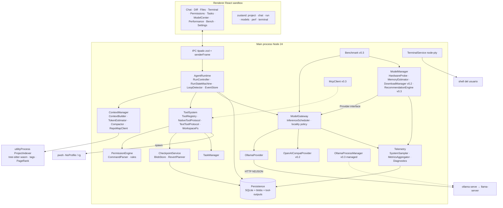
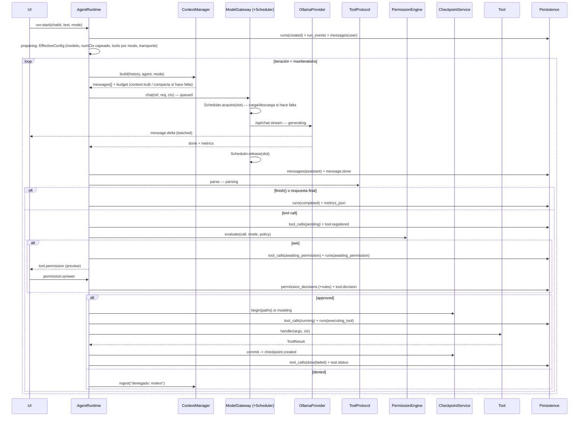

# SaurioLLM: arquitectura unificada (columna vertebral)

**Versión:** 1.0 · **Fecha:** 2026-09-18 · **Estado:** propuesta cerrada para revisión del usuario, previa a cualquier scaffolding.

**Convención de etiquetado (obligatoria en todo el documento):**
- `[COMPROBADO EN EQUIPO]`: solo lo relevado en la máquina del usuario y listado en las condiciones 3 y 10 (Ollama 0.34.1 cliente sin servidor corriendo; `gemma4:26b` y `gemma4:31b` en `N:\OllamaModels`; RTX 3060 Ti 8192 MiB según nvidia-smi, driver 595.97; Ryzen 5 5600X 6C/12T; 31,9 GB RAM; discos C: 48,2/222,6 GB y N: 447,4/931,5 GB; Node 24.14, pnpm 10.33, Python 3.14, .NET 10, git 2.54, sin Rust; versiones npm del contexto; WMI `AdapterRAM` = 4 GB truncado).
- `[VERIFICADO EN DOC OFICIAL]`: confirmado en documentación o código fuente oficial (fuente citada de las investigaciones 1 a 4).
- `[DECISIÓN DE DISEÑO]`: elección nuestra.
- `[HIPÓTESIS A PROBAR]`: estimaciones, rendimiento, compatibilidad, VRAM, tokens/s, calidad de tool calling, y todo dato que provenga de issues, blogs o reportes de terceros (se anota "fuente secundaria"), o de lecturas locales del relevamiento que no están en la lista de comprobados (se anota "relevamiento, pendiente de confirmar").

Los identificadores de código, nombres de tablas, eventos, estados e interfaces de este documento son la **fuente de verdad de nomenclatura** para los documentos detallados posteriores.

---

## 0. Resumen ejecutivo

**Qué es SaurioLLM.** Un runtime de agentes de escritorio, 100 % local por defecto, que trabaja sobre carpetas del usuario: abre un proyecto, elige un modelo instalado en Ollama, explora el código con herramientas de lectura progresiva, propone y aplica cambios bajo un sistema de permisos, muestra diffs, permite revertir y conserva todo el historial. Conceptualmente es un Claude Code / Codex / Cursor Agent con modelos locales reemplazables.

**Qué NO es.** No es otro chat UI para Ollama; no es un editor; no depende de Ollama (es el primer provider, no el único); no es un reemplazo de git; no envía nada a la nube salvo acción explícita del usuario.

**Arquitectura elegida** `[DECISIÓN DE DISEÑO]`. Electron 44 + React 19 + TypeScript. El centro es `@saurio/runtime`, un paquete Node puro (sin Electron ni React) alojado en el proceso `main`, expuesto al renderer por IPC tipado con zod. Capas: **UI → AgentRuntime → ModelGateway → Providers**, y **AgentRuntime → ToolSystem**. El `InferenceScheduler` (slots de inferencia) vive **dentro** de la capa ModelGateway. Persistencia en SQLite (better-sqlite3 + drizzle) con un **log de eventos append-only por run** como fuente de verdad y tablas relacionales como proyecciones. Se parte de la propuesta "small-models" (ganadora en los tres jueces) e injerta de "runtime-first" la preparación multi-agente y las reglas de disciplina, y de "mvp-pragmatic" la delimitación de responsabilidades entre Model Manager, Scheduler, Telemetry y Benchmark.

**Decisiones principales.**
1. Ollama por `/api/chat` nativo con `fetch` + NDJSON + zod propio; nunca `/v1` para Ollama `[VERIFICADO EN DOC OFICIAL: investigación 1 §4-5]`.
2. Protocolo de tools con dos transportes (nativo y texto Hermes `<tool_call>`) detrás de una sola interfaz `ToolProtocol`; validación zod; 6-8 tools por agente; una sola tool mutante por turno.
3. Edición con `edit_file(old_string, new_string)` con matching en cascada y `write_file` (whole-file); sin unified diff ni V4A.
4. Checkpoints por snapshot content-addressed de los archivos que el agente toca; revert selectivo con detección de conflictos por hash; el `.git` del usuario no se toca jamás.
5. Toda tool call se registra en SQLite **antes** de ejecutarse y al reiniciar nunca se re-ejecuta sola.
6. Slots de inferencia configurables (1 en esta PC); organización lógica (N chats/agentes) independiente de la concurrencia física.
7. Context Manager con prefijo estable para el cache de prompt, presupuestos explícitos, compactación en tres niveles y repo map tree-sitter + PageRank.

**Riesgos principales.** Calidad de tool calling de modelos 7-8B `[HIPÓTESIS A PROBAR]`; incompatibilidad `web-tree-sitter 0.27` con `tree-sitter-wasms 0.1.13` `[HIPÓTESIS A PROBAR, fuente secundaria]`; carga de módulos nativos (better-sqlite3 13, node-pty 1.1) en Electron 44 `[HIPÓTESIS A PROBAR]`; configuración ajena del servidor Ollama de bandeja (contexto 256K y exposición en red, leídos por el relevamiento) `[HIPÓTESIS A PROBAR, relevamiento pendiente de confirmar]`; los dos modelos instalados probablemente no entren en 8 GB `[HIPÓTESIS A PROBAR]`.

**Primer hito (MVP).** Recorrido de validación #1 completo: abrir carpeta → elegir modelo local → explorar → proponer cambio → autorizar → aplicar → revisar diff → deshacer → conservar historial al reiniciar. Con un agente, un slot, ocho tools builtin, modos Plan y Agent, terminal integrada, sin MCP ni multi-agente, pero con las interfaces preparadas. **Prerrequisito documentado:** tener instalado un modelo con capability `tools` que entre 100 % en GPU (por ejemplo `qwen3:8b` o `qwen2.5-coder:7b`, descargados manualmente con `ollama pull`); `gemma4:26b` queda como primera prueba del banco de compatibilidad, no como criterio del hito.

---

## 1. Decisiones de arquitectura

### 1.1 Principios

1. **Modelo chico primero.** Todo se diseña para un 7-8B en 8 GB con 16k de contexto y se relaja hacia arriba.
2. **El log de eventos es la verdad.** Ninguna transición de un run vive solo en memoria; reinicio = replay.
3. **Registrar antes de actuar.** Ninguna acción con efectos secundarios se ejecuta sin fila `pending` en SQLite.
4. **Prefijo estable.** Nada dinámico antes del historial; lo efímero va al final.
5. **El proyecto del usuario es sagrado.** El agente escribe solo dentro del workspace, nunca en `.git`, y todo lo que escribe es reversible archivo por archivo.
6. **Medido ≠ estimado.** Cada número que ve el usuario lleva `quality: 'measured' | 'estimated' | 'unavailable'` y su fuente.
7. **Local por defecto.** Ningún componente cambia a nube sin acción explícita.
8. **Cada abstracción paga en el hito 1** (injerto de runtime-first): si una interfaz no la usa al menos una implementación del MVP, no existe todavía; se deja un comentario `// v0.3` en su lugar. Las únicas excepciones, justificadas por costo de migración, son columnas y variantes de enum que cuestan una línea hoy y una migración mañana (`runs.parent_run_id`, `source.kind = 'delegate'`, `tool_calls.status = 'awaiting_input'`).
9. **Capas con contratos.** UI → AgentRuntime → ModelGateway → Providers; AgentRuntime → ToolSystem. Ninguna capa importa la de arriba; `providers/` solo se importa desde `gateway/`.

### 1.2 Tabla de decisiones

| Decisión | Elección | Alternativas descartadas | Por qué |
|---|---|---|---|
| Shell de escritorio | Electron 44.4.2 + electron-vite 5 con layout `src/main`, `src/preload`, `src/renderer`; monorepo pnpm con `packages/shared`, `packages/runtime`, `packages/repomap`, `apps/desktop` | Tauri (requiere Rust, el usuario no lo tiene `[COMPROBADO EN EQUIPO]`); web + desktop simultáneo (descartado por el usuario) | Decisión previa del usuario; electron-vite bundlea el preload sandboxeado y externaliza nativos `[VERIFICADO EN DOC OFICIAL: electron-vite.org/guide]` |
| Dónde corre el runtime | Proceso `main`, como paquete Node puro `@saurio/runtime` sin dependencias de Electron; trabajo CPU-intensivo (tree-sitter, PageRank) en un `utilityProcess` aparte | Runtime en `utilityProcess` (doble salto IPC por cada token); runtime en renderer (viola sandbox, no puede spawnear) | Un solo salto IPC para el streaming; el paquete se prueba con vitest sin Electron y se puede mover a otro host después |
| Driver SQLite | better-sqlite3 13.0.3 encapsulado en `persistence/driver.ts` | `node:sqlite` (RC; carga en Electron 44 sin verificar; FTS5 sin confirmar); libsql; sql.js | FTS5 garantizado, WAL, madurez; el driver encapsulado permite migrar a `node:sqlite` cuando sea estable `[VERIFICADO EN DOC OFICIAL: investigación 2 C.1]` |
| ORM | drizzle-orm 0.45.2 + drizzle-kit para migraciones embebidas; SQL crudo permitido en vistas de agregación (JSON1) | Solo SQL crudo (sin tipos); Prisma (pesado, motor propio) | Schema en TS compartido con zod; migraciones versionadas dentro de la app |
| Event log vs tablas | **Híbrido**: `run_events` append-only es la fuente de verdad; `messages`, `tool_calls`, `runs.state`, `tasks`, `checkpoints` son proyecciones escritas en la misma transacción; comando `saurio db rebuild` reproyecta desde el log | Solo tablas mutables (recuperación tras cierre inesperado incoherente); solo log en archivos JSON (sin consultas SQL ni FTS) | Recuperación trivial (leer el último evento), auditoría completa, replay para el harness de evaluación |
| Formato de edición | `edit_file(path, old_string, new_string, replace_all?)` con matching en cascada + `write_file(path, content)`; `delete_file(path)` explícita | Unified diff (aider mide peor en modelos chicos), V4A de Codex (solo modelos entrenados), SEARCH/REPLACE en fences (sintaxis que romper) | Dos strings JSON no tienen sintaxis; aider polyglot mide whole > diff en Qwen3 `[HIPÓTESIS A PROBAR, fuente secundaria: aider.chat/2025/05/08/qwen3]` |
| Checkpoints | Snapshots content-addressed por archivo tocado (pre/post imagen) en `appData/blobs/<hash>`; revert selectivo con conflicto por hash | Shadow git estilo Cline (pitfall de renombrar `.git`; revert de árbol pisa trabajo del usuario); commits reales (descartado por el usuario); snapshots por turno de Claude Code (no ven `rm`) | Cumple la condición 5 sin tocar `.git`; el shadow repo con `GIT_DIR` externo queda para v0.3 solo como **detector** de cambios por comandos |
| Repo map | `web-tree-sitter 0.27` con grammars compiladas por nosotros + queries `*-tags.scm` (derivadas de Aider, Apache-2.0 con atribución) + PageRank personalizado + presupuesto de tokens; cache por mtime | Embeddings + vector store (Continue/Roo) como requisito; `tree-sitter-wasms 0.1.13` (incompatibilidad reportada con 0.27 `[HIPÓTESIS A PROBAR, fuente secundaria]`) | Sin dependencia de modelos de embeddings ni de un segundo modelo en GPU; el ranking de Aider es el más probado en la práctica |
| Búsqueda | `@vscode/ripgrep` 1.18 (`rg --json`, `rg --files`) | fast-glob + regex en Node (lento, `.gitignore` anidado a mano) | `.gitignore` nativo, velocidad, multiline `[VERIFICADO EN DOC OFICIAL: investigación 2 C.5]` |
| Terminal | node-pty 1.1.0 + `@xterm/xterm` 6 para la terminal del usuario; `child_process.spawn` (sin pty) para comandos del agente | Ejecutar comandos del agente por pty (secuencias VT en la salida) | Texto limpio para el modelo; ConPTY para el humano `[VERIFICADO EN DOC OFICIAL: node-pty README]` |
| Protocolo de tools | `NativeToolProtocol` (API `tools`, y escanea `content`) + `TextToolProtocol` (Hermes `<tool_call>` JSON); elección por capabilities + override por agente | Solo nativo (Gemma 3, R1 distills no lo tienen); XML estilo Cline (rompe con código en argumentos) | `[VERIFICADO EN DOC OFICIAL: capabilities en /api/show]`; investigación 3 §1-2 |
| Conteo de tokens | `TokenEstimator` heurístico `chars/ratio[kind]` calibrado por modelo con EMA contra `prompt_eval_count` (`token_calibration`) | tiktoken WASM (aproximación ajena al tokenizer real, costo de bundle); esperar `/api/tokenize` (no existe en 0.34 `[VERIFICADO EN DOC OFICIAL: ausente en openapi.yaml]`) | Interfaz `TokenCounter` permite enchufar el endpoint cuando exista |
| Estado UI | zustand 5 con slices por dominio; `runStore` reduce `RunEvent`s | jotai 3 (major nuevo); redux (boilerplate) | Un reducer de eventos es la proyección natural del log |
| Validación IPC | Mapa `channel → { input, output }` con zod 4 en `packages/shared/ipc.ts`; `registerHandler` valida payload y `event.senderFrame`; preload expone `invoke` y `onEvent` genéricos, nunca `ipcRenderer` crudo | electron-trpc (compatibilidad con tRPC 11 sin verificar) | Contrato único, tipos derivados con `z.infer`, checklist de seguridad de Electron `[VERIFICADO EN DOC OFICIAL: electronjs.org/docs/latest/tutorial/security]` |
| Camino de inferencia | Único: `AgentRuntime → ModelGateway.chat(ref, req, ctx)`; el Gateway adquiere un slot del `InferenceScheduler` **por turno** y lo libera al `done`; el runtime nunca ve el Scheduler ni el Provider | Runtime → Scheduler → Gateway (invierte la capa); runtime que adquiere el slot por run (retiene el único slot durante `awaiting_permission`) | Respeta las capas del usuario; un run esperando permiso no tiene generación en curso, por lo tanto no ocupa slot; ver §14 |

### 1.3 ADRs (contexto / decisión / consecuencias)

**ADR-1 Runtime en `main`.** Contexto: dónde vive el loop. Decisión: `@saurio/runtime` en main con `HostAdapter` para efectos de Electron (diálogos, notificaciones). Consecuencia: si main se bloquea la UI sufre, por eso el indexer va a `utilityProcess`.

**ADR-2 `fetch` + NDJSON + zod propio.** Contexto: el cliente `ollama` 0.6.3 no tipa `tool_calls[].id`/`index`, `prompt_eval_cached_count`, `context_length` de `/api/ps` ni `capabilities` de `/api/tags`, y `abort()` corta todos los streams `[VERIFICADO EN DOC OFICIAL: investigación 1 §5]`. Decisión: provider propio con `AbortSignal` por request. Consecuencia: mantenemos schemas zod espejo de `api/types.go`.

**ADR-3 Log de eventos híbrido.** Ver tabla. Consecuencia: escritura doble (evento + proyección) en una transacción; `saurio db rebuild` como herramienta de mantenimiento.

**ADR-4 Checkpoints por archivo.** Ver tabla. Consecuencia: no captura efectos de `run_command`; se declara en la UI (§13).

**ADR-5 Scheduler dentro del Gateway, slot por turno.** Contexto: tres jueces discreparon (Scheduler antes del Gateway; Scheduler dentro; acquire/release separados de `chat`). Decisión: el slot se adquiere dentro de `ModelGateway.chat` y dura exactamente una generación. Consecuencia: `awaiting_permission`, `executing_tool` y `compacting` no ocupan slot sin necesidad de un `release` explícito; el prefijo cacheado se puede perder si otro modelo pasó por el slot entre turnos (aceptado, medido con `cacheHitRatio`).

**ADR-6 Dos transportes de tools.** Ver tabla. Consecuencia: en transporte texto los resultados viajan como `role: 'user'` con `<tool_result>`; `stop: ['</tool_call>']`.

**ADR-7 Sin ajustes automáticos en el MVP salvo uno.** Contexto: la condición 11.C exige ajustes visibles y reversibles; sin `model_compat` real no hay evidencia para ajustar. Decisión: el único ajuste automático del MVP es capear `num_ctx` al `<arch>.context_length` del modelo, porque Ollama lo hace igual y en silencio ("requested context size too large for model" `[VERIFICADO EN DOC OFICIAL: llm/llama_server.go]`); queda registrado en `run_adjustments` y visible. Todo lo demás: se avisa y se pregunta. Los ajustes con evidencia (`evidence_compat_id`) llegan en v0.2/v0.3.

---

## 2. Capas y componentes



Regla de imports: `providers/*` solo desde `gateway/`; `ModelManager` usa la interfaz `Provider` que le entrega el Gateway (`gateway.providers()`), nunca `OllamaProvider` directamente.

### 2.1 Responsabilidades por componente

**UI (renderer).** Renderiza proyecciones de eventos; nunca ejecuta nada; pide acciones por `invoke` y recibe `RunEvent`s por `onEvent`. Paneles: chat con tarjetas de tool/permiso/checkpoint, diff (CodeMirror 6 `@codemirror/merge`), árbol de archivos, terminal (xterm 6), checklist de tasks, Centro de modelos, Panel de rendimiento, Banco de pruebas, Settings.

**IPC (preload + main).** Contrato `packages/shared/ipc.ts`; `registerHandler(channel, schema, fn)` en main; `webContents.send('runtime:event', batch)` con batching de 30 ms para tokens; `MessagePort` para la salida de la terminal `[VERIFICADO EN DOC OFICIAL: electronjs.org/docs/latest/tutorial/message-ports]`.

**AgentRuntime.** `RunController` (una instancia por run activo), `RunStateMachine` (transiciones válidas + persistencia), `LoopDetector`, `EventStore` (append + proyecciones en una transacción), `recover()` al arrancar. Orquesta ContextManager, ToolSystem, PermissionEngine, CheckpointService, TaskManager y ModelGateway. Los subagentes (v0.4) son runs con `parent_run_id`; el `run.state → completed` del hijo se convierte en el `ToolResult` de la tool `delegate` del padre.

**ToolSystem.** `ToolRegistry` (registro único donde builtin, MCP y `delegate` conviven detrás de `ToolDefinition`), `ToolProtocol` (nativo/texto), validación zod, ejecución con timeout y cancelación, truncado nivel 0, persistencia de salidas grandes a archivo, `WorkspaceFs` (acceso a archivos confinado al workspace, aplica protected paths y `.saurioignore`).

**ContextManager.** `ContextBuilder` (ensamblado: system inmutable → few-shot → repo map → memoria → resumen → historial → efímero), `TokenEstimator` calibrado, `Compactor` (niveles 0/1/2), `RepoMapClient` (habla con el indexer). Garantiza `tokens ≤ numCtx − reserveForResponse`.

**ModelGateway.** Única puerta de inferencia. Resuelve `ModelRef → Provider`, aplica la política de localidad (`authorizedLocality` del run), adquiere/libera slots vía `InferenceScheduler`, normaliza chunks y métricas, mide TTFT de cliente, y notifica a Telemetry.

**InferenceScheduler (interno al Gateway).** `slots` configurables (1 default local), `ModelQueue` por `(providerId, modelName)`, agrupación por modelo, carga/descarga explícita (`load`/`unload`), prioridades: interactivo > subagente > benchmark > precalentamiento.

**Providers.** `OllamaProvider` (MVP): `/api/version`, `/api/tags`, `/api/show`, `/api/ps`, `/api/chat`, `/api/pull`, `/api/delete`. `OpenAICompatProvider` (v0.2, LM Studio / llama-server): acumula deltas de tool calls por `index`, métricas `estimated`.

**ModelManager.** Catálogo instalado, capabilities, `describeModel`, **único poller de `/api/ps`** (emite `models.loaded`), `MemoryEstimator` (`fits()`), `HardwareProbe`, `DownloadManager` (v0.2), `RecommendationEngine` (v0.3). Escribe `models`, `model_load_samples`, `downloads`; **lee** `model_compat`, nunca la escribe.

**PermissionEngine.** Categorías, modos, reglas deny → ask → allow, protected/critical paths, `CommandParser` por shell, memoria de decisiones, generación del patrón más específico para "permitir siempre".

**CheckpointService.** `BlobStore` en disco, `begin/commit` por tool call, diff (jsdiff), `planRevert` + `revert` con conflicto a tres vías, revert reversible.

**TaskManager.** Proyección `tasks` del plan visible; tool `task_update`.

**TerminalService.** pty interactivo del usuario (independiente de `run_command`).

**Persistence.** drizzle schema, migraciones embebidas, repositorios, `EventStore`, `BlobStore`, carpeta `tool-outputs/`, `saurio db rebuild`.

**ProjectIndexer (utilityProcess).** Parseo tree-sitter, tags, grafo, PageRank, cache por mtime; recibe `index(projectPath, changedFiles)` y `rank(query)`.

**Telemetry.** **No consulta Ollama por su cuenta ni estima VRAM** (injerto de mvp-pragmatic): recibe `/api/ps` del ModelManager, colas/slots del Scheduler, métricas por respuesta del Gateway; muestrea el sistema (`SystemSampler`), agrega (`MetricsAggregator`), diagnostica (`Diagnostics`).

**Benchmark (v0.3).** **No estima: solo mide.** Usa el Gateway para reservar el slot en exclusiva y el ModelManager para load/unload; es el **único escritor** de `model_compat` y `benchmark_runs`.

**McpClient (v0.3).** `McpConnection` propia sobre `@modelcontextprotocol/sdk` 1.30; registra tools como `mcp__<server>__<tool>` en el `ToolRegistry`; tools diferidas.

**OllamaProcessManager (v0.3).** Modo managed: lanza `ollama serve` en puerto propio con env controlado; nunca mata ni reconfigura la instancia de bandeja.

---

## 3. Estructura de carpetas

```
saurio/
  package.json  pnpm-workspace.yaml  electron-builder.yml
  .npmrc                       # node-linker=hoisted [HIPÓTESIS A PROBAR si hace falta con electron-builder]
  apps/desktop/
    electron.vite.config.ts    # main/preload con externalizeDepsPlugin; renderer con React
    src/main/
      index.ts                 # bootstrap, BrowserWindow (windowStatePersistence), migraciones, recover()
      ipc/                     # registerHandler por dominio: project, chat, run, permission, checkpoint, models, terminal, metrics, settings, bench
      host/RuntimeHost.ts      # instancia @saurio/runtime con HostAdapter (dialogs, notifications, paths)
      services/terminal/       # TerminalService (node-pty) + MessagePort
      services/ollama-process/ # OllamaProcessManager (v0.3)
      services/system-sampler/ # SystemSampler: os.cpus, freemem, nvidia-smi bajo demanda (MVP) / -lms (v0.2)
    src/preload/index.ts       # contextBridge: invoke(channel, payload), onEvent(cb), terminalPort()
    src/renderer/
      index.html  src/main.tsx
      src/features/{chat,diff,files,terminal,permissions,tasks,models,perf,bench,settings}/
      src/stores/              # zustand slices; runStore reduce RunEvent
      src/ipc/client.ts        # cliente tipado derivado de packages/shared/ipc.ts
  packages/shared/             # contratos, SIN deps de Electron/React
    src/domain.ts              # Project, Chat, Run, Message, ToolCall, Checkpoint, ModelRef, Task, Profile...
    src/enums.ts               # RunState, ToolCallStatus, PermissionCategory, Mode, Locality (zod enums, única fuente)
    src/events.ts              # RunEvent (z.discriminatedUnion)
    src/ipc.ts                 # mapa channel -> { input, output }
  packages/runtime/            # @saurio/runtime, Node puro, vitest sin Electron
    src/agent/                 # RunController, RunStateMachine, LoopDetector, recover.ts
    src/events/                # EventStore, projections/
    src/context/               # ContextBuilder, TokenEstimator, Compactor, budgets.ts, RepoMapClient
    src/tools/                 # ToolRegistry, WorkspaceFs, protocols/{native,text}.ts
    src/tools/builtin/         # list_files, search_code, read_file, read_output, edit_file, write_file, delete_file, run_command, task_update, finish
    src/permissions/           # PermissionEngine, CommandParser/{pwsh,bash}.ts, rules.ts, protected.ts
    src/checkpoint/            # BlobStore, CheckpointService, RevertPlanner, diff.ts
    src/gateway/               # ModelGateway, InferenceScheduler, ModelQueue, locality.ts, Provider.ts (interfaz)
    src/gateway/providers/     # ollama/{client,ndjson,schemas,provider}.ts ; openai-compat/ (v0.2)
    src/models/                # ModelManager, MemoryEstimator, HardwareProbe, DownloadManager (v0.2), RecommendationEngine (v0.3)
    src/telemetry/             # MetricsAggregator, Diagnostics, ringBuffer.ts
    src/benchmark/             # (v0.3) protocol.ts, suites/
    src/mcp/                   # (v0.3) McpConnection
    src/persistence/           # schema.ts (drizzle), migrations/, repositories/, driver.ts, rebuild.ts
    src/tasks/                 # TaskManager
  packages/repomap/            # loader web-tree-sitter, queries/*.scm, tags.ts, graph.ts, pagerank.ts, render.ts
  resources/
    grammars/*.wasm            # compiladas con tree-sitter-cli >= 0.26 (ts, tsx, js, python; más en v0.2)
    prompts/                   # system prompts por rol (.md) + few-shot (.json); hash en effective_config
    model-catalog.json         # lista curada (v0.2)
  eval/                        # fixtures (repos mini), tasks/, harness.ts, eval_runs (SQLite aparte)
  docs/adr/                    # ADR-001..NNN
```

Empaquetado: `asar: true` con `asarUnpack: ["**/*.node", "node_modules/@vscode/ripgrep*/**", "**/*.wasm"]`; `electron-builder install-app-deps` en postinstall `[VERIFICADO EN DOC OFICIAL: electron.build/docs, investigación 2 C.8]`.

---

## 4. Modelo de datos SQLite

Un archivo `saurio.db` en `appData` (WAL activo), más `appData/blobs/<hash>` (pre/post imágenes) y `appData/tool-outputs/<toolCallId>.txt` (salidas > 30.000 chars). Tipos SQLite; `_json` = TEXT validado con zod al leer. Timestamps en ms epoch. Todas las tablas se crean en la migración 1 aunque queden vacías hasta v0.2/v0.3 `[DECISIÓN DE DISEÑO]`.

```sql
-- Proyectos, agentes, chats
CREATE TABLE projects (id TEXT PRIMARY KEY, path TEXT UNIQUE NOT NULL, name TEXT, created_at INTEGER,
  last_opened_at INTEGER, settings_json TEXT);
CREATE TABLE agents (id TEXT PRIMARY KEY, project_id TEXT NULL REFERENCES projects(id), name TEXT NOT NULL,
  role TEXT NOT NULL,                       -- lead|coder|reviewer|explorer|custom
  model_ref_json TEXT NOT NULL, system_prompt TEXT NOT NULL, system_prompt_hash TEXT NOT NULL,
  allowed_tools_json TEXT NOT NULL, permission_policy_json TEXT NOT NULL, context_policy_json TEXT NOT NULL,
  memory_policy_json TEXT, default_mode TEXT NOT NULL, temperature REAL, thinking TEXT NOT NULL, -- off|on|auto
  tool_transport TEXT NOT NULL,             -- auto|native|text
  max_iterations INTEGER NOT NULL, working_dir TEXT, file_scope TEXT NULL, profile_id TEXT NULL,
  is_builtin INTEGER DEFAULT 0, updated_at INTEGER);
CREATE TABLE chats (id TEXT PRIMARY KEY, project_id TEXT NOT NULL REFERENCES projects(id),
  agent_id TEXT NOT NULL REFERENCES agents(id), title TEXT, mode TEXT NOT NULL, model_ref_json TEXT,
  profile_id TEXT NULL, created_at INTEGER, updated_at INTEGER, archived INTEGER DEFAULT 0);
CREATE INDEX chats_project ON chats(project_id, updated_at DESC);

-- Runs y log de eventos (fuente de verdad)
CREATE TABLE runs (id TEXT PRIMARY KEY, chat_id TEXT NOT NULL REFERENCES chats(id),
  parent_run_id TEXT NULL REFERENCES runs(id),          -- subagentes (v0.4); columna desde migración 1
  agent_id TEXT NOT NULL, mode TEXT NOT NULL, model_ref_json TEXT NOT NULL,
  effective_config_json TEXT NOT NULL,                   -- inmutable al iniciar: numCtx, think, tools, prompt_hash, profile_id
  state TEXT NOT NULL, state_reason TEXT, iteration INTEGER DEFAULT 0,
  started_at INTEGER, finished_at INTEGER, error_json TEXT, metrics_json TEXT, last_event_seq INTEGER);
CREATE INDEX runs_chat ON runs(chat_id, started_at);
CREATE INDEX runs_active ON runs(state) WHERE state IN
  ('created','preparing','queued','generating','parsing','awaiting_permission','executing_tool','compacting','cancelling');

CREATE TABLE run_events (seq INTEGER PRIMARY KEY AUTOINCREMENT, run_id TEXT NOT NULL, chat_id TEXT NOT NULL,
  ts INTEGER NOT NULL, type TEXT NOT NULL, payload_json TEXT NOT NULL);
CREATE INDEX run_events_run ON run_events(run_id, seq);
CREATE INDEX run_events_chat ON run_events(chat_id, seq);

-- Proyecciones
CREATE TABLE messages (id TEXT PRIMARY KEY, chat_id TEXT NOT NULL, run_id TEXT, seq INTEGER NOT NULL,
  role TEXT NOT NULL, content TEXT, thinking TEXT, tool_calls_json TEXT, tool_call_id TEXT, tool_name TEXT,
  token_estimate INTEGER, response_metrics_json TEXT, truncated INTEGER DEFAULT 0,
  compacted_by TEXT NULL,                                -- id del mensaje resumen que lo reemplaza; nunca se borra
  created_at INTEGER);
CREATE INDEX messages_chat ON messages(chat_id, seq);
CREATE VIRTUAL TABLE messages_fts USING fts5(content, content='messages', content_rowid='rowid');
CREATE TRIGGER messages_ai AFTER INSERT ON messages BEGIN
  INSERT INTO messages_fts(rowid, content) VALUES (new.rowid, new.content); END;
CREATE TRIGGER messages_ad AFTER DELETE ON messages BEGIN
  INSERT INTO messages_fts(messages_fts, rowid, content) VALUES ('delete', old.rowid, old.content); END;
CREATE TRIGGER messages_au AFTER UPDATE ON messages BEGIN
  INSERT INTO messages_fts(messages_fts, rowid, content) VALUES ('delete', old.rowid, old.content);
  INSERT INTO messages_fts(rowid, content) VALUES (new.rowid, new.content); END;

CREATE TABLE tool_calls (id TEXT PRIMARY KEY, run_id TEXT NOT NULL, message_id TEXT, iteration INTEGER,
  tool_name TEXT NOT NULL, args_json TEXT NOT NULL, args_hash TEXT NOT NULL,
  category TEXT NOT NULL, risk TEXT NOT NULL,            -- PermissionCategory ; low|medium|high
  transport TEXT NOT NULL,                               -- native|text
  status TEXT NOT NULL,                                  -- ToolCallStatus (ver enums)
  permission_decision_id TEXT NULL, checkpoint_id TEXT NULL,
  started_at INTEGER, finished_at INTEGER,
  result_preview TEXT, result_path TEXT NULL, result_is_error INTEGER, error_json TEXT,
  match_level TEXT NULL);                                -- exact|eol|indent|whitespace|fuzzy (edit_file)
CREATE INDEX tool_calls_run ON tool_calls(run_id, iteration);
CREATE INDEX tool_calls_open ON tool_calls(status) WHERE status IN
  ('pending','awaiting_permission','approved','running','awaiting_input');

-- Permisos
CREATE TABLE permission_rules (id TEXT PRIMARY KEY, scope TEXT NOT NULL,   -- session|project|global
  project_id TEXT NULL, tool_name TEXT NOT NULL, pattern TEXT, decision TEXT NOT NULL, -- allow|ask|deny
  source TEXT NOT NULL,                                  -- user|preset|mode|settings
  created_at INTEGER, source_tool_call_id TEXT NULL);
CREATE TABLE permission_decisions (id TEXT PRIMARY KEY, tool_call_id TEXT NOT NULL, decision TEXT NOT NULL,
  rule_id TEXT NULL, decided_by TEXT NOT NULL,           -- user|rule|mode
  reason TEXT, decided_at INTEGER);

-- Checkpoints
CREATE TABLE checkpoints (id TEXT PRIMARY KEY, run_id TEXT NOT NULL, chat_id TEXT NOT NULL, tool_call_id TEXT NULL,
  iteration INTEGER, label TEXT, kind TEXT NOT NULL,     -- tool|revert
  created_at INTEGER, stats_json TEXT, status TEXT NOT NULL DEFAULT 'active', -- active|reverted|partial
  reverted_at INTEGER NULL);
CREATE TABLE checkpoint_files (checkpoint_id TEXT NOT NULL, rel_path TEXT NOT NULL,
  change TEXT NOT NULL,                                  -- created|modified|deleted
  pre_hash TEXT NULL, post_hash TEXT NULL, pre_eol TEXT, pre_bom INTEGER, pre_mode INTEGER,
  blob_missing INTEGER DEFAULT 0,                        -- >20 MB: hash sin blob
  PRIMARY KEY(checkpoint_id, rel_path));
CREATE TABLE blobs (hash TEXT PRIMARY KEY, size INTEGER, created_at INTEGER, refcount INTEGER);

-- Tasks, memoria, repo map
CREATE TABLE tasks (id TEXT PRIMARY KEY, chat_id TEXT NOT NULL, run_id TEXT, ord INTEGER, title TEXT,
  status TEXT NOT NULL, updated_at INTEGER);             -- pending|in_progress|done|skipped
CREATE TABLE project_memory (project_id TEXT, key TEXT, content TEXT, updated_at INTEGER, PRIMARY KEY(project_id, key));
CREATE TABLE repo_map_cache (project_id TEXT, rel_path TEXT, mtime INTEGER, size INTEGER, lang TEXT,
  tags_json TEXT, PRIMARY KEY(project_id, rel_path));

-- Providers y modelos
CREATE TABLE providers (id TEXT PRIMARY KEY, kind TEXT NOT NULL, transport TEXT NOT NULL, base_url TEXT NOT NULL,
  is_loopback INTEGER NOT NULL, enabled INTEGER NOT NULL, mode TEXT NOT NULL, -- attach|managed
  max_concurrency INTEGER DEFAULT 1, config_json TEXT);
CREATE TABLE models (provider_id TEXT, name TEXT, digest TEXT, size INTEGER, details_json TEXT,
  capabilities_json TEXT, model_info_json TEXT, context_max INTEGER, locality TEXT NOT NULL,
  refreshed_at INTEGER, PRIMARY KEY(provider_id, name));
CREATE TABLE model_load_samples (id TEXT PRIMARY KEY, provider_id TEXT, model_name TEXT, model_digest TEXT,
  num_ctx INTEGER, size INTEGER, size_vram INTEGER, context_length INTEGER, load_ms INTEGER,
  estimated_vram INTEGER NULL, sampled_at INTEGER);      -- escrita por ModelManager tras cada carga real
CREATE TABLE model_compat (id TEXT PRIMARY KEY, provider_id TEXT, model_name TEXT, model_digest TEXT,
  hardware_fingerprint TEXT NOT NULL, num_ctx INTEGER, kv_cache_type TEXT, think TEXT,
  ollama_version TEXT, driver_version TEXT, size INTEGER, size_vram INTEGER, offload_ratio REAL,
  load_ms INTEGER, prompt_tps REAL, gen_tps REAL, ttft_ms INTEGER, peak_vram_mib INTEGER, peak_ram_mib INTEGER,
  quality_score REAL NULL, status TEXT NOT NULL,         -- fits|partial|failed
  error TEXT, tested_at INTEGER);                        -- escrita SOLO por Benchmark
CREATE TABLE benchmark_runs (id TEXT PRIMARY KEY, suite_id TEXT, model_name TEXT, model_digest TEXT,
  config_json TEXT, results_json TEXT, per_task_json TEXT, compat_id TEXT NULL, created_at INTEGER);
CREATE TABLE downloads (id TEXT PRIMARY KEY, provider_id TEXT, model_name TEXT, status TEXT NOT NULL,
  -- queued|running|paused|cancelled|done|failed
  total INTEGER, completed INTEGER, layers_json TEXT, started_at INTEGER, finished_at INTEGER, error TEXT);
CREATE TABLE token_calibration (provider_id TEXT, model_name TEXT, ratio REAL, samples INTEGER,
  updated_at INTEGER, PRIMARY KEY(provider_id, model_name));

-- Perfiles, ajustes, métricas, settings, auditoría
CREATE TABLE profiles (id TEXT PRIMARY KEY, project_id TEXT NULL, name TEXT NOT NULL, is_builtin INTEGER,
  config_json TEXT NOT NULL, updated_at INTEGER);        -- built-in: rapido|equilibrado|calidad
CREATE TABLE run_adjustments (id TEXT PRIMARY KEY, run_id TEXT NOT NULL, param TEXT NOT NULL,
  requested_json TEXT, applied_json TEXT, reason TEXT, source TEXT NOT NULL, -- auto|user
  evidence_compat_id TEXT NULL, reverted INTEGER DEFAULT 0, created_at INTEGER);
CREATE TABLE metrics_minute (ts_minute INTEGER PRIMARY KEY, cpu_avg REAL, cpu_max REAL,
  ram_used_avg INTEGER, ram_used_max INTEGER, gpu_util_avg REAL, gpu_util_max REAL,
  vram_used_avg INTEGER, vram_used_max INTEGER, gpu_temp_max REAL, power_avg REAL, app_rss_max INTEGER,
  samples INTEGER, quality_json TEXT);                   -- quality por campo
CREATE TABLE settings (key TEXT PRIMARY KEY, value_json TEXT NOT NULL, scope TEXT NOT NULL, project_id TEXT NULL);
CREATE TABLE audit_log (id INTEGER PRIMARY KEY AUTOINCREMENT, ts INTEGER, kind TEXT NOT NULL, payload_json TEXT);
```

**Cómo se guarda un turno.** Los chunks del stream no se persisten. Al cerrar el mensaje: fila en `messages` con `content`, `thinking`, `tool_calls_json`, `response_metrics_json` (`prompt_eval_count`, `prompt_eval_cached_count`, `eval_count`, duraciones `[VERIFICADO EN DOC OFICIAL: api/types.go Metrics]`) + evento `message.done`. Cada tool call válida: fila `tool_calls` en `pending` + evento `tool.registered` **antes** de evaluar permisos. Cada transición de run: `run_events` + `UPDATE runs SET state, last_event_seq` en la misma transacción. Resultados de tools: `result_preview` = lo que vio el modelo; completo en `tool-outputs/<id>.txt` si supera 30.000 chars. Mensajes con `ephemeral: true` (recordatorio final) **no** se escriben en `messages`.

**Vistas de agregación (SQL con JSON1, sin tablas redundantes):** `v_model_stats` (por `provider_id, model_name`: tokens, tps mediana, cache hit medio) y `v_chat_stats` (por chat) sobre `messages.response_metrics_json` y `runs.metrics_json`.

**Reproyección.** `saurio db rebuild [--run <id>]` borra las proyecciones (`messages`, `tool_calls`, `tasks`, `runs.state/iteration/metrics_json`) y las reconstruye desde `run_events`; `checkpoints`, `blobs`, `permission_*`, `models`, `settings` no se tocan.

---

## 5. Interfaces TypeScript principales

```ts
// ===== packages/shared/src/enums.ts (única fuente; zod enums) =====
export const RunState = z.enum(['created','preparing','queued','generating','parsing','awaiting_permission',
  'executing_tool','compacting','cancelling','completed','cancelled','failed','interrupted']);
export const ToolCallStatus = z.enum(['pending','awaiting_permission','approved','denied','running',
  'awaiting_input','done','failed','cancelled','orphaned','abandoned']);
export const PermissionCategory = z.enum(['read','write','delete','terminal','git_commit','git_push','network','mcp']);
export const Mode = z.enum(['plan','ask','edit','agent']);
export const Locality = z.enum(['local','lan','proxied-cloud','cloud']);
export type RunState = z.infer<typeof RunState>; // idem para los demás

// ===== packages/shared/src/domain.ts =====
export interface ModelRef { providerId: string; name: string; locality: Locality }
export type Role = 'system' | 'user' | 'assistant' | 'tool';
export type ContentPart =
  | { type: 'text'; text: string }
  | { type: 'image'; mime: string; data: string }          // base64
  | { type: 'resource'; uri: string; text?: string };
export interface ChatMessage {
  id: string; role: Role; content: string; thinking?: string; images?: string[];
  toolCalls?: ToolCall[]; toolCallId?: string; toolName?: string;
  tokenEstimate?: number;
  ephemeral?: boolean;          // true: nunca se persiste ni forma parte del prefijo cacheado
}
export interface ToolCall { id: string; name: string; args: unknown; index?: number; transport: 'native' | 'text' }
export interface ToolResult { content: ContentPart[]; isError: boolean; structured?: unknown;
  truncated?: boolean; fullOutputPath?: string }

export interface Task { id: string; chatId: string; ord: number; title: string;
  status: 'pending' | 'in_progress' | 'done' | 'skipped' }
export interface Plan { runId: string; summary: string; tasks: Task[] }   // salida estructurada de modo plan

export interface Checkpoint { id: string; runId: string; chatId: string; toolCallId?: string; kind: 'tool' | 'revert';
  files: { relPath: string; change: 'created' | 'modified' | 'deleted'; preHash?: string; postHash?: string; blobMissing?: boolean }[];
  stats: { files: number; added: number; removed: number }; status: 'active' | 'reverted' | 'partial' }

// ===== packages/runtime/src/gateway/Provider.ts =====
export interface ModelCapabilities { tools: boolean; thinking: boolean; vision: boolean; embedding: boolean }
export interface ModelInfo { ref: ModelRef; digest: string; sizeBytes: number; family: string; parameterSize: string;
  quantization: string; capabilities: ModelCapabilities; contextMax?: number; remoteHost?: string }
export interface ModelDescription extends ModelInfo { modelInfo: Record<string, unknown>; template?: string; parameters?: string }
export interface LoadedModel { name: string; digest: string; size: number; sizeVram: number; contextLength: number; expiresAt: string }
export interface ResponseMetrics { promptTokens?: number; cachedPromptTokens?: number; evalTokens?: number;
  loadMs?: number; promptEvalMs?: number; evalMs?: number; totalMs?: number; ttftClientMs?: number;
  quality: 'measured' | 'estimated' }
export interface ChatRequest {                      // puro y serializable (grabable para eval/)
  model: string; messages: ChatMessage[]; tools?: JsonSchemaTool[];
  options: { numCtx: number; temperature: number; numPredict: number; topP?: number; topK?: number; seed?: number; stop?: string[] };
  think?: boolean | 'low' | 'medium' | 'high' | 'max'; format?: 'json' | object; keepAlive?: string | number;
}
export interface ChatContext { runId: string; signal: AbortSignal; authorizedLocality: Locality[];
  priority: 'interactive' | 'subagent' | 'benchmark' | 'warmup' }
export type ChatChunk =
  | { type: 'content'; text: string } | { type: 'thinking'; text: string }
  | { type: 'tool_call'; call: ToolCall }
  | { type: 'error'; message: string; code?: ProviderErrorCode }
  | { type: 'done'; doneReason: string; metrics: ResponseMetrics };
export type ProviderErrorCode = 'connection_refused' | 'stream_cut' | 'oom_load' | 'oom_generate' | 'model_not_found'
  | 'no_tools_support' | 'server_busy' | 'context_too_large' | 'timeout' | 'unknown';
export interface PullProgress { status: string; digest?: string; total?: number; completed?: number }

export interface Provider {
  readonly id: string; readonly kind: 'ollama' | 'openai-compat' | 'cloud'; readonly locality: Locality;
  health(signal?: AbortSignal): Promise<{ ok: boolean; version?: string; error?: string }>;
  listModels(): Promise<ModelInfo[]>;
  describeModel(name: string): Promise<ModelDescription>;
  listLoaded?(): Promise<LoadedModel[]>;                           // /api/ps
  chat(req: ChatRequest, signal: AbortSignal): AsyncIterable<ChatChunk>;
  load?(name: string, numCtx: number, keepAlive: string | number): Promise<{ loadMs: number }>;
  unload?(name: string): Promise<void>;                            // keep_alive: 0
  pull?(name: string, signal: AbortSignal): AsyncIterable<PullProgress>;   // v0.2
  delete?(name: string): Promise<void>;                            // v0.2
}

// ===== packages/runtime/src/gateway/ModelGateway.ts =====
export interface ModelGateway {
  chat(ref: ModelRef, req: ChatRequest, ctx: ChatContext): AsyncIterable<ChatChunk>;
  // adquiere un slot del InferenceScheduler al empezar y lo libera en 'done'/'error'/abort
  providers(): Provider[];
  resolve(ref: ModelRef): Provider;
  ensureLoaded(ref: ModelRef, numCtx: number): Promise<void>;      // precalentamiento (priority 'warmup')
  status(): { slots: SlotStatus[]; queue: QueuedJob[] };            // para Telemetry y UI
}
export interface InferenceScheduler {                                // interno al gateway
  acquire(ref: ModelRef, numCtx: number, priority: ChatContext['priority'], signal: AbortSignal): Promise<SlotLease>;
  release(lease: SlotLease): void;
  status(): { slots: SlotStatus[]; queue: QueuedJob[] };
}

// ===== packages/runtime/src/tools/types.ts =====
export interface ToolDefinition<A = unknown> {
  name: string;                                   // [A-Za-z0-9_.-]{1,128}; MCP: mcp__<server>__<tool>
  description: string;
  inputSchema: object;                            // JSON Schema (contrato con el modelo y con MCP)
  argsSchema?: ZodType<A>;                        // builtins: fuente de verdad, deriva inputSchema; MCP valida con ajv
  category: PermissionCategory;                   // categoría base
  mutating: boolean;                              // dispara checkpoint
  allowedInModes: Mode[];
  source: { kind: 'builtin' } | { kind: 'mcp'; serverId: string } | { kind: 'delegate' };  // delegate: v0.4
  classify?(args: A): { category: PermissionCategory; risk: 'low' | 'medium' | 'high'; summary: string;
    paths?: string[]; command?: string };         // run_command clasifica por comando; edit_file declara paths
  handler: ToolHandler<A>;
}
export type ToolHandler<A> = (args: A, ctx: ToolContext) => Promise<ToolResult>;
export interface ToolContext {
  projectRoot: string; cwd: string; runId: string; toolCallId: string; signal: AbortSignal; timeoutMs: number;
  fs: WorkspaceFs;                                // confinado al workspace; aplica protected paths y .saurioignore
  checkpoint: CheckpointHandle;                   // begin ya hecho por el runtime para tools mutating
  emit(ev: Extract<RunEvent, { type: 'tool.progress' }>['payload']): void;
  log(e: unknown): void;
}
export interface ToolProtocol {
  renderTools(tools: ToolDefinition[]): { apiTools?: JsonSchemaTool[]; systemSuffix?: string; stop?: string[] };
  parse(message: ChatMessage): { toolCalls: ToolCall[]; text: string; parseErrors: string[] };
  renderResult(call: ToolCall, result: ToolResult): ChatMessage;    // native: role 'tool'; text: role 'user' + <tool_result>
}
export interface ToolRegistry {
  register(def: ToolDefinition): void; unregister(name: string): void;
  list(filter?: { names?: string[]; mode?: Mode }): ToolDefinition[]; get(name: string): ToolDefinition | undefined;
  onChanged(cb: () => void): () => void;          // MCP tools/list_changed (v0.3)
}

// ===== packages/runtime/src/agent/types.ts =====
export interface ContextPolicy {
  numCtx: number; reserveForResponse: number; repoMapTokens: number; historyBudgetRatio: number;
  maxReadLines: number; maxSearchResults: number; maxCommandLines: number;
  compactAtRatio: number; compactEveryTurns: number; keepLastTurns: number;
  fewShot: boolean;
}
export interface PermissionRule { id?: string; scope: 'session' | 'project' | 'global'; toolName: string;
  pattern?: string; decision: 'allow' | 'ask' | 'deny'; source: 'user' | 'preset' | 'mode' | 'settings' }
export interface PermissionPolicy { preset: 'strict' | 'balanced' | 'trusting'; rules: PermissionRule[];
  terminalAllowlist: string[] }
export interface PermissionRequest { toolCallId: string; toolName: string; category: PermissionCategory;
  risk: 'low' | 'medium' | 'high'; summary: string; triggeredBy: string;
  preview?: { diff?: string; command?: string; paths?: string[] };
  rememberOptions: { scope: 'project' | 'global'; suggestedPattern: string }[] }
export type PermissionDecision =
  | { decision: 'allow' | 'deny'; decidedBy: 'rule' | 'mode'; ruleId?: string; reason: string }
  | { decision: 'ask'; request: PermissionRequest };
export interface PermissionAnswer { toolCallId: string; answer: 'allow_once' | 'allow_always' | 'deny';
  rememberScope?: 'project' | 'global'; pattern?: string; reason?: string }

export interface AgentConfig {
  id: string; name: string; role: 'lead' | 'coder' | 'reviewer' | 'explorer' | 'custom'; model: ModelRef;
  systemPrompt: string; systemPromptHash: string; allowedTools: string[]; permissions: PermissionPolicy;
  workingDir: string; contextPolicy: ContextPolicy; memory: { readProjectMemory: boolean; writeProjectMemory: boolean };
  maxIterations: number; temperature: number; thinking: 'off' | 'on' | 'auto';
  toolTransport: 'auto' | 'native' | 'text'; defaultMode: Mode; profileId?: string; fileScope?: string; // fileScope v0.4
}
export interface EffectiveConfig { model: ModelRef; numCtx: number; think: ChatRequest['think']; tools: string[];
  transport: 'native' | 'text'; promptHash: string; profileId?: string; adjustments: Adjustment[] }
export interface Adjustment { param: string; requested: unknown; applied: unknown; reason: string;
  source: 'auto' | 'user'; evidenceCompatId?: string }
export interface Run { id: string; chatId: string; parentRunId?: string; agent: AgentConfig; mode: Mode;
  state: RunState; iteration: number; effectiveConfig: EffectiveConfig }

// ===== packages/shared/src/events.ts =====
export type RunEvent = { seq: number; runId: string; chatId: string; ts: number } & (
  | { type: 'run.state'; from: RunState; to: RunState; reason?: string }
  | { type: 'context.built'; budget: ContextBudgetReport }
  | { type: 'context.usage'; used: number; budget: number; cacheHitRatio?: number }
  | { type: 'context.compacted'; summaryMessageId: string; tokensBefore: number; tokensAfter: number }
  | { type: 'message.delta'; messageId: string; field: 'content' | 'thinking'; text: string }
  | { type: 'message.done'; message: ChatMessage; metrics: ResponseMetrics }
  | { type: 'tool.registered'; call: ToolCallRecord }
  | { type: 'tool.permission'; request: PermissionRequest }
  | { type: 'tool.decision'; toolCallId: string; decision: PermissionDecision | PermissionAnswer }
  | { type: 'tool.status'; toolCallId: string; status: ToolCallStatus; resultPreview?: string; error?: string }
  | { type: 'tool.progress'; toolCallId: string; text: string }               // salida en vivo de run_command
  | { type: 'checkpoint.created'; checkpoint: Checkpoint }
  | { type: 'checkpoint.reverted'; checkpointId: string; restored: string[]; conflicts: string[]; revertCheckpointId: string }
  | { type: 'tasks.updated'; tasks: Task[] }
  | { type: 'run.adjustment'; adjustment: Adjustment }
  | { type: 'run.error'; error: RunError; recoverable: boolean }
  | { type: 'run.recovered'; orphaned: ToolCallRecord[]; abandoned: ToolCallRecord[] });
export interface RunError { code: 'oom_load' | 'oom_generate' | 'provider_down' | 'provider_lost' | 'server_busy'
  | 'timeout' | 'format' | 'loop' | 'max_iterations' | 'context_overflow' | 'cancelled' | 'interrupted' | 'unknown';
  message: string; raw?: string }

// ===== CheckpointService =====
export interface CheckpointHandle { checkpointId: string; before(relPath: string): Promise<void>; after(relPath: string): Promise<void> }
export interface CheckpointService {
  begin(runId: string, toolCallId: string, paths: string[]): Promise<CheckpointHandle>;
  commit(handle: CheckpointHandle): Promise<Checkpoint>;
  diff(checkpointId: string, relPath: string): Promise<{ unified: string; added: number; removed: number }>;
  planRevert(checkpointIds: string[]): Promise<{ restorable: string[]; conflicts: { relPath: string; pre?: string; post?: string; current: string }[] }>;
  revert(checkpointIds: string[], resolution: Record<string, 'restore' | 'keep_mine' | 'skip'>): Promise<{ restored: string[]; skipped: string[]; revertCheckpointId: string }>;
}

// ===== packages/shared/src/ipc.ts (extracto) =====
export const ipc = {
  'project:open':       { input: z.object({ path: z.string().optional() }), output: ProjectSchema },
  'project:list':       { input: z.void(), output: z.array(ProjectSchema) },
  'chat:create':        { input: z.object({ projectId: z.string(), agentId: z.string(), mode: Mode, modelRef: ModelRefSchema }), output: ChatSchema },
  'chat:list':          { input: z.object({ projectId: z.string() }), output: z.array(ChatSchema) },
  'chat:history':       { input: z.object({ chatId: z.string() }), output: ChatHistorySchema },   // messages + tool_calls + checkpoints + tasks
  'run:start':          { input: z.object({ chatId: z.string(), text: z.string(), mode: Mode }), output: z.object({ runId: z.string() }) },
  'run:cancel':         { input: z.object({ runId: z.string() }), output: z.void() },
  'run:continue':       { input: z.object({ runId: z.string(), extraIterations: z.number().optional() }), output: z.object({ runId: z.string() }) },
  'permission:answer':  { input: PermissionAnswerSchema, output: z.void() },
  'checkpoint:list':    { input: z.object({ chatId: z.string() }), output: z.array(CheckpointSchema) },
  'checkpoint:diff':    { input: z.object({ checkpointId: z.string(), relPath: z.string() }), output: DiffSchema },
  'checkpoint:planRevert': { input: z.object({ checkpointIds: z.array(z.string()) }), output: RevertPlanSchema },
  'checkpoint:revert':  { input: z.object({ checkpointIds: z.array(z.string()), resolution: z.record(z.enum(['restore','keep_mine','skip'])) }), output: RevertReportSchema },
  'models:list':        { input: z.object({ refresh: z.boolean().optional() }), output: z.array(ModelInfoSchema) },
  'models:loaded':      { input: z.void(), output: z.array(LoadedModelSchema) },
  'models:describe':    { input: z.object({ ref: ModelRefSchema }), output: ModelDescriptionSchema },
  'models:fits':        { input: z.object({ ref: ModelRefSchema, numCtx: z.number() }), output: FitEstimateSchema },
  'models:pull':        { input: z.object({ name: z.string() }), output: z.object({ downloadId: z.string() }) },   // v0.2
  'models:pullCancel':  { input: z.object({ downloadId: z.string() }), output: z.void() },                          // v0.2
  'models:delete':      { input: z.object({ name: z.string() }), output: z.void() },                                // v0.2
  'provider:health':    { input: z.void(), output: z.array(ProviderHealthSchema) },
  'terminal:create':    { input: z.object({ projectId: z.string(), shell: z.string().optional() }), output: z.object({ terminalId: z.string() }) },
  'terminal:resize':    { input: z.object({ terminalId: z.string(), cols: z.number(), rows: z.number() }), output: z.void() },
  'terminal:close':     { input: z.object({ terminalId: z.string() }), output: z.void() },
  'metrics:snapshot':   { input: z.void(), output: MetricsSnapshotSchema },
  'settings:get':       { input: z.object({ key: z.string(), projectId: z.string().optional() }), output: z.unknown() },
  'settings:set':       { input: z.object({ key: z.string(), value: z.unknown(), projectId: z.string().optional() }), output: z.void() },
  'bench:run':          { input: BenchRequestSchema, output: z.object({ benchmarkRunId: z.string() }) },            // v0.3
} as const;
// Eventos main -> renderer (webContents.send):
//   'runtime:event'   RunEvent[] (batched 30 ms)
//   'models:changed'  { installed: ModelInfo[]; loaded: LoadedModel[] }
//   'download:progress' { downloadId, completed, total, bytesPerSec, eta }   (v0.2)
//   'metrics:tick'    MetricsSnapshot (solo con el panel abierto)
//   'provider:health' ProviderHealth
//   'terminal:data'   por MessagePort (no por send)
```

Regla 8 aplicada: en el MVP existen implementaciones para todo lo anterior salvo `source.kind = 'mcp' | 'delegate'`, `fileScope`, `pull/delete`, `bench:*`, `download:*`, `onChanged`, `awaiting_input` (solo en el enum). Cada uno lleva `// v0.2` / `// v0.3` / `// v0.4` en el código.

---

## 6. Flujo completo de una ejecución del agente



**Paso a paso con persistencia.**

1. **Ingreso.** `run:start` valida con zod; el runtime rechaza si el chat ya tiene un run activo. Inserta `runs` (`created`), `run_events(run.state created)`, `messages(role user)`. Si es el primer run en modo `agent` del proyecto en esta sesión, ejecuta `git status --porcelain` **de solo lectura** y, si hay cambios sin commitear del usuario, muestra un aviso no bloqueante sugiriendo commit manual (injerto de runtime-first).
2. **Preparación** (`preparing`). Resuelve `AgentConfig` + perfil → `EffectiveConfig`. `ModelManager.describeModel` confirma existencia y capabilities; transporte = `native` si `capabilities.tools` y `toolTransport ≠ 'text'`, si no `text`. `numCtx` se capea a `contextMax` (único ajuste automático del MVP, registrado en `run_adjustments` + evento `run.adjustment`). Si `MemoryEstimator.fits()` dice `partial_offload`/`no_fit` **se avisa y se pregunta** ("continuar igual / bajar num_ctx a X / cambiar de modelo"); nunca se ajusta solo. Tools filtradas por modo.
3. **Construcción de contexto.** `ContextBuilder`: system inmutable (rol + reglas + protocolo, hash en `effective_config`) → few-shot como mensajes reales (`assistant` con `toolCalls` + `tool`, si `fewShot`) → primer mensaje `user` con repo map + `SAURIO.md` → resumen de compactación si existe → historial (append-only) → mensaje efímero final (recordatorio "una tool o respuesta final" + checklist actual). Cuenta con `TokenEstimator`; si `used > numCtx − reserveForResponse` dispara compactación (§8) antes de llamar; si ni así entra → `failed(context_overflow)`. Evento `context.built`.
4. **Inferencia** (`queued` → `generating`). `ModelGateway.chat(ref, req, { runId, signal, authorizedLocality, priority: 'interactive' })`. El Gateway rechaza si `ref.locality ∉ authorizedLocality`; adquiere slot (carga/descarga según §9); `OllamaProvider` hace `POST /api/chat` con `stream: true`, `tools` (nativo), `think` (off en loop, on en plan si `thinking: 'auto'`), `options.num_ctx` **siempre explícito**, `keep_alive`, `AbortSignal` del run + `AbortSignal.timeout(firstTokenTimeoutMs)`. Chunks → `message.delta` (batched). Un chunk puede traer `content` y `tool_calls` a la vez `[VERIFICADO EN DOC OFICIAL: docs tool-calling]`; se acumula todo. Detector de degeneración (ventana de 50 chars repetida ≥ 4 veces → abort del turno con `failed(format)`). Al `done`: slot liberado, `messages` + `message.done` con métricas.
5. **Parseo** (`parsing`). `ToolProtocol.parse`: tool calls nativas + escaneo de `content` por `<tool_call>`. Validación con `argsSchema` (`z.coerce`, `.strict()`), normalización de paths (relativos al workspace, sin `..` fuera). Nombre desconocido → match tolerante (case-insensitive, snake/camel, Levenshtein ≤ 2) con registro en telemetría; sin match → re-prompt con la lista válida. Error de validación → `role: tool` con el error y el schema; contador de reintentos por turno (máx. 2); al tercero, modo rescate con `format` = schema envelope en un request separado `[HIPÓTESIS A PROBAR: que format y tools no convivan]`; si tampoco, `failed(format)`. Sin tool call ni `finish` → nudge una vez; luego se acepta como respuesta final. N tool calls: todas si son read-only, en orden; si hay mutantes, solo la primera y se avisa al modelo.
6. **Loop detector.** Ventana de 20 eventos: misma tool + mismo `args_hash` ×3 → nudge; mismo error ×3 → nudge con sugerencia; alternancia A-B ×6 → abort; 3 mensajes sin tool ni final → forzar cierre. Tras un nudge sin efecto → `failed(loop)`.
7. **Registro previo.** Por cada tool call válida: `tool_calls(pending)` con `category`, `risk`, `args_hash`, `transport` + evento `tool.registered`. Ocurre **antes** de cualquier chequeo.
8. **Permisos.** `PermissionEngine.evaluate(call, mode, policy)` (§7). `allow` → `approved`; `deny` → `denied` y el modelo recibe "acción no permitida: <regla>"; `ask` → `awaiting_permission` en tool y run, evento `tool.permission` con preview (diff calculado en seco para `edit_file`/`write_file` sin tocar disco; comando parseado para `run_command`). **El run no ocupa slot** en este estado. La `PermissionRequest` queda persistida en el evento para re-mostrarla tras reinicio. Respuesta → `permission_decisions` (+ `permission_rules` si "siempre") + `tool.decision`.
9. **Checkpoint.** Para `mutating: true`: `CheckpointService.begin(runId, toolCallId, paths)` guarda pre-imágenes (bytes exactos, EOL, BOM, modo) como blobs; `tool_calls.checkpoint_id` vinculado.
10. **Ejecución** (`executing_tool`). `tool_calls(running)` persistido **antes** de invocar el handler. `run_command`: `spawn('pwsh.exe', ['-NoProfile','-NonInteractive','-ExecutionPolicy','Bypass','-Command', cmd], { cwd, env, windowsHide: true })` (fallback `powershell.exe`; bash en POSIX), timeout 120 s por defecto (máx. 600 s, prorrogable desde la UI), salida en vivo por `tool.progress`, kill del árbol con `taskkill /PID <pid> /T /F` (tree-kill) `[VERIFICADO EN DOC OFICIAL: investigación 2 C.3]`. `edit_file`: relee del disco, compara hash con la última lectura del run (si cambió → error "el archivo cambió desde que lo leíste"), matching en cascada (§13), escritura atómica temp + rename con reintento/backoff y fallback in-place en Windows si `EPERM`/`EBUSY` (la pre-imagen ya está guardada). Luego `commit` → post-imágenes, stats `+N −M` (jsdiff), `checkpoint.created`. Resultado: nivel 0 de truncado → `result_preview`; completo a `tool-outputs/`. `tool_calls(done | failed)` + `tool.status`.
11. **Ingesta.** `ToolProtocol.renderResult` (nativo: `role: 'tool'` con `tool_call_id` y `tool_name`; texto: `role: 'user'` con `<tool_result name=...>`).
12. **Tasks.** `task_update(steps[])` → `tasks` + `tasks.updated`; en modo `plan`, `finish(summary, steps)` produce el `Plan`.
13. **Compactación** (`compacting`). Ver §8. Evento `context.compacted`; los mensajes reemplazados reciben `compacted_by`, nunca se borran.
14. **Iteración.** `iteration++`; si `≥ maxIterations` → `failed(max_iterations)` con resumen y botón "continuar 10 más" (`run:continue` crea un run nuevo que hereda el historial).
15. **Fin.** `finish(summary)` → `completed`; `runs.metrics_json` (tokens, tps medio, cache hit, iteraciones, tool calls por estado, wall time, `load_ms`).
16. **Cancelación.** `run:cancel` → `cancelling`; `AbortController.abort()` corta el fetch (Ollama cancela al cerrarse la conexión `[HIPÓTESIS A PROBAR en 0.34.1]`); la tool en curso recibe `signal`, se mata su proceso; `pending/approved/awaiting_permission → cancelled`; mensaje parcial persistido con `truncated = 1`; `cancelled`. Lo aplicado conserva sus checkpoints.
17. **Errores del provider.** Error NDJSON a mitad de stream llega como `{"error"}` con HTTP 200 `[VERIFICADO EN DOC OFICIAL: docs.ollama.com/api/errors]` → `failed` con `error_json`. Reintento automático solo para `connection_refused`/`stream_cut` (1 vez, backoff 2 s, si `health()` vuelve) y `server_busy` (3 veces, backoff 3 s); **nunca** para tool calls.

**Plan vs Agent.** En `plan` el set de tools es `list_files, search_code, read_file, read_output, task_update, finish`; `think: true` si el modelo lo soporta; `finish` devuelve `Plan` estructurado (opcionalmente con `format` schema); cualquier intento de tool mutante es error de runtime (la tool no está en el prompt y `parse` la rechaza como desconocida). En `agent` el set completo del agente, `think: false` por defecto `[HIPÓTESIS A PROBAR, fuente secundaria: aider polyglot Qwen3]`.

---

## 7. Sistema de permisos y modos

**Modos** `[DECISIÓN DE DISEÑO]`:

| Modo | Tools | Efecto |
|---|---|---|
| `plan` | `list_files`, `search_code`, `read_file`, `read_output`, `task_update`, `finish` | Produce plan/checklist; nada se modifica; thinking on |
| `ask` | lectura + `finish` | Conversación sobre el código sin plan |
| `edit` | lectura + `edit_file`, `write_file`, `delete_file`, `task_update`, `finish` | Edita, no ejecuta comandos |
| `agent` | todas las permitidas al agente | Loop completo |

El modo filtra el set **antes** de renderizar el prompt. MVP: `plan` y `agent`; `ask`/`edit` son filtros triviales que entran en v0.2 con su UI.

**Categorías y defaults** (configurables por el usuario; preset `balanced` inicial): `read` → allow; `write` → ask hasta que el usuario elija "permitir ediciones en este proyecto" (crea regla `edit_file(**)` + `write_file(**)` scope project); `delete` → ask; `terminal` → ask salvo allowlist; `git_commit` → ask; `git_push` → **ask siempre, no admite regla allow**; `network` → ask; `mcp` → ask por tool.

**Clasificación por argumentos.** `run_command.classify(args)` parsea el comando y devuelve la categoría real: `rm`/`del`/`Remove-Item` → `delete`; `git commit` → `git_commit`; `git push` → `git_push`; `curl`/`wget`/`Invoke-WebRequest` → `network`; resto → `terminal`. `edit_file`/`write_file`/`delete_file` declaran `paths` para chequeo de protected paths.

**Reglas.** `PermissionRule { scope, toolName, pattern, decision }`. Evaluación en orden fijo **deny → ask → allow**, sin especificidad `[VERIFICADO EN DOC OFICIAL: code.claude.com/docs/en/permissions]`. Patrones: prefijo de tokens para `run_command` (`npm test`, `npm run *`, `git status`), glob para paths (`edit_file(src/**)`, `read_file(!.env*)`). `CommandParser` por shell: PowerShell (`;`, `|`, `&&`, `||`, `& { }`, `Invoke-Expression`, `-Command`), bash (`&&`, `||`, `;`, `|`, `$( )`, subshells). Todo subcomando debe matchear para `allow`; cualquiera que matchee `deny`/`ask` aplica; si el parser no está seguro → `ask` `[DECISIÓN DE DISEÑO]`.

**Invariantes que ninguna regla ni preset destraba:**
- **Protected paths** (escritura): `.git/**`, `.saurio/**`, `.env*`, `*.pem`, `id_rsa*`, `.vscode/**`, `.idea/**`. `node_modules/**` no es protected sino `ask` por defecto (patch-package es legítimo).
- **Critical commands** (siempre `ask` con advertencia roja, no configurable a allow): `rm -rf` / `Remove-Item -Recurse` sobre raíz de unidad, home, project root o sus padres; `git push --force`; `git push` en general.
- **Bloqueados por defecto (`deny` no configurable desde el chat):** `git reset --hard`, `git checkout -- <path>`, `git restore`, `git clean`, `git stash` sobre paths que el run **no** tocó. La única excepción es una regla explícita creada en Settings → Permisos, nunca desde el diálogo del chat (injerto endurecido por el juez de producto).
- `.saurioignore` filtra lectura y repo map; `read_file(!.env*)` es regla `deny` por defecto en preset `balanced`.

**Presentación.** Tarjeta bloqueante en el chat: summary legible ("Ejecutar `npm test` en `N:\proj`"), categoría con color, `triggeredBy` (qué regla o default disparó el pedido), preview (diff en seco / comando parseado / paths), botones *Permitir una vez* / *Permitir siempre en este proyecto* / *Permitir siempre* / *Denegar* con motivo opcional que vuelve al modelo. "Permitir siempre" propone el **patrón más específico** que cubre la llamada (`run_command(npm test)`, no `npm *`), editable en el diálogo (injerto de runtime-first). Sin timeout: el run queda en `awaiting_permission` sin ocupar slot. Settings → Permisos lista reglas con origen y permite borrarlas.

**MVP:** modos `plan`/`agent`, categorías read/write/delete/terminal/git_commit/git_push, `CommandParser` PowerShell + bash, reglas por prefijo y glob, recordar por proyecto/global, protected/critical/bloqueados. **Después:** `ask`/`edit` (v0.2), `network`/`mcp` (v0.3), juez LLM opcional estilo Goose y annotations MCP como hint (v0.4), sandbox de procesos (no hay nativo en Windows `[VERIFICADO EN DOC OFICIAL: Claude Code sandboxing, Codex sandboxing]`).

---

## 8. Estrategia de context management

**Repo map** (patrón Aider, `[DECISIÓN DE DISEÑO]`). El `ProjectIndexer` lista archivos con `rg --files` (respeta `.gitignore`) + `.saurioignore`, parsea con `web-tree-sitter` y queries `*-tags.scm` (defs/refs), construye grafo archivo→archivo ponderado (×50 archivos mencionados/tocados en el chat, ×10 identificadores mencionados por el usuario, ×0,1 nombres con `_` o definidos en > 5 archivos, escalado `sqrt(refs)`), PageRank personalizado, selección por búsqueda binaria hasta `repoMapTokens`. Render `path:\n│ def foo(...)\n⋮`. Cache en `repo_map_cache` por mtime + size; reindexado incremental por `fs.watch` con debounce; excluidos binarios y > 1 MB. **Lenguajes MVP:** ts, tsx, js, python (grammars compiladas propias); json y el resto como árbol plano de archivos. v0.2: go, rust, java, c, cpp, c_sharp, css, html, bash, yaml. Sin embeddings.

**Tools de exploración progresiva.** `list_files(path, depth ≤ 3)`; `search_code(query, glob?, max_results ≤ 50)` sobre `rg --json` con 1 línea de contexto agrupada por archivo; `read_file(path, start_line?, end_line?)` con tope `maxReadLines` (250) y aviso "[archivo de N líneas; usá rango]"; `read_output(toolCallId, start, end)` sobre salidas completas persistidas (evita re-ejecutar comandos).

**Presupuestos** (tokens; `[HIPÓTESIS A PROBAR]`, ajustables por `ContextPolicy`):

| Bloque | 16k (`qwen3:8b`, `qwen2.5-coder:7b`) | 32k (requiere KV q8_0 en 8B; managed) |
|---|---|---|
| System + protocolo + few-shot | 1.400–1.800 | 1.800–2.400 |
| Definiciones de tools (6–8) | 700–1.000 | 700–1.000 |
| Repo map | 1.500–2.000 | 3.000–4.000 |
| `SAURIO.md` + resumen + tasks | 300–500 | 500–800 |
| Historial vivo | 7.000–8.500 | 17.000–20.000 |
| Reserva de respuesta (`numPredict`) | 2.000–2.500 (4–8k en turnos `write_file`) | 3.500–4.000 |
| Margen (error de estimación 10–15 %) | 1.000–1.500 | 2.000 |

A 32k la compactación dispara al mismo umbral de historial que a 16k **+50 %**, no al 90 % del contexto, porque la calidad del 7B cae antes de que se llene `[HIPÓTESIS A PROBAR, fuente secundaria: RULER/NoLiMa]`. Nunca se manda más de `numCtx − reserveForResponse`: Ollama trunca silenciosamente por el frente `[HIPÓTESIS A PROBAR, fuente secundaria: issues ollama #8099/#7907]`; el ContextManager es el único guardián.

**Conteo de tokens.** `TokenEstimator.estimate(text, kind)` = `chars / ratio[kind]` con ratios iniciales `{ prose: 3.8, code: 3.2, json: 2.8, path: 2.5 }`; tras cada respuesta se compara con `prompt_eval_count` y se ajusta un factor por modelo con EMA α = 0,2 (`token_calibration`) `[HIPÓTESIS A PROBAR: error ≤ ±5 % tras 3–5 turnos]`. Conteo cacheado por mensaje. Interfaz `TokenCounter` para `/api/tokenize` cuando exista.

**Compactación en tres niveles.**
- **Nivel 0 (siempre, en ingestión):** `read_file` 250 líneas; `search_code` 50 matches; `run_command` head 40 + tail 60 líneas + `[… N líneas omitidas; read_output(id) …]`; completo en `tool-outputs/`.
- **Nivel 1 (solo junto con nivel 2, nunca solo):** tool results de más de `keepLastTurns` (6–8) turnos → stub `[read_file src/a.ts 1-120: truncado; volvé a leer si lo necesitás]`; `edit_file` se reduce a "editado src/a.ts: +12 −3".
- **Nivel 2 (MVP):** resumen estructurado con el mismo modelo, `think: false`, `format` = schema `{ objetivo, archivos_tocados[], decisiones[], descubrimientos[], pendientes[], ultimo_error }`, insertado como un único mensaje `user` en **posición fija** justo después del repo map; los últimos `keepLastTurns` turnos quedan verbatim; los reemplazados reciben `compacted_by`.
- **Disparo:** `historial > compactAtRatio (0,75) × presupuesto`, o cada `compactEveryTurns` (25), o al cambiar de subtarea; nunca durante un reintento de formato; niveles 1+2 **en un solo paso** para invalidar el prefijo cacheado una sola vez `[VERIFICADO EN DOC OFICIAL: cache por prefijo de llama.cpp; investigación 3 §4.3]`. El repo map se refresca solo en estos puntos.

**Prefijo estable.** System sin fecha ni contadores; set de tools fijo por run; historial append-only; efímero como último mensaje (`ephemeral: true`); métrica `cacheHitRatio = prompt_eval_cached_count / prompt_eval_count` por turno (`prompt_eval_cached_count` desde 0.33.3 `[HIPÓTESIS A PROBAR, fuente secundaria]`), objetivo ≥ 85 % `[HIPÓTESIS A PROBAR]`; diagnóstico si cae < 50 % (template que re-renderiza tools).

**Memoria de proyecto.** `SAURIO.md` en la raíz (opcional, ≤ 200 líneas, editable por el usuario, inyectado tras el repo map) + `project_memory` en SQLite. MVP: lectura de `SAURIO.md`. v0.2: tool `remember(key, content)` con permiso `write`, y `.saurio/rules/*.md` con `paths:` (patrón Claude Code).

---

## 9. Model Manager y Scheduler

**ModelManager consulta** `[VERIFICADO EN DOC OFICIAL: api.md, api/types.go, investigación 1]`: `GET /api/version` (salud); `GET /api/tags` (`name`, `size`, `digest`, `details`, `capabilities`, `remote_model`/`remote_host`); `POST /api/show` sin verbose (`model_info`: `general.architecture`, `<arch>.block_count`, `attention.head_count`, `attention.head_count_kv`, `attention.key_length`, `embedding_length`, `context_length`, `attention.sliding_window`; `capabilities`); `GET /api/ps` (`size`, `size_vram`, `context_length`, `expires_at`). Es el **único poller** de `/api/ps` (5 s con modelo cargado y panel abierto o run activo; 30 s en reposo) y emite `models.loaded` a Telemetry y UI. Cache en `models`, refresco cada 30 s en el Centro de modelos y bajo demanda.

**MemoryEstimator calcula** `[HIPÓTESIS A PROBAR, fórmula explícita]`:
```
head_dim          = key_length ?? embedding_length / head_count
kvBytesPerToken   = 2 × block_count × head_count_kv × head_dim × bytesPerElem   (f16 2; q8_0 1.0625; q4_0 0.5625)
kv(numCtx)        = kvBytesPerToken × numCtx × numParallel(1)
kvSwa(numCtx)     = capas globales × ... × numCtx + capas SWA × ... × min(numCtx, sliding_window + ubatch)   (si hay sliding_window; se calculan ambas)
vramNeeded        = weights(size de /api/tags, incluye projector/draft) + kv + overhead   (overhead inicial 1 GiB, calibrado por modelo con model_load_samples)
fitClass          = fits_gpu | tight | partial_offload | no_fit   contra vramAvailable = vramFree(HardwareProbe) − 512 MiB
```
El `kv_cache_type` efectivo se lee de la configuración del provider (managed) o se asume `f16` (attach; no es consultable por API). **Se mide** leyendo `size`/`size_vram`/`context_length` de `/api/ps` tras cada carga real → `model_load_samples` (con `estimated_vram` para calibrar el overhead), y `eval_count/eval_duration` por respuesta. Toda cifra de VRAM en la UI lleva "estimado" salvo que exista `model_compat` para `(digest, num_ctx, kv_type, hardware_fingerprint)`.

**Modelos instalados hoy** `[COMPROBADO EN EQUIPO]`: `gemma4:26b` y `gemma4:31b` en `N:\OllamaModels`. Tamaños según ollama.com: 19 GB y 20 GB `[VERIFICADO EN DOC OFICIAL: ollama.com/library/gemma4/tags]`. Su viabilidad en 8 GB es `[HIPÓTESIS A PROBAR]`: la investigación 4 proyecta que el 31B denso queda casi entero en CPU (1,5–2,5 tok/s) y que el 26B MoE podría ser usable con experts en RAM (8–20 tok/s); ambas cosas se miden con el procedimiento de §19 antes de recomendar nada.

**Protocolo de tools por modelo.** `capabilities.tools` → `native`; si no → `text`; override por agente (`toolTransport`) y tabla en `settings.toolTransportOverrides` por modelo.

**InferenceScheduler (interno al Gateway)** `[DECISIÓN DE DISEÑO]`:
- `slots`: `settings.inference.slots = 'auto' | number` por provider; `auto` = 1 para providers `local` y VRAM < 24 GB; `providers.max_concurrency` para cloud/LAN.
- `acquire(ref, numCtx, priority, signal)`: cola `ModelQueue` por `(providerId, modelName)`; prioridad `interactive > subagent > benchmark > warmup` (injerto de runtime-first); **agrupación por modelo**: mientras haya trabajo encolado para el modelo cargado no se cambia de modelo (evita cold loads de 3–10 s y pérdida del prompt cache `[HIPÓTESIS A PROBAR, fuente secundaria]`).
- Cambio de modelo: si `MemoryEstimator.fits(suma de cargados + nuevo)` es `no_fit`, `unload(keep_alive: 0)` del actual cuando su cola está vacía, luego `load(nuevo, numCtx, keepAlive '30m')` (`messages: []` + `options.num_ctx` `[VERIFICADO EN DOC OFICIAL: api.md, FAQ]`); `load_ms` a `model_load_samples` y `runs.metrics_json`.
- `num_ctx` fijo por modelo dentro de una sesión `[HIPÓTESIS A PROBAR: que cambiar num_ctx recargue el runner]`.
- El slot dura una generación (ADR-5); `awaiting_permission`, `executing_tool` y `compacting` no lo ocupan.
- Managed (v0.3): `OLLAMA_MAX_LOADED_MODELS=1`, `OLLAMA_NUM_PARALLEL=1`, `OLLAMA_KEEP_ALIVE=30m`, `OLLAMA_HOST=127.0.0.1:11435`, opcionales `OLLAMA_KV_CACHE_TYPE=q8_0`, `OLLAMA_FLASH_ATTENTION=1`, `OLLAMA_GPU_OVERHEAD`, `OLLAMA_NO_CLOUD=1` si `settings.localOnly` `[VERIFICADO EN DOC OFICIAL: envconfig/config.go]`.

**Multi-agente secuencial** (v0.4): todos los roles con el mismo modelo y distinto system prompt en el MVP (`AgentConfig.model` existe desde el día 1). El Lead delega N subruns (`parent_run_id`) que entran a la cola agrupados por modelo; un segundo modelo se justifica solo para visión a demanda o un Reviewer más fuerte en batch al final.

**MVP:** listar, loaded/unloaded, capabilities, `fits` estimado y etiquetado, `model_load_samples`, 1 slot, cola por modelo, load/unload explícito. **Después:** N slots, calibración automática del overhead, scheduling entre providers, managed.

---

## 10. Roadmap

| Etapa | Alcance | Criterio de "listo" | Riesgos |
|---|---|---|---|
| **MVP (hito 1)** | Proyecto, chat, selector de modelos Ollama (attach a `127.0.0.1:11434`), 10 tools builtin (`list_files, search_code, read_file, read_output, edit_file, write_file, delete_file, run_command, task_update, finish`), protocolo nativo + texto, modos plan/agent, permisos completos, checkpoints + diff + revert selectivo, terminal xterm, SQLite con log de eventos, `recover()`, métricas por respuesta y por run, repo map ts/tsx/js/py, compactación nivel 0 + 2, `SAURIO.md` lectura, Centro de modelos mínimo (instalados, cargado, capabilities, fit estimado, badge LOCAL), nvidia-smi bajo demanda | (a) Recorrido #1 pasa 3 veces seguidas con un modelo con `tools` que cargue 100 % en GPU (`size_vram == size` en `/api/ps`), descargado manualmente si hace falta; (b) cierre forzado de la app a mitad de `run_command` deja la tool en `orphaned` visible y nada se re-ejecuta; (c) harness `eval/` con 5 tareas: tarea 1 ≥ 60 % con Qwen3-8B `[HIPÓTESIS A PROBAR el umbral]`; (d) `saurio db rebuild` reproduce `messages`/`tool_calls` idénticos | Tool calling 7-8B; grammars en web-tree-sitter 0.27; nativos en Electron 44 |
| **v0.2** | Modos ask/edit; descarga/eliminación con progreso, cancelación y espacio en disco; `OpenAICompatProvider` (LM Studio); Panel de rendimiento con `SystemSampler` continuo y `metrics_minute`; perfiles con `profiles` activa; `run_adjustments` con evidencia; `remember`; chequeo sintáctico post-edición; repo map con 10 lenguajes más; shadow snapshot detector (v0.3 si no entra) | Descarga cancelable y reanudable tras cancelación; panel muestra `measured/estimated/unavailable` por métrica; perfil cambia `num_ctx` con ajuste visible y botón "volver a lo pedido" | Reanudación de pulls tras reinicio del servidor no garantizada `[VERIFICADO EN DOC OFICIAL: api.md + server/images.go]` |
| **v0.3** | Benchmark + `model_compat` + `benchmark_runs`; `RecommendationEngine`; modo managed (`OllamaProcessManager`); `McpClient` (SDK 1.30, tools diferidas, `awaiting_input`); shadow repo con `GIT_DIR` externo como detector de cambios por comandos | Una fila `model_compat` alimenta una recomendación con badge "probado"; un server MCP stdio expone tools con permisos `mcp` sin cambios en el runtime; managed arranca en 11435 sin tocar la bandeja | Drift de spec MCP (v1.30 vs 2026-07-28) |
| **v0.4 (avanzada)** | Multi-agente (Lead/Coder/Reviewer) con tool `delegate` y `parent_run_id`; N slots; providers cloud con frontera explícita; memoria persistente; `fileScope`; hooks tipo PreToolUse; embeddings opcionales; auto-update firmado | Tarea delegada a 3 subagentes con 1 slot se serializa sin cambios de UI; con 4 slots cloud corren en paralelo | Calidad de delegación en modelos locales |

---

## 11. Riesgos y mitigaciones

| Riesgo | Mitigación en el diseño |
|---|---|
| Tool calling errático en 7-8B `[HIPÓTESIS A PROBAR]` | Dos transportes; zod + coerción; match tolerante de nombres; re-prompt con error (máx. 2); rescate `format`; loop detector; `finish` explícito; ≤ 8 tools; harness `eval/` con matriz de modelos desde el MVP |
| `web-tree-sitter 0.27` rechaza `tree-sitter-wasms 0.1.13` `[HIPÓTESIS A PROBAR, fuente secundaria]` | Grammars compiladas en el repo con tree-sitter-cli ≥ 0.26; repo map degrada a árbol plano si falla la carga; indexer aislado en `utilityProcess` |
| better-sqlite3 13 / node-pty 1.1 no cargan en Electron 44 sin rebuild `[HIPÓTESIS A PROBAR]` | `electron-builder install-app-deps`; `persistence/driver.ts` con fallback a `node:sqlite`; terminal opcional si pty falla; smoke test antes del scaffolding |
| Servidor Ollama de bandeja con contexto 256K y expuesto en red `[HIPÓTESIS A PROBAR, relevamiento]` | `options.num_ctx` explícito siempre; verificar `context_length` en `/api/ps`; advertencia en Centro de modelos; managed en v0.3 |
| Truncado silencioso del prompt | Presupuesto estricto + margen + calibración; `failed(context_overflow)` definido |
| Cache de prefijo invalidado por templates | `cacheHitRatio` por modelo; overrides de template documentados; compactación en un solo paso |
| Cambio de `num_ctx` recarga el runner `[HIPÓTESIS A PROBAR]` | `num_ctx` fijo por modelo en la sesión |
| Procesos colgados en Windows | tree-kill; timeout obligatorio; "pasar a background"; `windowsHide` |
| Cambios del usuario pisados | Revert por hash con conflicto → pregunta; hash antes de `edit_file`; protected paths; git destructivo bloqueado |
| Latencia de modelos lentos | Streaming de content/thinking/nombre de tool; estados visibles; `keep_alive` largo; `ensureLoaded` al abrir el chat (`num_predict: 1`) |
| Renderer con acceso a Node | `contextIsolation`, sandbox, preload mínimo, `senderFrame` validado, CSP `script-src 'self'` |
| Sobre-abstracción para un desarrollador solo | Principio 8; tabla única de alcance (§16) |
| Cliente `ollama` npm desactualizado | Provider propio con `fetch` (ADR-2) |

---

## 12. Comportamiento ante fallos y recuperación

**Máquina de estados del run.** Cada transición = `run_events(run.state)` + `UPDATE runs SET state, state_reason, iteration, last_event_seq` en la misma transacción.

```
created → preparing → [queued → generating → parsing]  (una vez por iteración)
parsing → completed                               finish / respuesta final
parsing → awaiting_permission                     tool con verdict ask     [tool_calls.awaiting_permission + PermissionRequest en el evento]
parsing → executing_tool                          verdict allow            [tool_calls.approved → running + checkpoint begin]
awaiting_permission → executing_tool | parsing    permission:answer        [permission_decisions (+rules)]
executing_tool → compacting | queued              tool.status done/failed  [tool_calls.done|failed + checkpoint commit]
compacting → queued                               context.compacted        [messages(resumen) + compacted_by]
queued|generating|parsing|executing_tool|awaiting_permission|compacting → cancelling → cancelled
preparing|queued|generating|parsing|executing_tool|compacting → failed     [error_json {code, message, raw, recoverable}]
(cualquier estado activo salvo awaiting_permission, detectado al arrancar) → interrupted
```

**Qué se persiste en cada estado:** `preparing`: `effective_config_json` + `run_adjustments`; `queued`: posición en cola (evento `run.state` con `reason: 'queue:<n>'`); `generating`: nada por chunk (el mensaje parcial se persiste con `truncated = 1` si el stream se corta); `awaiting_permission`: la `PermissionRequest` completa; `executing_tool`: `tool_calls.running` + `started_at` + `checkpoint_id`; `compacting`: resumen y marcas `compacted_by`; `failed`: `error_json`.

**Al arrancar la app (`recover()`):**
1. `SELECT runs WHERE state IN (activos)` usando `runs_active`.
2. Runs en `awaiting_permission` **permanecen** así (no había acción en curso; la tarjeta de permiso se re-muestra desde el evento persistido). Al responder, el run se rehidrata desde el log y continúa: la tool pasa `approved → running` por primera vez; no es re-ejecución.
3. Los demás runs activos pasan a `interrupted`. Sus tool calls: `running → orphaned`; `pending | approved → abandoned`. Evento `run.recovered` con ambas listas.
4. Para cada `orphaned` de `edit_file`/`write_file`/`delete_file`: comparar `hash(archivo actual)` contra `pre_hash` y `post_hash` del checkpoint → "no se aplicó" / "se aplicó completa" / "estado distinto a ambos (¿editado después?)". Para `run_command`: mostrar comando y salida parcial capturada (injerto de runtime-first).
5. La UI abre el chat con la tarjeta "Este run se interrumpió en la iteración N mientras ejecutaba `<tool>`: <diagnóstico>. Podés: revisar el checkpoint / revertir / marcar como hecho / continuar el chat". **Continuar** crea un run nuevo (`run:continue`) que hereda el historial; una tool call `orphaned`/`abandoned` **nunca** se reutiliza ni se ejecuta: si el modelo la vuelve a pedir, es una fila nueva con id nuevo (mismo `args_hash`, lo que permite mostrar "ya intentaste esto antes del cierre").

**Idempotencia.** El runtime se niega a ejecutar cualquier `tool_calls` que no esté en `approved` y cuyo `run_id` no sea un run vivo en memoria de esta sesión. `tool_calls.id` es la clave; `args_hash` sirve para detección de repeticiones, no para reutilizar filas.

| Caso | Detección | Qué ve el usuario | Recuperación sin perder trabajo | Sin repetir acciones peligrosas |
|---|---|---|---|---|
| Modelo no entra / OOM en carga | `load` o `/api/chat` devuelve 500 con texto de llama-server ("model is too large", `cudaMalloc failed`) `[VERIFICADO EN DOC OFICIAL: sched.go]`; o `/api/ps` con `size_vram ≪ size` | "El modelo no entró en la GPU. Opciones: bajar contexto a X (se registra como ajuste), KV q8_0 (managed), otro modelo, continuar con offload (lento)" | Run `failed(oom_load)`; `model_load_samples` registra el fallo; reintento manual con el ajuste elegido | Nada se ejecutó |
| OOM en generación | Chunk `{"error"}` a mitad del stream con HTTP 200 `[VERIFICADO EN DOC OFICIAL: docs.ollama.com/api/errors]` | "La generación falló por memoria en el turno N; el mensaje parcial se guardó" | Mensaje parcial `truncated = 1`; run `failed(oom_generate)`; botón "Reintentar turno con menos contexto" (nuevo run) | Tool calls parciales no parseadas no se registran |
| Ollama no responde al iniciar | `health()` falla (`ECONNREFUSED`) | Banner "Ollama no está corriendo" + Reintentar (+ Iniciar managed en v0.3) | `failed(provider_down)` sin iteración | — |
| Ollama cae a mitad del run | `fetch` rechaza o stream cortado sin `done` | "Se perdió la conexión en la iteración N; lo hecho hasta acá está guardado" | 1 reintento de la **generación** tras 2 s si `health()` vuelve; si no, `failed(provider_lost)`; la tool en curso (no depende de Ollama) termina o vence timeout; "Continuar" = run nuevo | Tools `done` no se repiten; `pending/approved → abandoned` |
| Cola llena (`ErrMaxQueue`, "server busy") | Texto del error `[VERIFICADO EN DOC OFICIAL: sched.go]`; status HTTP `[HIPÓTESIS A PROBAR]` | "Ollama ocupado por otro cliente; reintentando" | 3 reintentos con backoff 3 s; luego `failed(server_busy)` | — |
| Modelo sin `tools` | `capabilities` sin `tools`; o 400 al mandar `tools` `[HIPÓTESIS A PROBAR el código]` | Badge "tools por texto" en selector y cabecera | `TextToolProtocol` automático; rescate `format` tras 2 fallos de parseo | — |
| Comando colgado | Timeout (120 s); sin salida durante 30 s → aviso | Tarjeta con salida en vivo: "Esperar 2 min más / Pasar a background / Matar" | tree-kill (`taskkill /T /F`); `tool_calls.failed(timeout)` con salida parcial al modelo | La fila no se re-ejecuta; el modelo decide con la salida parcial |
| Comando bloqueado por permisos | `PermissionEngine` → `denied` | Aviso inline con la regla | El modelo recibe "denegado: <regla>" y sigue | — |
| Cancelación por el usuario | `run:cancel` | "Cancelando…" → "Cancelado en la iteración N" con resumen de checkpoints | Abort del stream; kill del hijo; `pending/approved/awaiting_permission → cancelled`; checkpoints conservados | Tools canceladas listadas, no reintentadas |
| Cierre inesperado a mitad de una tool | `recover()` al arrancar | Tarjeta "run interrumpido" con diagnóstico por hash | `interrupted`; `orphaned`; escritura atómica garantiza archivo entero o intacto; checkpoint permite revertir | Nunca auto re-ejecución |
| Prompt excede `num_ctx` | Estimación pre-envío | "Contexto lleno: compactando…" | Compactación forzada; si no entra, `failed(context_overflow)` con sugerencia (perfil 32k / tarea más chica) | — |
| JSON malformado / tool desconocida | `parse` | "Reintento 1/2" en el turno | Re-prompt con error; rescate `format`; `failed(format)` | La tool inválida nunca llega a `approved` |
| Loop | `LoopDetector` | "El agente se repite; se le pidió cambiar de estrategia" | Nudge → `failed(loop)` | — |

**MVP:** todos los casos salvo "Iniciar managed". **Después:** reanudación con confirmación granular por tool (v0.3).

---

## 13. Protección del proyecto

**Qué garantiza el checkpoint** `[DECISIÓN DE DISEÑO]`. Antes de que `edit_file`/`write_file`/`delete_file` toquen un archivo, `CheckpointService.begin` guarda contenido exacto (bytes, EOL, BOM, modo) como blob content-addressed en `appData/blobs/<hash>` con `refcount`; después, `commit` guarda la post-imagen. Un checkpoint agrupa los archivos de una tool call; la UI agrupa por run ("cambió 12 archivos +421 −87", calculado con jsdiff desde blobs, nunca por el modelo). Archivos > 20 MB: `blob_missing = 1` (hash sin contenido; revert avisa).

**Revert.** `planRevert(ids)` compara por archivo: `hash(actual) == post_hash` → restaurable (se restaura la pre-imagen o se borra si `created`); `hash(actual) != post_hash` → **conflicto**: el usuario editó después; se muestra diff a tres vías (pre / post del agente / actual) y se decide por archivo (`restore` / `keep_mine` / `skip`). Varios checkpoints se aplican del más nuevo al más viejo. **El revert crea a su vez un checkpoint** (`kind: 'revert'`), por lo tanto es reversible. Los archivos que el agente no tocó no se leen ni se escriben jamás.

**Qué NO cubre** (texto literal en la tarjeta del checkpoint y en el diálogo de revert): efectos de `run_command` (`npm install`, migraciones de base de datos, borrados fuera del workspace, `git push`, artefactos de build); cambios hechos por el usuario u otras herramientas; archivos en `.saurioignore`; archivos > 20 MB. **No es un reemplazo de git.** v0.3 agrega un shadow repo (`GIT_DIR=<appData>/shadow/<hash>`, `--work-tree=<proyecto>`, `info/exclude` con `.gitignore` + tamaño, `git add` con pathspec `:!**/.git`, **nunca renombrar ni tocar `.git`**) solo para **detectar** archivos cambiados por comandos dentro del workspace y ofrecer revertirlos; sigue sin deshacer efectos externos.

**El `.git` del usuario.** Protected path para escritura; el runtime nunca ejecuta `git add/commit/reset/checkout/stash/clean` por su cuenta; `git status --porcelain` y `git diff --stat` son las únicas lecturas (aviso de trabajo sin commitear al iniciar `agent`); comandos destructivos de git sobre paths no tocados por el run están bloqueados (§7); tools `git_commit`/`git_push` (v0.2) pasan por `ask` siempre y operan con `--` y pathspec limitado a archivos que el run tocó.

**Trabajo no guardado.** `edit_file` relee del disco al aplicar (nunca una copia cacheada); si el hash difiere de la última lectura del run → error "el archivo cambió desde que lo leíste; releé"; si el `old_string` deja de matchear por una edición del usuario entre propuesta y autorización, la tool falla en vez de pisar. Matching en cascada (registrado en `tool_calls.match_level`): `exact` → `eol` (CRLF/LF, trailing whitespace) → `indent` (indentación relativa, re-aplicando la real) → `whitespace` (runs de espacios) → `fuzzy` (ratio ≥ 0,9, solo bloques ≥ 3 líneas, match único, marcado en UI). Si no matchea: error útil con las 5–10 líneas más parecidas numeradas.

**Detección de ediciones del usuario.** Por hash al revertir y al editar; por `fs.watch` durante el run para invalidar el repo map y marcar "archivo modificado externamente" en la UI.

---

## 14. Modelo de concurrencia

**Dos conceptos separados** `[DECISIÓN DE DISEÑO]`:
- **Organización lógica:** proyectos → chats → agentes → runs → subruns (`parent_run_id`). Ilimitada y siempre posible: 5 chats abiertos con 3 agentes cada uno, cada run con su `AbortController`, su estado y su cola de eventos. La UI muestra por run "en cola (posición 2)" / "generando" / "esperando permiso".
- **Slots de inferencia:** capacidad física. `settings.inference.slots` por provider; `auto` = 1 para providers `local` con VRAM < 24 GB; N para cloud/LAN (`providers.max_concurrency`). Un slot = una generación en curso.

**Qué cambia entre 1 y N slots:** solo el tiempo en `queued` y si dos runs generan a la vez. **Qué no cambia:** la máquina de estados, los eventos, el modelo de datos, los permisos, la UI. Las tools no consumen slot y sí pueden correr en paralelo entre runs; las escrituras al mismo archivo se serializan con un lock por path en `WorkspaceFs`.

**Configuración por hardware:** CPU-only u 8 GB → 1 slot; 24 GB+ → 1 slot por modelo que `fits` simultáneamente (el usuario puede subir a 2 con `OLLAMA_NUM_PARALLEL > 1` en managed `[HIPÓTESIS A PROBAR el rendimiento]`); multi-GPU → una instancia managed por GPU con `CUDA_VISIBLE_DEVICES` (v0.4); cloud → N. El Scheduler serializa con 1 y paraleliza con N sin que UI ni runtime cambien.

**Con provider cloud:** cada provider aporta su propio pool de slots; un run fija `authorizedLocality` al iniciar (§17); el Gateway nunca mueve un run de un provider local a uno cloud.

**MVP:** 1 slot, cola por modelo con prioridad, estado `queued` visible. **Después:** N slots (v0.4), slots por GPU.

---

## 15. Recorrido de validación #1

| Paso | Componentes | Evento | Persistencia | Qué ve el usuario |
|---|---|---|---|---|
| 1. Abrir carpeta | UI → `project:open` → `dialog.showOpenDialog` → Persistence; `ProjectIndexer` arranca; `git status --porcelain` lectura | — | `projects` (path, `last_opened_at`); `repo_map_cache` incremental | Árbol de archivos; "indexando 312 archivos…"; aviso si hay cambios sin commitear |
| 2. Elegir modelo local | Centro de modelos → `ModelManager` (`/api/version`, `/api/tags`, `/api/show`, `/api/ps`) → `fits` estimado | `models:changed` | `providers` (attach), `models`, `settings.lastModel` | Lista con badge LOCAL, capabilities, "cargado / no cargado", "estimado: entra 100 % a 16k [HIPÓTESIS A PROBAR]" |
| 3. Crear chat y explorar (plan) | `chat:create`; `run:start(mode plan)`; `ContextBuilder` con repo map; Gateway carga el modelo; `list_files`/`search_code`/`read_file` sin permiso; `finish` con plan | `run.state`, `context.built`, `message.delta/done`, `tool.registered/status`, `tasks.updated` | `chats`, `runs(completed)`, `run_events`, `messages` (métricas), `tool_calls(done)`, `tasks`, `model_load_samples` | Streaming del razonamiento colapsado, "Leyendo src/index.ts…", checklist del plan, "12k tokens, 48 tok/s [medido]" |
| 4. Proponer un cambio (agent) | Cambio a `agent`; nuevo run; el modelo emite `edit_file` → `pending` → `PermissionEngine` → `ask` (write en preset balanced) | `tool.registered`, `run.state awaiting_permission`, `tool.permission` | `tool_calls(awaiting_permission)`, `runs(awaiting_permission)`, evento con preview | Tarjeta de permiso con diff en seco `+12 −3` y "por qué se pide: write → ask (preset)" |
| 5. Autorizar | Panel → `permission:answer(allow_once)` | `tool.decision` | `permission_decisions`; `tool_calls(approved)` | Botón se convierte en "Aplicando…" |
| 6. Aplicar | `CheckpointService.begin` → `edit_file` (hash, matching, escritura atómica) → `commit` → resultado al modelo → `finish` | `tool.status running/done`, `checkpoint.created`, `run.state completed` | `blobs`, `checkpoints`, `checkpoint_files`, `tool_calls(done, match_level)`, `runs(completed, metrics_json)` | "Cambió 1 archivo +12 −3" con enlace al diff; resumen final |
| 7. Revisar el diff | UI Diff ← `checkpoint:diff(id, path)` desde blobs (CodeMirror merge) | — | nada nuevo | Antes/después lado a lado |
| 8. Deshacer | `checkpoint:planRevert` → `checkpoint:revert` (hash actual == post → restaura; si no, conflicto a tres vías) | `checkpoint.reverted` | `checkpoints.status = reverted`; nuevo checkpoint `kind revert`; `audit_log` | "Restaurado src/a.ts" o diálogo de conflicto |
| 9. Reiniciar la app | Bootstrap → migraciones → `recover()` (no hay runs activos) → `chat:history` | `run.recovered` (vacío) | Lectura; nada se pierde porque cada paso se escribió en transacción antes de responder a la UI | El chat con mensajes, tarjetas de tool, checkpoints (uno revertido) y métricas |

---

## 16. Imprescindible para el MVP vs previsto (tabla única de alcance)

Cada sección referencia esta tabla; ante contradicción, manda esta tabla.

| Componente | Imprescindible para el MVP | Previsto para más adelante |
|---|---|---|
| UI | Chat, tarjetas de tool/permiso/checkpoint, diff, árbol, terminal, tasks, Centro de modelos mínimo, métricas bajo cada mensaje, Settings básico | Panel de rendimiento completo (v0.2), Banco de pruebas (v0.3), editor de agentes (v0.4) |
| AgentRuntime | RunController, RunStateMachine, LoopDetector, EventStore, `recover()`, cancelación, `run:continue` | Subagentes / `delegate` (v0.4), hooks (v0.4) |
| ToolSystem | 10 builtins, Native + Text protocol, WorkspaceFs, truncado nivel 0, tool-outputs | MCP tools (v0.3), chequeo sintáctico post-edición (v0.2), `remember` (v0.2), `git_commit`/`git_push` (v0.2) |
| ContextManager | Presupuestos 16k, TokenEstimator + calibración, compactación 0 + 2 (1 junto con 2), `SAURIO.md` lectura, few-shot opcional | Presupuesto 32k con perfiles (v0.2), `.saurio/rules` (v0.2), embeddings opcionales (v0.4) |
| ProjectIndexer | ts, tsx, js, python; json/resto como árbol plano; cache por mtime; `fs.watch` | 10 lenguajes más (v0.2) |
| ModelGateway + Scheduler | Camino único, 1 slot, cola por modelo con prioridad, load/unload, locality `local` únicamente, TTFT cliente | N slots (v0.4), providers remotos habilitables (v0.4) |
| Providers | `OllamaProvider` (`/api/version, tags, show, ps, chat`) | `pull/delete` (v0.2), `OpenAICompatProvider` (v0.2), cloud (v0.4) |
| ModelManager | Catálogo, capabilities, poller `/api/ps`, `MemoryEstimator` etiquetado, `model_load_samples`, `HardwareProbe` (CPU/RAM/nvidia-smi bajo demanda), badge de localidad, aviso si Ollama no corre | DownloadManager (v0.2), catálogo curado (v0.2), RecommendationEngine (v0.3), AMD/Apple/registro Windows (v0.2) |
| PermissionEngine | Modos plan/agent, categorías, CommandParser pwsh+bash, reglas, recordar, protected/critical/bloqueados | ask/edit (v0.2), network/mcp (v0.3), juez LLM (v0.4) |
| CheckpointService | BlobStore, begin/commit, diff, planRevert/revert con conflicto, revert reversible | Shadow repo detector (v0.3) |
| TaskManager | `task_update`, `tasks`, checklist | Plan editable por el usuario (v0.2) |
| TerminalService | node-pty + xterm, pwsh/powershell/bash configurable | Terminales múltiples con pestañas (v0.2) |
| Persistence | Migración 1 con todas las tablas, WAL, FTS5 + triggers, `saurio db rebuild` | Retención/vacuum (v0.2) |
| Telemetry | Métricas por respuesta y por run; `/api/ps` vía ModelManager; CPU/RAM del sistema | `SystemSampler` continuo, `metrics_minute`, diagnósticos completos, vistas por chat/modelo (v0.2) |
| Benchmark | — | Todo (v0.3) |
| McpClient | — (solo `source.kind = 'mcp'` en el tipo y `awaiting_input` en el enum) | Todo (v0.3) |
| OllamaProcessManager | — | Managed (v0.3) |
| Perfiles / ajustes | Perfil implícito por chat (modelo + numCtx + think); único ajuste automático: capear `num_ctx`, registrado en `run_adjustments` | `profiles` activa, ajustes con evidencia (v0.2) |

---

## 17. Centro de modelos y recomendaciones (condición 11.A)

**Responsables.** `ModelManager`: catálogo instalado, estado de instalación, capabilities, tamaño, `fits`, estado cargado, carpeta de modelos, `model_load_samples`. `DownloadManager` (nuevo, dentro de `runtime/models`, v0.2): pulls con progreso, cancelación y verificación de espacio. `HardwareProbe` (nuevo, `runtime/models`): inventario con fuente y calidad. `RecommendationEngine` (nuevo, v0.3): función pura sobre inventario × catálogo curado × `model_compat`. El Scheduler solo interviene para no descargar un modelo en uso (`unload` antes de `delete`). `Benchmark` es quien produce el estado "probado".

**Datos.** `models`, `downloads`, `model_load_samples`, `model_compat` (lectura), `settings.hardware_inventory_json`, `resources/model-catalog.json` (curado: nombre, tag, tamaño desde manifest, capabilities, contexto, uso sugerido, notas; refrescado con el manifest del registry al mostrar).

**Eventos.** `models:changed`, `download:progress`, `download:done`, `download:failed`, `provider:health`.

**Flujo de descarga (v0.2).** (1) `GET https://registry.ollama.ai/v2/library/<m>/manifests/<tag>` sin autenticación → Σ `layers[].size` `[VERIFICADO EN DOC OFICIAL: investigación 4 §3.2]`; restar capas ya presentes en `OLLAMA_MODELS/blobs`. (2) `fs.statfsSync(root de OLLAMA_MODELS)` (`bavail × bsize`; Node ≥ 19.6, Electron 44 embebe Node 24.21 `[VERIFICADO EN DOC OFICIAL: nodejs.org/api/fs, releases.electronjs.org]`) → bloquear si `libre < faltante + 2 GB` y mostrar "N: 447 GB libres" `[COMPROBADO EN EQUIPO el valor actual]`. (3) `POST /api/pull {stream: true}` con `AbortSignal`; progreso global agregado por `digest` (`completed/total` es por capa `[VERIFICADO EN DOC OFICIAL: api.md]`); velocidad con media móvil; ETA. (4) Cancelar = abort; reanudación tras cancelación soportada por Ollama (`-partial`); tras reinicio del servidor **no garantizada** `[VERIFICADO EN DOC OFICIAL: api.md; server/images.go]`. (5) Al terminar, `describeModel` → `models`; estado "instalado, no probado". Eliminación: `DELETE /api/delete` tras confirmación con GB a liberar; si está cargado, `unload` previo.

**Carpeta `OLLAMA_MODELS`.** La API no expone la ruta `[VERIFICADO EN DOC OFICIAL: lista de endpoints]`. *Attach* (MVP): leer variables de usuario y máquina (`[Environment]::GetEnvironmentVariable('OLLAMA_MODELS', 'User'|'Machine')`; hoy `N:\OllamaModels` `[COMPROBADO EN EQUIPO]`) con fallback al default; **validar** comprobando que exista `manifests/.../<modelo>/<tag>` de un modelo listado por `/api/tags`; mostrar como "carpeta detectada" con unidad y espacio; cambiarla = guía paso a paso (cerrar Ollama de la bandeja, editar variable, reiniciar) **sin tocar nada**. *Managed* (v0.3): SaurioLLM lanza `ollama serve` en `127.0.0.1:11435` con el `OLLAMA_MODELS` elegido por el usuario tras confirmación explícita, aclarando que la instancia de bandeja no se ve afectada y que los modelos no se comparten si la carpeta difiere; nunca mata ni reconfigura la instancia ajena.

**Detección de hardware por fuente** (cada dato `{ value, unit, quality, source, sampledAt }`):

| Dato | Fuente confiable | Fuente no confiable (no usar, o marcar `estimated`) |
|---|---|---|
| CPU nombre/hilos | `os.cpus()` (`measured`) | — |
| Núcleos físicos | `systeminformation.cpu()` una vez (v0.2) | — |
| RAM total/libre | `os.totalmem/freemem` (`measured`) | — |
| VRAM total (Windows/Linux NVIDIA) | `nvidia-smi --query-gpu=memory.total,memory.used,memory.free,utilization.gpu,temperature.gpu,power.draw --format=csv,noheader,nounits` (`measured`) `[VERIFICADO EN DOC OFICIAL: docs.nvidia.com/deploy/nvidia-smi]`; 8192 MiB en este equipo `[COMPROBADO EN EQUIPO]` | WMI `Win32_VideoController.AdapterRAM` (uint32, satura en 4 GiB `[VERIFICADO EN DOC OFICIAL: learn.microsoft.com]`; 4 GB en este equipo `[COMPROBADO EN EQUIPO]`) → solo como último recurso marcado "posiblemente truncado" |
| VRAM total (Windows cualquier vendor) | Registro `HardwareInformation.qwMemorySize` (QWORD) `[HIPÓTESIS A PROBAR, relevamiento pendiente de confirmar]` (v0.2) | `MemorySize` DWORD |
| VRAM usada / util. (Windows sin NVIDIA) | Contadores `\GPU Adapter Memory(*)\Dedicated Usage`, `\GPU Engine(*)` con período ≥ 10 s `[HIPÓTESIS A PROBAR, relevamiento]` (v0.2) | `nvidia-smi --query-compute-apps` por proceso bajo WDDM (devuelve `[N/A]`) `[HIPÓTESIS A PROBAR, relevamiento]` |
| Linux AMD | `rocm-smi --showmeminfo vram --json` / `amd-smi metric --mem-usage --json` `[VERIFICADO EN DOC OFICIAL: rocm.docs.amd.com]` (v0.2) | — |
| macOS Apple Silicon | Memoria unificada: línea `inference compute … available=` del log/stdout de Ollama (Metal `recommendedMaxWorkingSetSize` `[VERIFICADO EN DOC OFICIAL: discover/gpu_info_darwin.m]`); `os.totalmem() × factor` = `estimated` (v0.2) | `system_profiler` para VRAM (no aplica) |
| VRAM por modelo | `/api/ps size_vram` (`measured` tras carga) | Fórmula de `MemoryEstimator` (`estimated`) |
| Vendor-agnóstico | Línea `inference compute` de Ollama (managed: stdout; attach: `server.log`) `[HIPÓTESIS A PROBAR el formato exacto en 0.34.1, relevamiento]` | — |

**Motor de recomendaciones (v0.3).** Entrada: `{ vramAvailable, ramFree, cpuThreads }` × uso `{ coding, chat, analysis, vision }` × objetivo `{ speed, quality }`. Filtra por capabilities (coding/agent requieren `tools`; vision requiere `vision`), calcula `fitClass`, ordena por tamaño (speed) o `quality_score` curado (quality) `[HIPÓTESIS A PROBAR]`. Cada tarjeta: badge LOCAL/LAN/NUBE, tamaño de descarga, capabilities, "estimado: entra 100 % en GPU a 16k" o "requiere CPU/RAM además de GPU (offload parcial)", y **"Probado el DD/MM: 42 tok/s a 16k" únicamente si existe `model_compat` con `status = fits` para este `hardware_fingerprint`**. Resultado esperado en este equipo `[HIPÓTESIS A PROBAR]`: `gemma4:31b` → "no recomendado (20 GB de pesos vs 8 GiB de VRAM)" con botón Eliminar; `gemma4:26b` → "calidad, lento: MoE con experts en CPU, pendiente de prueba"; sugerir `qwen3:8b`, `qwen2.5-coder:7b`, `qwen3:4b`.

**Frontera local/nube.** `ModelRef.locality`: `proxied-cloud` si `/api/tags` trae `remote_host`/`remote_model` o el tag contiene `cloud` `[VERIFICADO EN DOC OFICIAL: api/types.go; docs.ollama.com/cloud]`; `lan` si el host no es loopback; `local` solo loopback sin campos remotos. Providers remotos deshabilitados por defecto; habilitarlos requiere Settings + confirmación por proyecto; cada run fija `authorizedLocality` al iniciar y el Gateway rechaza cualquier request cuya localidad no esté autorizada; **jamás fallback local → nube**; `settings.localOnly = true` bloquea también `proxied-cloud` y en managed pasa `OLLAMA_NO_CLOUD=1` `[VERIFICADO EN DOC OFICIAL: envconfig]`; toda llamada no local se registra en `audit_log`; badge permanente en selector, cabecera del chat y cada mensaje; advertencia si Ollama está expuesto en red.

**MVP:** instalados, cargado/no, capabilities, tamaño, `fits` estimado etiquetado, carpeta detectada (attach), badge de localidad, CPU/RAM/nvidia-smi bajo demanda, aviso si Ollama no corre. **Después:** descargas y catálogo (v0.2), recomendaciones y managed (v0.3), AMD/Apple/registro (v0.2).

---

## 18. Panel de rendimiento y consumo (condición 11.B)

**Frontera de responsabilidades (injerto de mvp-pragmatic):** Telemetry no consulta Ollama por su cuenta ni estima VRAM. El ModelManager le entrega `/api/ps`; el Gateway le entrega `status()` (slots, cola) y las métricas de cada respuesta; el `SystemSampler` (en main) le entrega muestras del sistema. Telemetry agrega, persiste y diagnostica.

| Métrica | Fuente | Frecuencia | Calidad |
|---|---|---|---|
| Tokens de entrada/salida, cacheados, tok/s de prompt y generación, tiempo de carga | `prompt_eval_count`, `prompt_eval_cached_count`, `eval_count`, `*_duration` (ns), `load_duration` del chunk final `[VERIFICADO EN DOC OFICIAL: api.md]`; `gen_tps = eval_count / eval_duration × 1e9` | por respuesta | `measured`; providers `/v1` solo `usage` sin duraciones → `estimated` |
| TTFT | Reloj de cliente en el Gateway: primer chunk con contenido − envío | por respuesta | `measured` (incluye cola) |
| Contexto utilizado | `TokenEstimator` corregido con `prompt_eval_count` | por turno | `estimated` → `measured` post-respuesta |
| Cache hit ratio | `prompt_eval_cached_count / prompt_eval_count` | por turno | `measured` (si el campo existe; si no `unavailable`) |
| Modelos cargados, VRAM por modelo, offload, `context_length` | `/api/ps` vía ModelManager | 5 s con run activo o panel abierto; 30 s en reposo | `measured` |
| Tareas activas, solicitudes en espera | `ModelGateway.status()` | por evento | `measured` |
| CPU %, RAM | Deltas de `os.cpus().times`, `os.freemem()` | 2 s activo / 15 s reposo | `measured` |
| GPU util, VRAM usada, temperatura, potencia | MVP: `nvidia-smi` bajo demanda al abrir el panel; v0.2: proceso hijo de larga vida `nvidia-smi -lms 2000`; Windows sin NVIDIA: `Get-Counter` cada 10 s; sin fuente: `unavailable` | 2 s / 10 s | `measured` / `unavailable` |
| Consumo de la propia app | `app.getAppMetrics()` `[VERIFICADO EN DOC OFICIAL: electronjs.org/docs/api/app]` | 5 s | `measured` |

Regla: la "VRAM pico durante el run" es **VRAM del sistema** (nvidia-smi mide todo, incluidos ~950 MiB ajenos observados en reposo por el relevamiento `[HIPÓTESIS A PROBAR, relevamiento]`); se muestra junto a la línea base previa al run; la VRAM del modelo sale de `/api/ps size_vram`.

**Persistencia.** Ring buffer en memoria (10 min a 1–2 s) para la vista en vivo; `metrics_minute` por minuto con `quality_json` por campo (v0.2), retención 30 días con job diario; `runs.metrics_json` por run (tokens in/out, tps medio, TTFT, cache hit, iteraciones, VRAM sistema pico + línea base); `messages.response_metrics_json` por respuesta. Vistas `v_chat_stats` y `v_model_stats` con JSON1. Muestreo pausado con ventana oculta o `powerMonitor.suspend`; al renderer solo deltas (`metrics:tick` con el panel abierto).

**Diagnósticos** (reglas sobre datos etiquetados; cada uno muestra la evidencia con su `quality` y una acción que abre Settings o propone un run con el ajuste; **nunca cambian configuración solos**):
- `size_vram < size` → "El modelo está X % en CPU (medido): bajá `num_ctx`, KV q8_0 (managed) o modelo más chico".
- `gen_tps` < 40 % de la mediana histórica del modelo → "Generación lenta: offload, temperatura de GPU o proceso ajeno".
- VRAM libre < 500 MiB antes de un run → "Poca VRAM libre: cerrá aplicaciones que usan GPU".
- `cacheHitRatio < 0,5` varios turnos → "El prefijo se reevalúa cada turno: template incompatible con el cache".
- `health()` falla 20 s → "Ollama no responde: Reintentar / Iniciar (managed)".
- Error de carga con `cudaMalloc`/"too large" → "Sin memoria al cargar: ver sugerencias en Centro de modelos".
- `/api/ps context_length` ≠ `numCtx` pedido → "El servidor asignó otro contexto: revisá `OLLAMA_CONTEXT_LENGTH`".

**MVP:** métricas por respuesta bajo cada mensaje (tokens, tok/s, carga, cache), por run, `/api/ps` en el selector, CPU/RAM, nvidia-smi bajo demanda, diagnóstico de offload. **Después:** sampler continuo, `metrics_minute`, historial por chat/modelo, diagnósticos completos, AMD/Intel/Apple.

---

## 19. Banco de pruebas y perfiles (condición 11.C)

**Responsables sin duplicar.** `Benchmark` (nuevo, v0.3) **no estima: solo mide**; usa `ModelGateway.chat` con `priority: 'benchmark'` (slot en exclusiva) y `ModelManager` para load/unload; es el **único** escritor de `model_compat` y `benchmark_runs`. `ModelManager` expone `fits` estimado y **lee** `model_compat`. `Telemetry` aporta el muestreo de VRAM/RAM durante la corrida.

**Modelo.** `benchmark_runs { suite_id, model_name, model_digest, config { num_ctx, kv_cache_type, think, temperature: 0, seed: 42, num_predict: 256 }, results { load_ms, prompt_tps, gen_tps, ttft_ms, peak_vram_mib, baseline_vram_mib, offload_ratio, quality_score }, per_task[] }`. `model_compat.status`: `fits` si `size_vram == size`; `partial` si menor; `failed` si error de carga (con el texto del error).

**Metodología** (inspirada en `llama-bench`: `pp512`/`tg128`, repeticiones, warm-up `[VERIFICADO EN DOC OFICIAL: tools/llama-bench/README.md]`):
1. Precondición: `/api/ps` vacío (`unload` de otros); muestrear VRAM/RAM libres como línea base.
2. Carga con `num_ctx` X → `load_duration` o 500 capturado.
3. `/api/ps` → `size`, `size_vram`, `offload_ratio`, `context_length`.
4. Suite `speed`: prompt corto (~200 tokens) y largo (~2k) de código real, prefijo con UUID por corrida para anular el cache; 1 warm-up descartado + N = 5; **mediana e IQR**; `nvidia-smi -lms 500` en paralelo para pico. Frío aparte: `unload` → `/api/ps` vacío → request → `load_duration`.
5. Suite `quality` (opcional, con `eval/`): 8–10 tareas deterministas (respuesta exacta por regex/JSON schema; 3–5 tool calls validadas sintácticamente y por argumentos; 1 `edit_file` con diff esperado). `quality_score` = tasa de aciertos.
6. Guardar `model_compat` con `hardware_fingerprint = hash(gpu_uuid, vram_total, cpu_model, ram_total)`, versiones de Ollama y driver; invalidar si cambia digest, Ollama, driver o VRAM total.
7. Comparar modelos = misma suite, misma máquina, tabla lado a lado (respuesta, tps, TTFT, VRAM pico, offload, aciertos) con limitaciones declaradas en la UI: variación térmica, procesos ajenos en GPU, RAM libre (Windows + CUDA carga en RAM la parte en CPU), decodificación especulativa (draft MTP de gemma4) que hace depender el tok/s del prompt `[HIPÓTESIS A PROBAR]`.

**Perfiles** (`profiles.config_json`, v0.2): `{ model, fallbackModel?, numCtx, temperature, topP, think, numPredict, keepAlive, contextPolicy, maxIterations, permissionPreset, timeouts, kvCacheType (solo managed) }`. Built-in con id estable `rapido`, `equilibrado`, `calidad`; por proyecto o por agente (`agents.profile_id`); el chat puede sobreescribir. Sugerencia inicial para este equipo, toda `[HIPÓTESIS A PROBAR]`: `rapido` = `qwen3:4b` 16k think off 15 iteraciones; `equilibrado` = `qwen3:8b` o `qwen2.5-coder:7b` 16k (32k con KV q8_0 en managed) think low 30; `calidad` = `gemma4:26b` 16–32k think on 40 con aviso "lento: X tok/s medidos" solo tras `model_compat`. En el MVP los perfiles son presets estáticos con id estable guardado en `effective_config_json.profileId`.

**Ajustes automáticos visibles y reversibles.** El runtime nunca modifica el perfil; produce `EffectiveConfig.adjustments[]` → `run_adjustments { param, requested, applied, reason, source, evidence_compat_id }`, evento `run.adjustment` mostrado como mensaje de sistema en el chat ("`num_ctx` 32768 → 16384: en la prueba del 18/09, 32k dejó 40 % del modelo en CPU") y en el panel "Config efectiva" con botón **"Usar lo pedido"** (crea un run con el valor original; si falla, guarda el error). Cambiar de modelo nunca es automático. MVP: el único ajuste es capear `num_ctx` a `contextMax` (ADR-7); para todo lo demás, si la estimación dice que no entra, **se avisa y se pregunta**.

---

## 20. Preguntas abiertas para el usuario

1. **Modelo de trabajo del MVP.** ¿Autorizás descargar manualmente `qwen3:8b` (5,2 GB) y/o `qwen2.5-coder:7b` (4,7 GB) con `ollama pull` antes de empezar? Sin un modelo con `tools` que entre 100 % en GPU el hito 1 no se puede validar; `gemma4:26b`/`31b` quedan como pruebas del banco.
2. **Default de `write`.** ¿Preferís que las ediciones de archivos pidan permiso siempre al principio (preset `balanced` propuesto) o que se permitan automáticamente dentro del workspace desde el día 1?
3. **Smoke tests antes del scaffolding.** ¿Aprobás que el primer paso posterior a la arquitectura sea una carpeta temporal fuera de `N:\SaurioLLM` con cuatro pruebas de riesgo (better-sqlite3 y node-pty en Electron 44, grammar propia en web-tree-sitter 0.27, abort de stream y cambio de `num_ctx` en Ollama 0.34.1)? Implica instalar dependencias en esa carpeta temporal, no en el proyecto.
4. **Terminal por defecto.** ¿`pwsh` 7 para la terminal del usuario y para `run_command`, con Git Bash como opción? Afecta el `CommandParser` que se prioriza.
5. **Servidor Ollama.** ¿Confirmás que la app de bandeja de Ollama es la que va a seguir corriendo (modo attach) y que SaurioLLM no debe tocar su configuración ni siquiera para el contexto de 256K que el relevamiento leyó? Si querés managed antes de v0.3, cambia el orden del roadmap.
6. **Comprobados.** ¿Incorporás a la lista de `[COMPROBADO EN EQUIPO]` las lecturas del relevamiento 4 (registro `qwMemorySize` = 8 GiB, `db.sqlite` de la app con `context_length = 262144` y `expose = 1`, ~950 MiB de VRAM ocupados en reposo)? Hoy figuran como `[HIPÓTESIS A PROBAR, relevamiento]` y condicionan el diagnóstico de contexto y el aviso de exposición en red.

---

**Cierre.** Esta es la única propuesta recomendada. Nada de este documento habilita escribir código de la app ni instalar dependencias en `N:\SaurioLLM`; el siguiente paso, tras la aprobación del usuario y sus respuestas a §20, son los smoke tests de riesgo en carpeta temporal y recién después el scaffolding.
